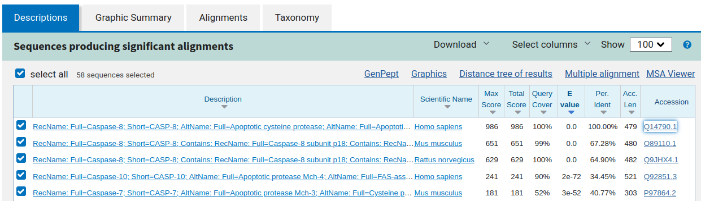
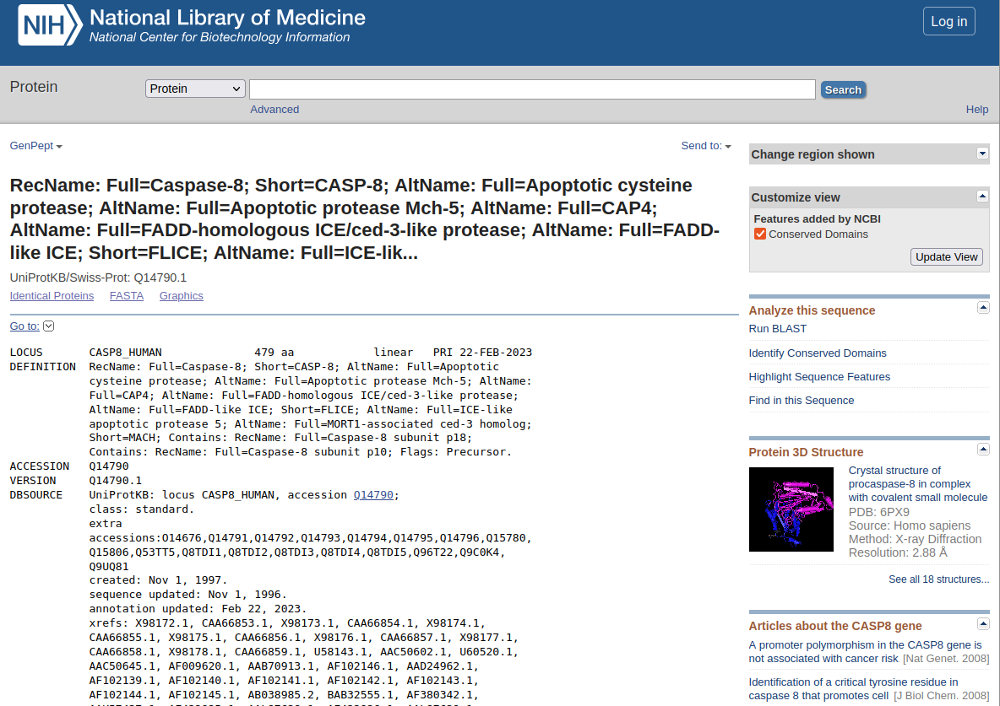

<h1>QiEP: Pràctica 1. Proteïnes que digereixen proteïnes</h1>

<!-- toc -->

- [Introducció](#introduccio)
- [Sobre la proteïna:](#sobre-la-proteina)
- [Briefing on the mechanism of action of SARS-CoV-2](#briefing-on-the-mechanism-of-action-of-sars-cov-2)
- [Assignment questions](#assignment-questions)
  * [1. 1) Virus-cell interactions](#1-1-virus-cell-interactions)
  * [2. 2) Variability in the SARS-CoV-2 genome](#2-2-variability-in-the-sars-cov-2-genome)
  * [3. 3) Rational Drug Discovery](#3-3-rational-drug-discovery)
    + [3.1. Ligand](#31-ligand)
    + [3.2. Complex](#32-complex)
- [References](#references)

<!-- tocstop -->

# Introducció


L'exercici consisteix a explorar l'estructura de sis proteïnes, una per a cada grup de la classe, de les quals ens donen les seqüències:

```fasta
>A
MDFSRNLYDIGEQLDSEDLASLKFLSLDYIPQRKQEPIKDALMLFQRLQEKRMLEESNLSFLKELLFRINRLDLLITYLNTRKEEMERELQTPGRAQISAYRVMLYQISEEVSRSELRSFKFLLQEEISKCKLDDDMNLLDIFIEMEKRVILGEGKLDILKRVCAQINKSLLKIINDYEEFSKERSSSLEGSPDEFSNGEELCGVMTISDSPREQDSESQTLDKVYQMKSKPRGYCLIINNHNFAKAREKVPKLHSIRDRNGTHLDAGALTTTFEELHFEIKPHDDCTVEQIYEILKIYQLMDHSNMDCFICCILSHGDKGIIYGTDGQEAPIYELTSQFTGLKCPSLAGKPKVFFIQACQGDNYQKGIPVETDSEEQPYLEMDLSSPQTRYIPDEADFLLGMATVNNCVSYRNPAEGTWYIQSLCQSLRERCPRGDDILTILTEVNYEVSNKDDKKNMGKQMPQPTFTLRKKLVFPSD
>B
MSDMEKPWKEEEKREVLAGHARRQAPQAVDKGPVTGDQRISVTVVLRRQRGDELEAHVERQAALAPHARVHLEREAFAASHGASLDDFAEIRKFAEAHGLTLDRAHVAAGTAVLSGPVDAVNQAFGVELRHFDHPDGSYRSYVGDVRVPASIAPLIEAVLGLDTRPVARPHFRLRRRAEGEFEARSQSAAPTAYTPLDVAQAYQFPEGLDGQGQCIAIIELGGGYDETSLAQYFASLGVSAPQVVSVSVDGATNQPTGDPNGPDGEVELDIEVAGALAPGAKIAVYFAPNTDAGFLNAITTAVHDPTHKPSIVSISWGGPEDSWAPASIAAMNRAFLDAAALGVTVLAAAGDSGSTDGEQDGLYHVDFPAASPYVLACGGTRLVASAGRIERETVWNDGPDGGSTGGGVSRIFPLPSWQERANVPPSANPGAGSGRGVPDVAGNADPATGYEVVIDGETTVIGGTAAVAPLFAALVARINQKLGKPVGYLNPTLYQLPPEVFHDITEGNNDIANRARIYQAGPGWDPCTGLGSPIGIRLLQALLPSASQAQP
>C
MLGITVLAALLACASSCGVPSFPPNLSARVVGGEDARPHSWPWQISLQYLKNDTWRHTCGGTLIASNFVLTAAHCISNTRTYRVAVGKNNLEVEDEEGSLFVGVDTIHVHKRWNALLLRNDIALIKLAEHVELSDTIQVACLPEKDSLLPKDYPCYVTGWGRLWTNGPIADKLQQGLQPVVDHATCSRIDWWGFRVKKTMVCAGGDGVISACNGDSGGPLNCQLENGSWEVFGIVSFGSRRGCNTRKKPVVYTRVSAYIDWINEKMQL
>D
MAQALPWLLLWMGAGVLPAHGTQHGIRLPLRSGLGGAPLGLRLPRETDEEPEEPGRRGSFVEMVDNLRGKSGQGYYVEMTVGSPPQTLNILVDTGSSNFAVGAAPHPFLHRYYQRQLSSTYRDLRKGVYVPYTQGKWEGELGTDLVSIPHGPNVTVRANIAAITESDKFFINGSNWEGILGLAYAEIARPDDSLEPFFDSLVKQTHVPNLFSLQLCGAGFPLNQSEVLASVGGSMIIGGIDHSLYTGSLWYTPIRREWYYEVIIVRVEINGQDLKMDCKEYNYDKSIVDSGTTNLRLPKKVFEAAVKSIKAASSTEKFPDGFWLGEQLVCWQAGTTPWNIFPVISLYLMGEVTNQSFRITILPQQYLRPVEDVATSQDDCYKFAISQSSTGTVMGAVIMEGFYVVFDRARKRIGFAVSACHVHDEFRTAAVEGPFVTLDMEDCGYNIPQTDESTLMTIAYVMAAICALFMLPLCLMVCQWRCLRCLRQQHDDFADDISLLK
>E
MTMEKGMSSGEGLPSRSSQVSAGKITAKELETKQSYKEKRGGFVLVHAGAGYHSESKAKEYKHVCKRACQKAIEKLQAGALATDAVTAALVELEDSPFTNAGMGSNLNLLGEIECDASIMDGKSLNFGAVGALSGIKNPVSVANRLLCEGQKGKLSAGRIPPCFLVGEGAYRWAVDHGIPSCPPNIMTTRFSLAAFKRNKRKLELAERVDTDFMQLKKRRQSSEKENDSGTLDTVGAVVVDHEGNVAAAVSSGGLALKHPGRVGQAALYGCGCWAENTGAHNPYSTAVSTSGCGEHLVRTILARECSHALQAEDAHQALLETMQNKFISSPFLASEDGVLGGVIVLRSCRCSAEPDSSQNKQTLLVEFLWSHTTESMCVGYMSAQDGKAKTHISRLPPGAVAGQSVAIEGGVCRLESPVN
>F
MRGLLVLSVLLGAVFGKEDFVGHQVLRISVADEAQVQKVKELEDLEHLQLDFWRGPAHPGSPIDVRVPFPSIQAVKIFLESHGISYETMIEDVQSLLDEEQEQMFAFRSRARSTDTFNYATYHTLEEIYDFLDLLVAENPHLVSKIQIGNTYEGRPIYVLKFSTGGSKRPAIWIDTGIHSREWVTQASGVWFAKKITQDYGQDAAFTAILDTLDIFLEIVTNPDGFAFTHSTNRMWRKTRSHTAGSLCIGVDPNRNWDAGFGLSGASSNPCSETYHGKFANSEVEVKSIVDFVKDHGNIKAFISIHSYSQLLMYPYGYKTEPVPDQDELDQLSKAAVTALASLYGTKFNYGSIIKAIYQASGSTIDWTYSQGIKYSFTFELRDTGRYGFLLPASQIIPTAKETWLALLTIMEHTLNHPY
```

# Sobre la proteïna:

**Cerqueu la seqüència donada a UNIPROT i trobeu el nom del gen corresponent. Anoteu el codi UNIPROT i també la classifició EC.X.X.X.X de l'enzim segons la base de dades BRENDA.**

El primer que farem serà identificar quines són aquestes seqüències usant el programa [BLAST a NCBI](https://blast.ncbi.nlm.nih.gov/Blast.cgi?PROGRAM=blastp&PAGE_TYPE=BlastSearch&LINK_LOC=blasthome) per a buscar les proteïnes per a les quals codifiquen (tinguem cura d'especificar que volem executar BLAST "contra" la base de dades Uniprot en el desplegable corresponent). Per exemple, en el cas de la proteîna del grup `A` obtenim un resultat a BLAST com el de la figura següent (mostrem només els 5 millors resultats):


Accedint al codi d'accés `Q14790.1`de la drerta de la primera línea trobem que es tracta de la caspasa-8 humana, amb codi d'accés [UNIPROT `Q14790`](https://www.uniprot.org/uniprotkb/Q14790/entry).


A la pròpia entrada UNIPROT hi trobem l'enllaç a BRENDA i el codi EC de l'enzim.

Així, identifiquem:

| Grup: proteïna        | Codi UNIPROT                                          | Codi BRENDA/ENZYME                                                                                      |
| ---------------------- | ----------------------------------------------------- | ------------------------------------------------------------------------------------------------------- |
| A: Caspasa-8           | [Q14790](https://www.uniprot.org/uniprotkb/Q14790/entry) | [EC 3.4.22.61](https://www.brenda-enzymes.org/enzyme.php?ecno=3.4.22.61&UniProtAcc=Q14790&OrganismID=2681) |
| B: Kumamolisina        | [Q8RR56](https://www.uniprot.org/uniprotkb/Q8RR56/entry) | [EC 3.4.21.B48](https://www.brenda-enzymes.org/enzyme.php?ecno=3.4.21.B48) [^1]                            |
| C: Quimotripsina-C     | [Q99895](https://www.uniprot.org/uniprotkb/Q99895/entry) | [EC 3.4.21.2](https://www.brenda-enzymes.org/enzyme.php?ecno=3.4.21.2&UniProtAcc=Q99895&OrganismID=2681)   |
| D: BACE1               | [P56817](https://www.uniprot.org/uniprotkb/P56817/entry) | [EC 3.4.23.46](https://www.brenda-enzymes.org/enzyme.php?ecno=3.4.23.46&UniProtAcc=P56817&OrganismID=2681) |
| E: Taspasa 1           | [Q9H6P5](https://www.uniprot.org/uniprotkb/Q9H6P5/entry) | [EC 3.4.25.1](https://www.brenda-enzymes.org/enzyme.php?ecno=3.4.25.1) [^2]                                    |
| F: Carboxipeptidasa A1 | [P15085](https://www.uniprot.org/uniprotkb/P15085/entry)                                                |                         [EC 3.4.17.1](https://www.brenda-enzymes.org/enzyme.php?ecno=3.4.17.1&UniProtAcc=P15085&OrganismID=2681)                                                                 |

[^1]: Cal notar que en aquest cas l'entrada UNIPROT no enllaça a BRENDA, però si entrem a BRENDA i cerquem directament el nom de la proteïna obtenim un *preliminary BRENDA supplied EC number*
[^2]: En aquest cas, en accedir a ENZYME des de la pàgina d'UNIPROT, obtenim [dues opcions de codi](https://enzyme.expasy.org/EC/3.4.25.-), i hem agafat el primer.


A Cystein protease https://rest.uniprot.org/uniprotkb/Q14790.fasta Caspase 8
B Serine protease https://www.uniprot.org/uniprotkb/Q8RR56/entry Kumamolysin
C Serine Protease https://www.uniprot.org/uniprotkb/Q99895/entry Chymotrypsin-C
D Aspartate protease https://www.uniprot.org/uniprotkb/P56817/entry BACE1
E Threonine protease https://www.uniprot.org/uniprotkb/Q9H6P5/entry Taspase 1
F metalloprotease https://www.uniprot.org/uniprotkb/P15085/entry Carboxipeptidase A1

    Cerqueu a la base de dades del Protein Data Bank si l'estructura de la proteïna és coneguda i, en aquest cas, doneu-ne el codi PDB (si n'hi ha més d'un justifiqueu amb quin treballareu a partir d'aquest punt en base a la resolució de l'experiment on s'ha resolt l'estructura i també la cobertura de seqüència que s'ha fet). En cas que la seqüència no sigui exactament coincident amb la de la proteïna resolta al PDB, justifiqueu perquè heu escollit aquest codi.
    Expliqueu breument la funció de la proteïna.

El més fàcil és accedir a aquesta informació directament des de la pàgina d'UNIPROT (secció `Structure`) sempre que estigui disponible (en general el més comú és no trobar estructures resoltes d'una proteïna al PDB i aleshores podem fer ús de la predicció que ens dona Alphafold2 accessible directament des de la pàgina d'UNIPROT). Fent-ho i escollint els PDB amb millor resolució i major cobertura, obtenim aquesta nova taula:

| Grup: proteïna        | Funció [^3]                                         | Codi PDB [^5]                                                                                      |
| ---------------------- | ----------------------------------------------------- | ------------------------------------------------------------------------------------------------------- |
| A: Caspasa-8   [Q14790](https://www.uniprot.org/uniprotkb/Q14790/entry) | Proteasa de tiol que juga un paper clau en la mort cel·lular programada actuant com a interruptor molecular per a l'apoptosi, la necroptosi i la piroptosi, i és necessària per prevenir danys en el teixit durant el desenvolupament embrionari i la vida adulta.  | [1QTN](https://www.rcsb.org/structure/1QTN) | 
| B: Kumamolisina  [Q8RR56](https://www.uniprot.org/uniprotkb/Q8RR56/entry) | L'enzim hidrolitza preferentment pèptids que tenen un residu Ala o Pro a la posició P2 i prefereix residus d'aminoàcids carregats com Glu o Arg a la posició P2'.[^4]   | [1T1E](https://www.rcsb.org/structure/1T1E) |
| C: Quimotripsina-C [Q99895](https://www.uniprot.org/uniprotkb/Q99895/entry) | Regula l'activació i la degradació de tripsinògens i procarboxipeptidases dirigint-se a llocs de tall específics dins dels seus zimogens. Té activitat proteasa de tipus quimotripsina i activitat hipocalcèmica.   | [4H4F](https://www.rcsb.org/structure/4H4F)|
| D: BACE1   [P56817](https://www.uniprot.org/uniprotkb/P56817/entry) | Responsable del processament proteolític de la proteïna precursora de l'amiloide (APP). L'escissió a l'extrem N de la seqüència de pèptids A-beta, entre els residus 671 i 672 de l'APP, condueix a la generació i l'alliberament extracel·lular d'APP soluble escindida en beta, i un fragment C-terminal associat a la cèl·lula corresponent que s'allibera més tard. per gamma-secretasa | [1TQF](https://www.rcsb.org/structure/1TQF)_A |
| E: Taspasa 1  [Q9H6P5](https://www.uniprot.org/uniprotkb/Q9H6P5/entry) | Proteasa responsable del processament i activació de KMT2A/MLL1.
També activa KMT2D/MLL2 (Per similitud).
Mitjançant l'activació del substrat, controla l'expressió dels gens HOXA i l'expressió de reguladors clau del cicle cel·lular, inclosos CCNA1, CCNB1, CCNE1 i CDKN2A (Per similitud) | |
| F: Carboxipeptidasa A1 [P15085](https://www.uniprot.org/uniprotkb/P15085/entry) | | |

[^3]: Si no s'especifica el contrari, la informació està extreta de la fitxa UNIPROT
[^4]: Informació obtinguda de la fitxa a BRENDA.
[^5]: S'inclou la cadena més rellevant per a l'estudi estructural

 Treball amb ChimeraX

    Obriu l'estructura del PDB amb el programa Chimera
    Detecteu les diferents estructures secundàries de la proteïna (fulles, hèlix, llaços) i determina el seu tipus. Mireu de descriure amb un cert detall els diferents tipus d'enllaços que podeu trobar dins aquestes estructures secundàries (mostreu els ponts d'hidrogen interns d'aquestes estructures secundàries).
    Podeu detectar-hi motius d'estructura supersecundària? Mostreu les interaccions (ponts d'hidrogen, van der Waals) entre els diferents elements que constitueixen aquestes estructures supersecundàries.
    L'estructura terciària de la proteïna, a quin tipus de plegament correspon? Busqueu el plegament a la base de dades SCOP, anoteu el codi que us dona aquesta base de dades per al plegament i mostreu la jerarquía d'aquest plegament.

Funció de la proteïna:

    Identifiqueu el centre actiu de la proteïna. Quins residus són rellevants, a partir de la literatura? L'estructura que heu explorat, inclou algun substrat o inhibidor? Podeu descriure les interaccions que presenten entre ells els residus del centre actiu i, eventualment, d'aquests amb el possible substrat/inhibidor (ponts d'hidrogen, van der Waals, càrregues, etc)?
    Cerqueu informació sobre la funció fa aquesta proteïna? Podeu mostrar el mecanisme detallat que segueix?
    Relació seqüència-estructura-funció: Com relacionaríeu l'estructura que heu analitzat amb la funció de la proteïna? Quins elements estructurals participen en aquesta funció? Quins residus en concret són claus per a la funció? Cerqueu eventuals variants de la proteïna que tinguin implicacions funcionals i comenteu els seus efectes a nivell molecular.

In this assignment for the LVF601M course on Systems Biology at the University of Iceland, we will get some hints on the rational design of a new drug. In particular, we will visualize some simple details on the way an antiviral for SARS-CoV-2 can be designed.

Needed software and databases:

1. [OpenBabel](http://openbabel.org/wiki/Main_Page) to convert small molecules coordinates from one format to another. You can also use its [online version](http://www.cheminfo.org/Chemistry/Cheminformatics/FormatConverter/index.html).
2. [Chimera](https://www.cgl.ucsf.edu/chimera/) to visualize proteins and their interactions.
3. [UNIPROT](https://www.uniprot.org/) to obtain information about a particular protein (sequence, structure, interactions...).
4. [PDB](https://www.rcsb.org/) to obtain 3D structures of proteins.

# Briefing on the mechanism of action of SARS-CoV-2

The SARS-CoV-2 virus is the cause of the disease known as COVID19. The Spike protein is responsible for anchoring the virus to the cell surface.

|                                                                          |
| :----------------------------------------------------------------------------------------------: |
| Detail of the structure of the SARS-CoV-2, showing the Spike proteins in their glycosilated form |

 From here the fusion of the membranes occurs and the virus pours its RNA content into the cell. This RNA uses the cellular machinery to replicate the virus and to generate many more that can infect other cells.

|                                                    |
| :------------------------------------------------------------------------------------------: |
| [Credit: David S. Goodsell](https://pdb101.rcsb.org/sci-art/goodsell-gallery/sars-cov-2-fusion) |

A nice introductory video on the wat SARS-CoV-2 infects a cell and on the development of vaccines against it:

[](https://youtu.be/5DGwOJXSxqg)

The virus machinery includes the information to translate a collection of proteins that, once assembled into new viral particles to infect new host cells. Some of these proteins are sructural and other have a precise funcion to help the maturation of the virus within the cell. See the details of the SARS-CoC-2 proteome in the figure.

|  |
| :-------------------------------------------: |
|          The proteome of SARS-CoV-2          |

# Assignment questions

##  1. <a name='Virus-cellinteractions'></a>1) Virus-cell interactions

1. Get the human SARS-CoV-2 virus Spike protein Uniprot code.
2. Identify the name of the cell surface protein that the SARS-CoV-2 Spike protein interacts with.
3. Look in the PDB database for a structure of the complex between Spike protein and the above cell membrane protein. Add an image of the PDB obtained with Chimera.
4. Look in the PDB database for a structure of the complex between Spike protein and antibodies. Add an image of the PDB obtained with Chimera.
5. Identify the residues that are in the interface regions, using the `select zone` tool in Chimera. Are they many? What do you think a good strategy for preventing SARS-CoV-2 to interact with the cell could be? Are the regions of interaction the same in the complexes you located in the above steps?

##  2. <a name='VariabilityintheSARS-CoV-2genome'></a>2) Variability in the SARS-CoV-2 genome

Go to the SARS-CoV-2 genome variation site at Stanford University: [COVDB](https://covdb.stanford.edu/variants/omicron_ba_1_3/). Look for the page devoted to the omicron variants:

6. Is the variability homogeneous? why do you think it is like this in terms of viral-host interaction evolution?
7. Check in particular the genomic region for 3CLpro. Can you give a rough measure of the percentage of variation of Spike and 3CLpro?

##  3. <a name='RationalDrugDiscovery'></a>3) Rational Drug Discovery

###  3.1. <a name='Ligand'></a>Ligand

8. Go to the [DRUGBANK](https://go.drugbank.com/) web site, and check for the Nirmatrelvir file. Download the structure in the PDB format and visualize it in Chimera. Paste it here Does it look right to you? What is missing?

|                                                                                                                      |
| :------------------------------------------------------------------------------------------------------------------------------------------------: |
| Some related molecules with antiviral properties, including Nirmatrelvir[(Joyce et al., 2022)](https://www.ncbi.nlm.nih.gov/pmc/articles/PMC9425786/) |

9. Try fixing the structure using [openbabel](http://www.cheminfo.org/Chemistry/Cheminformatics/FormatConverter/index.html). Paste the new structure as seen in Chimera.
10. Can you identify the different functional groups. Discover the protein target of this molecule. Which of them is relevant for the interaction with the target?

###  3.2. <a name='Complex'></a>Complex

11. Can you find a structure in the PDB database that contains Nirmatrelivir with its target?
12. The target is based on a conserved catalytic dyad, Can you recognize it using Chimera?
13. Check the variability of the target and show in the structure where those variants at the level of aminoacids appear. Are they relevant for the function?
14. What is the mode of interaction between ligand and target? Can you elaborate on why would you consider it strong and specific? How can this be related to the activity of the protein?
15. Can you find information about the way Nirmatrelvir was designed? In particular, what are its precursors?

# References

* You can find interesting material on COVID19 structural biology at the web of the PDB: [COVID-19/SARS-CoV-2 Resources](https://www.rcsb.org/news/feature/5e74d55d2d410731e9944f52).
* Greasley, S. E.; Noell, S.; Plotnikova, O.; Ferre, R.; Liu, W.; Bolanos, B.; Fennell, K.; Nicki, J.; Craig, T.; Zhu, Y.; Stewart, A. E.; Steppan, C. M. [Structural Basis for the in Vitro Efficacy of Nirmatrelvir against SARS-CoV-2 Variants](https://doi.org/10.1016/j.jbc.2022.101972). Journal of Biological Chemistry 2022, 298 (6), 101972.
* Ryan P. Joyce, Vivian W. Hu & Jun Wang [The history, mechanism, and perspectives of nirmatrelvir (PF-07321332): an orally bioavailable main protease inhibitor used in combination with ritonavir to reduce COVID-19-related hospitalizations](https://link.springer.com/article/10.1007/s00044-022-02951-6). Medicinal Chemistry Research 2022; 31, 1637-1646.

&copy; [Jordi Villà Freixa](https://mon.uvic.cat/cbbl/members/), [Facultat de Ciències, Tecnologia i Enginyeries](https://mon.uvic.cat/fcte/), [Universitat de Vic - Universitat Central de Catalunya](https://www.uvic.cat/), 2023


