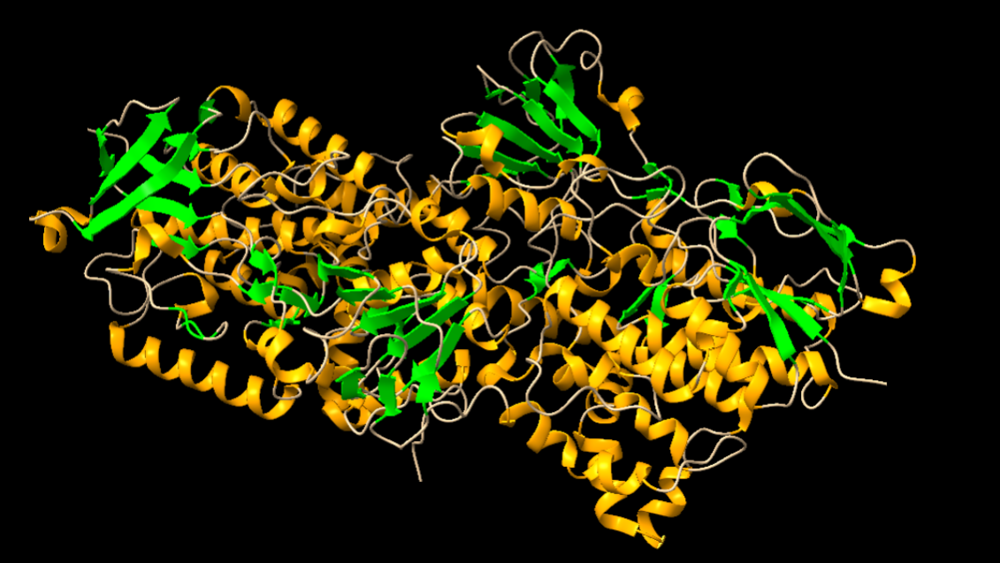
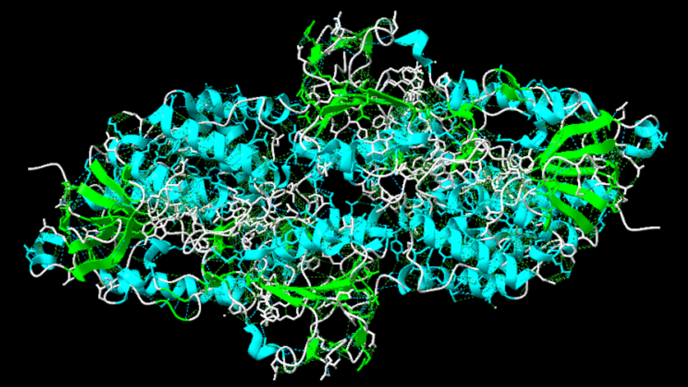
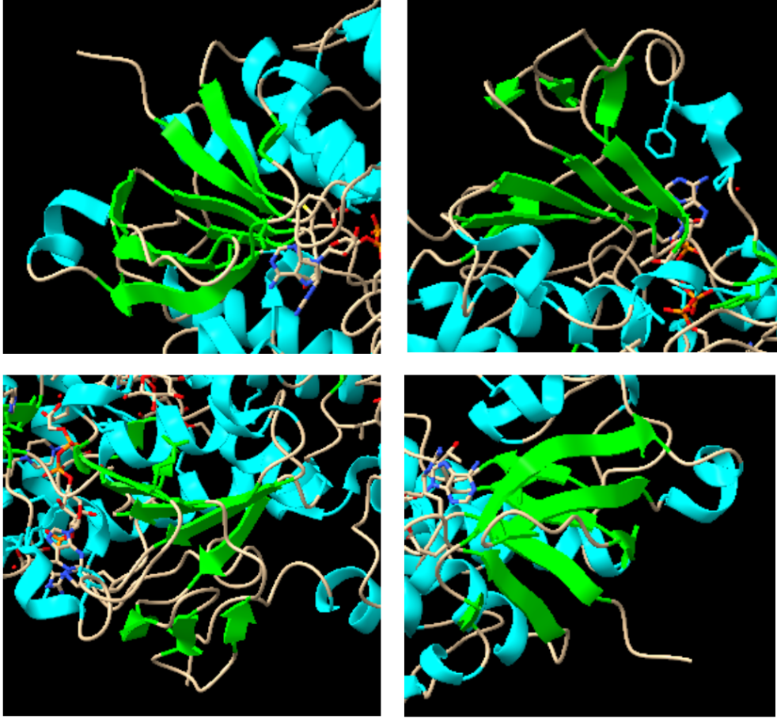
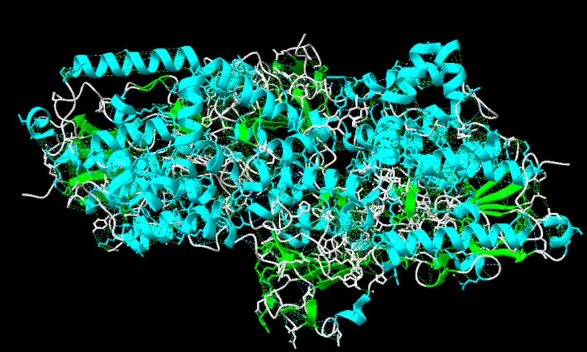
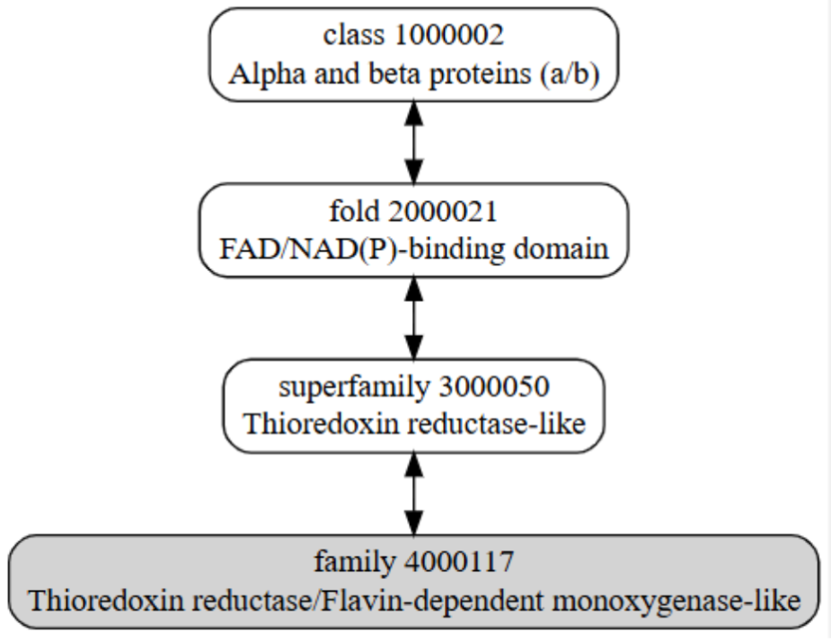
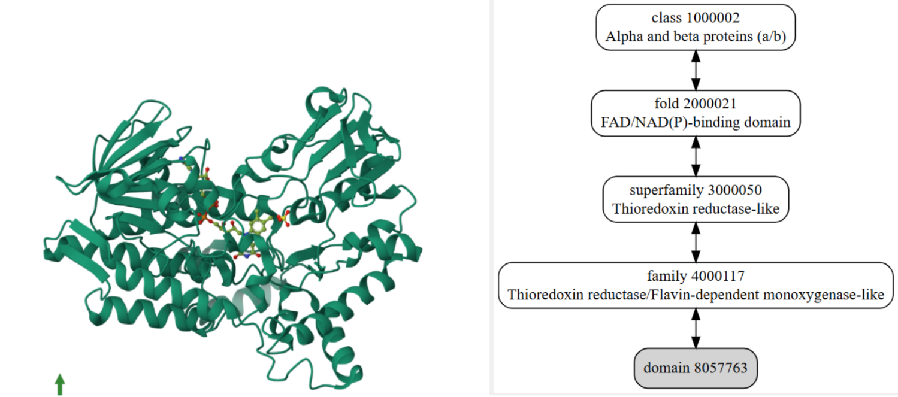
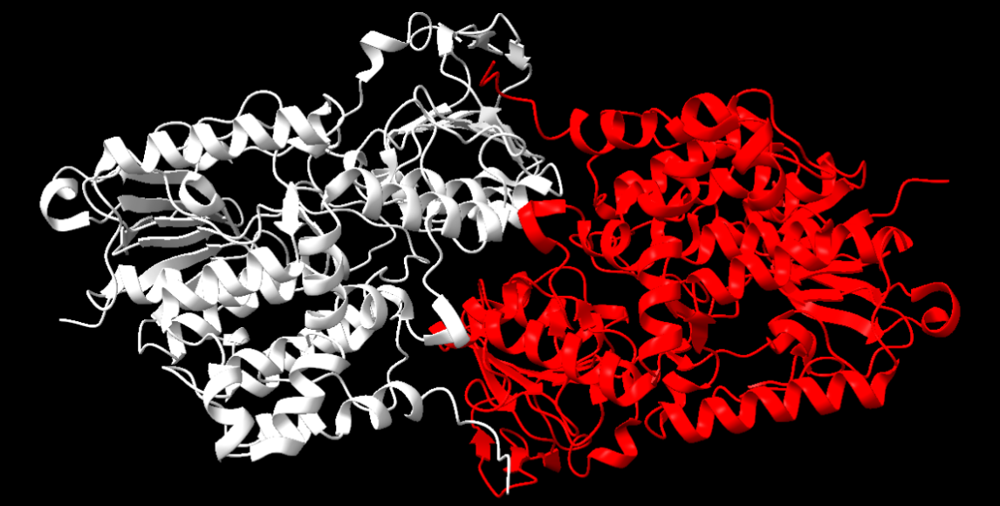
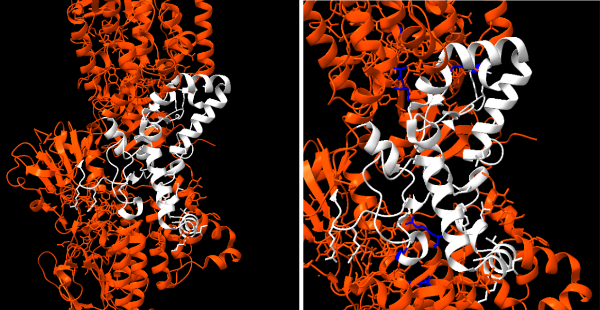
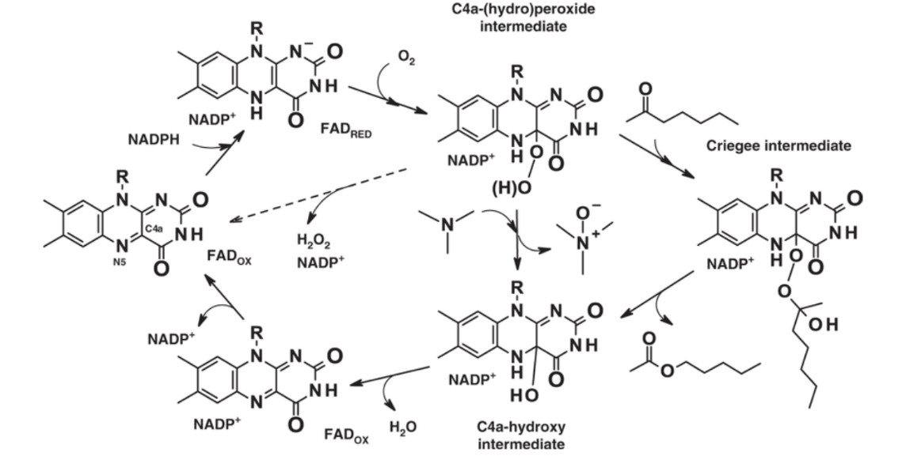

# Flavin-containing monooxygenase 5 (FMO)

## Grup A: Ruben Casalí, Martí Corbella, Albert Garcia

## Introducció a la proteïna

**Nom del gen:** FMO5

**Codi uniprot:** P49326· FMO5_HUMAN 

**Classificació de l’enzim:** EC1.14.13.8	

**Estructura:** Hem utilitzat per a l'anàlisi de la proteïna el codi PDB 6SEK, ja que aquesta estructura PDB era la que tenia una estructura 3D, realitzada amb el mètode de X-RAY DIFFRACTION 2.17 Å, més completa i ens podia aportar major informació que no pas els resultats obtinguts amb el BLAST. De fet, amb el BLAST vam obtenir com a resultats de la cerca la proteïna anomenada Chain A, Amine oxidase [flavin-containing] A [Homo sapiens] que era la que tenia més total score té, tenint una query cover de 7% i un percentatge d'identitat del 45,71% i el seu codi PDB era 2Z5Y, però ja que no es basava en la nostra proteïna vam descartar aquesta opció i ens vam centrar en la primera opció.

**Funció:** La proteïna té diferents funcions, en les quals podem destacar que: 

- Actua com a monooxigenasa (Incorpora un grup hidroxil a un determinat substrat) de Baeyer_Villiger, en una varietat de diferents substrats.
- Catalitza la inserció d’un àtom d'oxigen en un enllaç carboni-carboni adjacent a un carbonil que permet convertir cetones en èsters. 
- Catalitza l'oxidació de molècules de fàrmacs que porten un grup carbonil en una cadena alifàtica.
- Actua com a modulador positiu en la biosíntesi del colesterol i de l'homeòstasi de la glucosa, promovent, l’envelliment metabòlic a través d’efectes pleiotròpics.

## Treball amb l'aplicació ChimeraX

**1. Detecteu les diferents estructures secundàries de la proteïna i determineu-ne el tipus (fulles, hèlix, llaços i les seves diferents variants). Mireu de descriure amb un cert detall els diferents tipus d'interaccions que podeu trobar dins aquestes estructures secundàries (mostreu els ponts d'hidrogen interns d'aquestes estructures secundàries).**

                                                   
**Figura 1:** Imatge pròpia que mostra estructures secundàries.

Com podem apreciar en la imatge, l’enzim té diverses estructures secundàries. Les estructures acolorides de color taronja corresponen a estructures hèlix-alfa, i les de color verd corresponen a làmines beta. Entre aquestes, les estructures de color blanc que es mostren corresponen a seqüències d’aminoàcids que les uneixen, però que no presenten una estructura secundària definida.

La imatge següent ens mostra de color blau els ponts d’hidrogen presents a la proteïna. Hi ha un total de 4386 ponts d’hidrogen presents. Podem distingir que tots els enllaços es donen entre les estructures secundàries, o bé a les hèlix alfa o bé les fulles beta. A més a més, també es veuen involucrades en les estructures supersecundàries que es formen els motius Beta. 

**Figura 2:** Imatge pròpia que mostra els ponts d'hidrogen

**2. Podeu detectar-hi motius d'estructura supersecundària? Mostreu les interaccions (ponts d'hidrogen, van der Waals) entre els diferents elements que constitueixen aquestes estructures supersecundàries.**

Com es pot apreciar en la imatge sí que s’observa diferents motius d’estructura supersecundària, les estructures acolorides de color verd corresponen a fulles beta formant hairpins de manera antiparal·lela una darrera l’altre amb girs de 180 graus. 

**Figura 3:** Imatge pròpia que mostra estrcutures supersecundàries

Aquests "hairpins", en el mateix moment, es pot apreciar en la imatge com en quatre disposicions de l’enzim formen un altre tipus de subestructura, anomenats barrils beta (Els barrils beta són una seria de làmines beta unides per ponts d’hidrogen formant una estructura secundària tancada amb forma de cercle). Cada un d’aquestes forma un domini independent.

                                                          
**Figura 4 i 5:** Imatge pròpia que mostra els barrils beta en tota la proteïna i de forma ampliada.

També, podem apreciar de color blau diferents superestructures secundàries amb conformació helix alfa-loop-helix alfa.

**Figura 6:** Imatge pròpia que mostra diferents superestructures

**3. L'estructura terciària de la proteïna, a quin tipus de plegament correspon? Busqueu el plegament a la base de dades SCOP, anoteu el codi que us dona aquesta base de dades per al plegament i mostreu la jerarquía d'aquest plegament. En cas que existeixi estructura quaternària, discutiu-la també.**

                                              
**Figura 7:** Imatge extreta de la base de dades SCOP que detalla el plegament de la família del plegament

**SCOP ID 4000117:** Al gràfic superior podem veure la jerarquia, mostrant les estructures ancestre d’aquest plegament.  El domini concret de la nostra proteïna no es troba referència a la base de dades SCOP, es troba un homòleg d’un organisme diferent d’Homo sapiens, però amb una funció de monooxidasa igual a la nostra proteïna.

**Figura 8 i 9:** A l'esquerra podem visualitzar la proteïna homòloga que s'ha fet referència anteriorment extreta de PDB i a la dreta podem veure l'esquema extret de la base de dades SCOP que detallem el domini del nostre organisme.

**SCOP ID 8057763:** Pel domini que pertany a l’organisme Thermobidia fusca. A external links mostra que el codi per consultar l'estructura superior de la base de dades PDB és 1w4x. 

La nostra proteïna presenta estructura quaternària, podem veure, cadascuna de les cadenes que la conformen es poden considerar una interacció entre dos dominis tipus l’esmentat anteriorment, ja que consta d’una cadena alfa i una cadena beta, és a dir, dues estructures terciàries que en interaccionar formen la proteïna. 

                                                     
**Figura 10:** Representació de l'estructura quaternària de la nostra proteïna, en blanc es veu la cadena beta i en vermell l’alfa.

## Funció de la proteïna

**1. Identifiqueu el centre actiu de la proteïna. Quins residus són rellevants, a partir de la literatura? L'estructura que heu explorat, inclou algun substrat o inhibidor? Podeu descriure les interaccions que presenten entre ells els residus del centre actiu i, eventualment, d'aquests amb el possible substrat/inhibidor (ponts d'hidrogen, van der Waals, càrregues, etc)?**

**Figura 11:** Fragment de l'article 1 que indica les posicions del centre actiu (214-295)

**Figura 12 i 13:** Imatge pròpia on es representa el centre actiu a l'esquerra i a la dreta els residus rellevants

L’enzim està tot de color taronja excepte el centre actiu que es troba pintat de color blanc per així poder-ho apreciar de millor forma. Segons la literatura els residus més rellevants són: Thr62, Ser62, Thr63; Glu 281, Glu 281, His 282; Ile378, Thr378, Ile378 (marcats en blau fort), ja que els altres residus són estrictament conservats per tenir conformacions idèntiques. Els substrats o inhibidors que té la nostra molècula són els que es mostren a continuació marcats en verd.

**Figura 14:** Imatge pròpia on es poden veure els substrats units a la nostra molècula.

D’aquests substrats marcats en verd podem destacar en la següent imatge en aquests podem destacar que tenim 2 cofactors els quals són el FAD (Flavin Adenine Dinucleotide), marcat de color magenta, NAP (NADP⁺ - Nicotinamide Adenine Dinucleotide Phosphate), marcat de color groc. 

A més també trobem un buffer utilitzat en la cristal·lització com és EPE (HEPES - 4-(2-hydroxyethyl)-1-piperazine ethanesulfonic àcid), marcat de color blau claret, un possible substrat com és GLC (Glucose - α-D-Glucopyranose), marcat de color rosa i per últim un detergent també fet servir en la cristal·lització com és el LMT (Dodecyl-β-D-Maltoside), marcat de color verd fosc.

**Taula 1 i Figura 15:** Taula on podem veure els substrats que interaccionen i figura on es mostra aquesta interacció

Les interaccions realitzades pels substrats amb la nostra proteïna són ponts d’hidrogen i forces de Van der Waals.

**Figura 16 i 17:** Imatge pròpia on a l'esquerra veiem els ponts d'hidrogen de color blau i a la dreta les forces de Van der Waals de color verd.

**2. Cerqueu informació sobre la funció fa aquesta proteïna? Podeu mostrar el mecanisme detallat que segueix si es tracta d'un enzim? (mireu la figura 6.5.1 d'aquest enllaç per entendre a què ens referim amb el mecanisme de reacció d'un enzim)?**

La nostra proteïna pertany a la família de les monooxigenases que contenen flavina, que són enzims dependents de NADPH (i els seus derivats com NADH) que catalitzen l'oxidació de centres heteroatòmics nucleòfils en fàrmacs, pesticides i altres compostos xenobiòtics. Com hem comentat breument a la introducció, la FMO5 presenta una activitat com a Baeyer-Villiger monooxigenasa, que implica la inserció d'un àtom d'oxigen en un enllaç carboni-carboni adjacent a un grup carbonil, convertint cetones en èsters.

**Figura 18:** Imatge extreta de l'article 1 on podem veure la reacció de l'enzim. 

El mecanisme catalític implica la reducció del cofactor FAD per NADPH, seguida de la formació d'un intermediari hidroperòxid que oxida el substrat. Aquest mecanisme és eficient i no requereix la unió prèvia del substrat per activar l'oxigen, a diferència d'altres monooxigenases.

**3. Relació seqüència-estructura-funció: Com relacionaríeu l'estructura que heu analitzat amb la funció de la proteïna? Quins elements estructurals participen en aquesta funció? Quins residus en concret són claus per a la funció? Cerqueu eventuals variants de la proteïna que tinguin implicacions funcionals i comenteu els seus efectes a nivell molecular.**

En primer lloc, per relacionar l'estructura amb la funció caldria saber quina és la funció que realitza la nostra proteïna, la Chain A, Amine oxidase [flavin-containing] A [Homo sapiens] concretament es basa principalment en la capacitat per a catalitzar reaccions d’oxigenació de substrats utilitzant el FAD i el NADPH com a cofactors.

Els cofactors són molt importants per a la nostra proteïna, ja que el FAD ajuda a la transferència d’electrons durant la reacció així com el domini de Flavina que estabilitza aquest FAD i ajuda a la transferència d’electrons entre el NADPH, el FAD i l’oxigen (indispensables per a la reacció). També és important el centre actiu, pel fet que és on s’uneix el substrat així com els residus claus perquè es pugui dur a terme la funció de l’enzim.

Aquests residus claus són la Histidina (His) que està involucrada en la coordinació del FAD i en la transferència d'electrons cap a l'àtom d'oxigen, l’Àcid glutàmic (Glu) que permet l'estabilització d'ions o la interacció amb l'oxigen, la Serina (Ser) i treonina (Thr) que s'encarreguen de formar ponts d'hidrogen amb el substrat o el cofactor, facilitant la reacció d'oxigenació i per últim la Cisteïna (Cys) que ajuda a la catalització de la transferència d'electrons així com a l'estabilització d'un intermediari reactiu si s'arribés a produir.
Com a variants de la nostra proteïna en humans trobem altres FMOs basades en mutacions en alguns aminoàcids que provocant certs efectes a escala molecular així com diferents funcions:

- FMO3 V257M: Es basa en un canvi en un aminoàcid proper al centre actiu on en comptes d’haver-hi una valina hi ha una metionina, fet que provoca una alteració en la forma de l'enzim que afecta l'afinitat pel substrat i la capacitat d'oxidar-lo correctament.

- FMO1 R500H: La mutació R500H reemplaça una arginina carregada positivament al centre actiu per una histidina. Això provoca que s’alterin les interaccions de càrrega i afecta l'afinitat pels substrats així com l'estabilitat del cofactor FAD, cosa que dificulta la metabolització de toxines.

- FMO4 I71T: En aquest cas, la isoleucina se substitueix per una treonina al lloc actiu de l'enzim. Això canvia la hidrofobicitat de la regió, afectant la capacitat de la proteïna per interactuar correctament amb substrats hidrofòbics fent disminuir l'eficiència de metabolització de fàrmacs i altres molècules.

## Bibliografia

Article 1 : Nicoll, Callum & Bailleul, Gautier & Fiorentini, Filippo & Mascotti, Laura & Fraaije, Marco & Mattevi, Andrea. (2020). Ancestral-sequence reconstruction unveils the structural basis of function in mammalian FMOs. Nature Structural & Molecular Biology. 27. 1-11. 10.1038/s41594-019-0347-2.

Proteïna en Uniprot: https://www.uniprot.org/uniprotkb/P49326/entry

Proteïna en PDB: https://www.rcsb.org/structure/6SEK 

