# PRÀCTICA 1 Química i Enginyeria de Proteïnes
## Grup B (Alex Durán, Ariadna Gómez, Jordi Martín)

**Seqüència:** 
MKLFYKPGACSLASHITLRESGKDFTLVSVDLMKKRLENGDDYFAVNPKGQVPALLLDDGTLLTEGVAIMQYLADSVPDRQLLAPVNSISRYKTIEWLNYIATELHKGFTPLFRPDTPEEYKPTVRAQLEKKLQYVNEALKDEHWICGQRFTIADAYLFTVLRWAYAVKLNLEGLEHIAAFMQRMAERPEVQDALSAEGLK

**1. Nom de la proteina i codi Uniprot:**                                                                         
Aquesta seqüència prové de l'Escherichia coli K-12, i codifica per la proteïna Glutathione S-transferase GstA (Amino àcids: 201)

- **Codi Uniprot:** P0A9D2
- **Nom del gen:** gstA
- **Funció breu:** Catalitza la conjugació de glutatió reduït (GSH) a un gran nombre d'electròfils hidrofòbics exògens i endògens.
- **Classificació Enzim:** EC 2.5.1.18
  
**2. Codi PDB i estructura:**
- **Codi de PDB:** 1A0F_A
- **Method:** X-RAY DIFFRACTION
- **Resolution:** 2.10 Å
- **Mutation(s):** No

                                                                 
**Figura1:** Imatge extreta del UniProt, Estructura de la proteïna Glutathione S-transferase GstA (Dímer)

Treballarem amb l'estructura en PDB, que és aquesta:

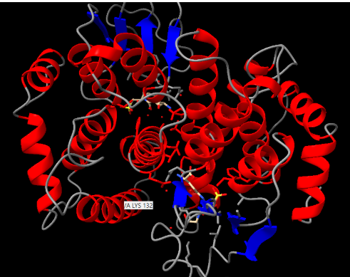                                                        
**Figura2:** Imatge pròpia, Estructura extreta amb ChimeraX de la proteïna Glutathione S-transferase GstA

En aquesta imatge de l'estructura de la proteïna podem observar estructures secundàries individuals, com fulles o làmines plegades β i també podem veure hèlix α, però també estructures supersecundàries, com forquilles beta-beta o Greca amb 4 betas.

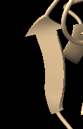                                                        
**Figura3:** Imatge pròpia, Fulla o làmina plegada β 

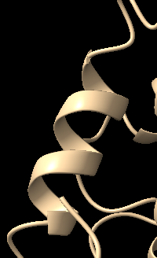                                                        
**Figura4:** Imatge pròpia, Hèlix α

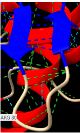                                                        
**Figura5:** Imatge pròpia, Forquilla beta-beta

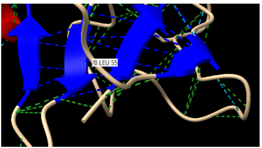                                                        
**Figura6:** Imatge pròpia, Greca amb 4 betas

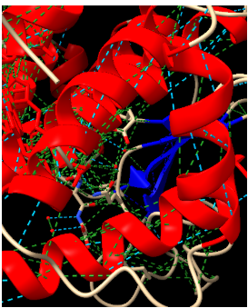                                                        
**Figura7:** Imatge pròpia, Alfa-alfa

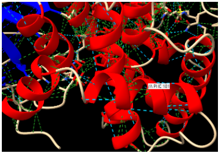                                                        
**Figura8:** Imatge pròpia, Feix de 4 helix alfa

- **Interaccions:**

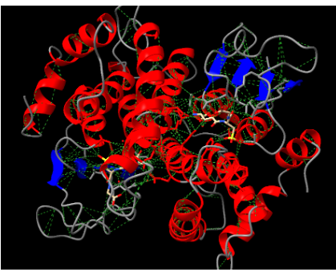                                                        
**Figura9:** Imatge pròpia, Trobem línies verdes que són les interaccions de van der waals (Quantitat: 2683) 

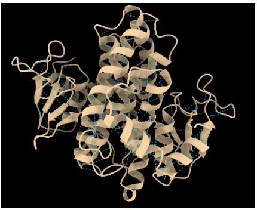                                                        
**Figura10:** Imatge pròpia, Trobem ponts d’hidrogen que són les línies blaves (Quantitat: 806)

- **Estructura terciaria:**                                                      
**Codis de base de dades SCOP:** 1a0f A:81-201 [17737], 1a0f A:1-80 [33031], 1a0f B:81-201 [17738], 1a0f B:1-80 [33032]

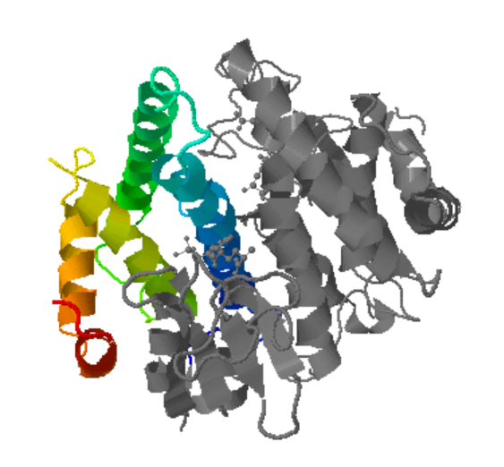                                                        
**Figura11:** Imatge pròpia, d1a0fa1: 1a0f A:81-201 

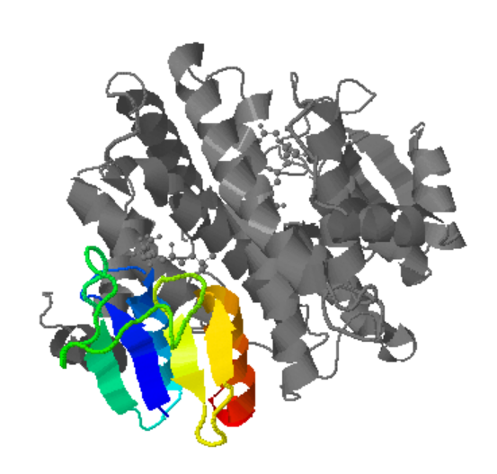                                                        
**Figura12:** Imatge pròpia, d1a0fa2: 1a0f A:1-80

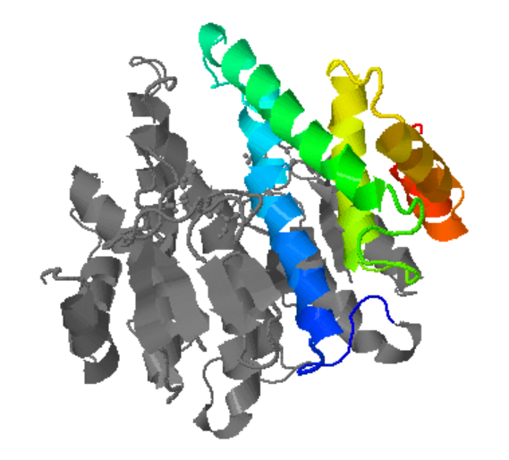                                                        
**Figura13:** Imatge pròpia, d1a0fb1: 1a0f B:81-201

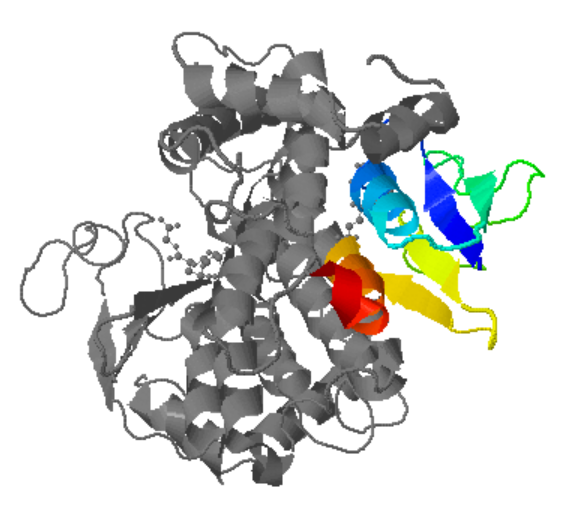                                                        
**Figura14:** Imatge pròpia, d1a0fb2: 1a0f B:1-80

En les imatges podem observar la proteïna, en color estan les estructures terciàries, i en gris està la resta de la proteïna, quan aquestes estructures s’uneixen, en formen una de quaternària.

**3. Funció de la proteïna:**
- **Centre actiu:**                                       
Trobem centres actius a les posicions 10,35,52,65-66,99 i 103-106. Marcats en verd a l’estructura. 

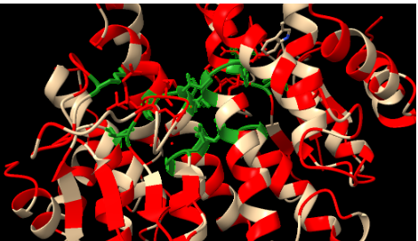                                                        
**Figura15:** Imatge pròpia, Centre actiu en verd i residus clau en vermell de la proteïna

- **Residus clau:**                                                                    
Cisteïna 10 (Cys10), Lisina 35 (Lys35), Valina 52 (Val52), Glutamat 65 (Glu65), Glicina 66 (Gly66), Histidina 106 (His106), Asparagina 99 (Asn99), Treonina 103 (Thr103), Glutamat 104 (Glu104)

- **Substrats/Inhibidors:**                                                              
Sí, el GTS, és un substrat que inclou la nostra molècula.

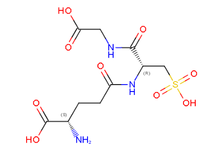                                                        
**Figura16:** Imatge pròpia, Fórmula química GST

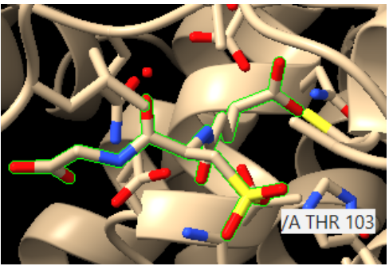                                                        
**Figura17:** Imatge pròpia, Estructura 3D GST

- **Interaccions amb centre actiu i residus:**                                            
Es formen ponts d’hidrogen entre His106, Thr103 i Glu104 amb el glutatió o altres residus polars propers, interaccions de Van der Walls entre Leu32, Val52 i Gly66 i Lys35 i Glu65 poden tenir interaccions electroestàtiques
El GTS és un substrat de la GstA, i la seva unió està estabilitzada mitjançant una combinació de ponts d’hidrogen, interaccions de van der Waals i forces electroestàtiques. Els residus del centre actiu orienten correctament el substrat i faciliten la reacció catalítica.

- **Informació sobre la funció fa aquesta proteïna:**                                   
​La Glutatió S-transferasa A (GstA) és un enzim que catalitza la conjugació del glutatió reduït (GSH) amb compostos electrofílics, facilitant la detoxificació cel·lular.
També ajuda a la prevenció de l'estrès oxidatiu i a neutralitzar toxines exògenes com ara drogues, pesticides i carcinògens.

- **Mostrar el mecanisme detallat que segueix aquest enzim:**                                     
Primer el GSH s'uneix al lloc G de GstA, on el grup tiol (-SH) de GSH s'activa per residus específics de l'enzim. En molts GST, la tirosina del lloc actiu forma enllaços d'hidrogen amb el grup tiol de GSH, estabilitzant així la seva forma tiolat més nucleòfila.
Després el substrat electrofílic s'uneix al lloc H de la GstA, es produeix un atac nucleofílic del GSH al substrat i per últim es produeix una formació del producte conjugat i alliberament.

- **Relació seqüència-estructura-funció:**                                                    
Com es pot veure anteriorment en la nostra proteïna, aquesta presenta un substrat, que és el GTS. Aquest, segons la seva estructura no presenta un grup tiol (SH), el qual segons la funció de la proteïna és capaç d'atacar compostos tòxics electrofílics. Per això, la seva versió reduïda del GTS, el GSH si el conte, llavors, segons l'estructura d’aquest compost, això afectarà a la funció de la proteïna.
Pel que fa a l'estructura més global de la proteïna, aquesta és un dímer, o sigui que conté dues subunitats les quals són similars. Per tant, aquesta dimerització permet que la proteïna sigui més estable estructuralment. No només això sinó que també ajuda en el seu paper de prevenció de l'estrès oxidatiu. En conclusió, podríem dir que tant el centre actiu com el substrat GTS, tenen un paper molt important en la funció de la proteïna, a més de la seva estructura en dímer. 

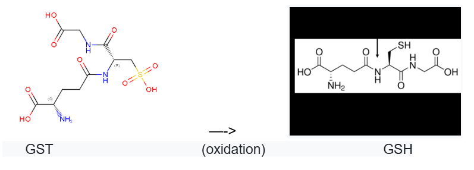                                                        
**Figura18:** Imatge pròpia, Procès d’oxidació del GST a GSH

- **Variants:**                                                                     
Aquesta proteïna pot tenir diverses variants les quals afectaran a la seva funcionalitat. Per exemple, una mutació al lloc d’unió del GSH, això afecta a la capacitat de la proteïna per unir i activar el GSH disminuint l'eficiència de la conjugació amb compostos tòxics. Una altra mutació que pot tenir és en residus de la interfície de dimerització, que provoquen que l'estabilitat de l'estructura es vegi afectada juntament amb la seva activitat enzimàtica. Per últim, també es pot ocasionar mutacions en regions reguladores que afecten l'expressió de GstA, implicant una menor protecció contra l'estrès oxidatiu. 

## Bibliografia:

- https://biomodel.uah.es/model1j/prot/supersec/inicio.htm
- https://www.uniprot.org/uniprotkb/P0A9D2/entry
- https://www.brenda-enzymes.org/enzyme.php?ecno=2.5.1.18
- https://scop.berkeley.edu/search/?ver=2.08&key=1A0F_A
- https://www.rcsb.org/structure/1A0F 
- https://bio.libretexts.org/Bookshelves/Biochemistry/Fundamentals_of_Biochemistry_%28Jakubowski_and_Flatt%29/01%3A_Unit_I-_Structure_and_Catalysis/06%3A_Enzyme_Activity/6.05%3A_Enzymatic_Reaction_Mechanisms 

