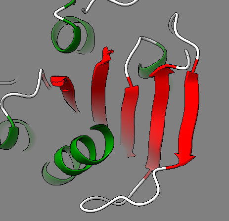
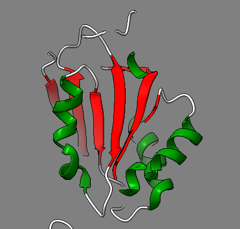
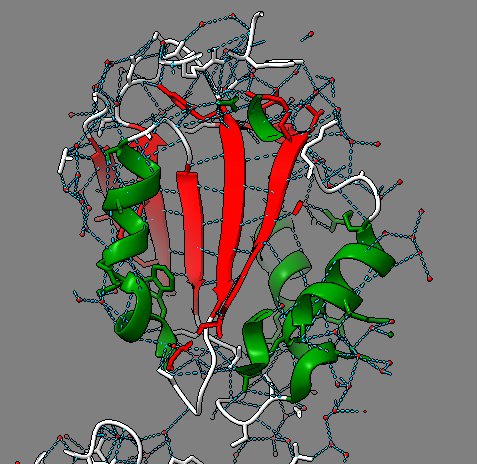
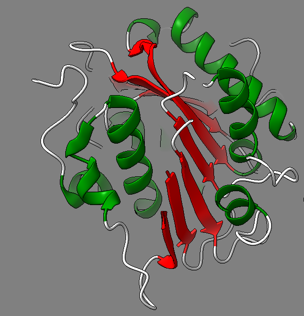
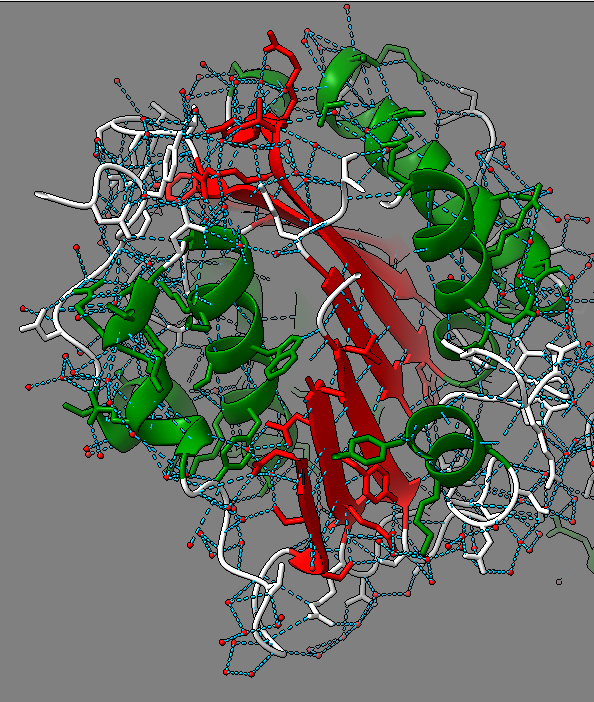
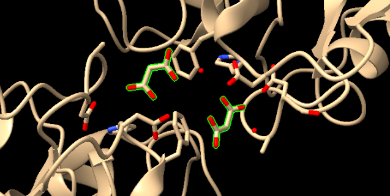
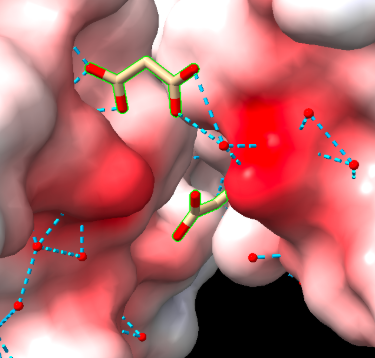

# Pràctica 1: Relacions estructura-funció de proteïnes:

Grup C: Marta Amaro, Núria Gonzalez i Fatima Saculles

## 1. Sobre la proteïna:
**Seqüència**: MLSFLRSTGRPERRRASLPALLLFTAALVASGLTAAPAAQAADNPYQRGPDPTNASIEAATGPFAVGTQPIVGASGFGGGQIYYPTDTSQTYGAVVIVPGFISVWAQLNWLGPRLASQGFVVIGIETSVITDLPDPRGDQALAALDWATTRSPVASRIDRTRLAAAGWSMGGGGLRRAALQRPSLKAIVGMAPWNGERNWSAVTVPTLFFGGSSDAVASPNDHAKPFYNSITRAEKDYIELRNADHFFPTSANTTMAKYFISWLKRWVDNDTRYTQFLCPGPSTGLFAPVSASMNTCPF

- **Codi uniprot**: A0A1M7II12
- **Nom del gen (ORF name)**: SAMN05443668_101498
- **Nom proteïna**: Cutinasa → És una hidrolasa.
- **Classificació EC.X.X.X.X**: EC.3.1.1.74
- **Estructura (codi PDB)**: 7YM9. → De les dues opcions, aquesta estructura és la que presenta una resolució més petita (1.34 Å vs 1.5 Å (estructura 7YME)).
- **Funció**: enzim que cataliza la hidròlisis de la quitina, un component estructural de la cutícula de les plantes. 

*Fig 1*: Imatge de la proteïna cutinasa extreta del PDB

## 2. Estructures secundàries de la proteïna:

- Es poden veure dues cadenes (A i B).
- Les estructures secundàries que es poden observar són: fulles beta (strand), hèlix alfa (helix) i coils.
- També podem observar residus no standards MLI.

### Hèlix alfa:

*Fig 2*: Imatge pròpia, Hèlix alfa seleccionades en verd

### Làmines beta:

*Fig 3*: Imatge pròpia, Làmines beta seleccionades en verd

### Coils:

*Fig 4*: Imatge pròpia, Coils seleccionats en verd

### Residus no estàndard:

*Fig 5*: Imatge pròpia, Ió malonate

Trobem 1780 ponts d’hidrogen.

*Fig 6*: Imatge pròpia, Ponts d'hidrogen de la cutinasa

### Motius d'estructura supersecundària [3]:

- **Forquilla beta-beta**:

*Fig 7*: Imatge pròpia, forquilla beta-beta.

*Fig 8*: Imatge pròpia, forquilla beta-beta amb ponts d'hidrogen.

*Fig 9*: Imatge pròpia, forquilla beta-beta amb interaccions van der Waals. 

*Fig 10*: Imatge pròpia, forquilla beta-beta amb totes les interaccions. 

- **Beta-alfa-beta**:

*Fig 11*: Imatge pròpia, beta-alfa-beta.

*Fig 12*: Imatge pròpia, beta-alfa-beta amb ponts d'hidrogen. 

*Fig 13*: Imatge pròpia, beta-alfa-beta amb interaccions van der Waals. 

*Fig 14*: Imatge pròpia, beta-alfa-beta amb totes les interaccions. 

- **Alfa-alfa**:

*Fig 15*: Imatge pròpia, alfa-alfa. 

*Fig 16*: Imatge pròpia, alfa-alfa amb ponts d'hidrogen. 

*Fig 17*: Imatge pròpia, alfa-alfa amb interaccions van der Waals.

*Fig 18*: Imatge pròpia, alfa-alfa amb totes les interaccions. 

### L'estructura terciària de la proteïna:

SCOP no conté una classificació directa de la nostra proteïna, possiblement perquè no ha estat inclosa en la base de dades estructuralment classificades. Per això, hem buscat estructures similars de proteïnes hidrolases (cutinases) com la nostra. Hem trobat una proteïna cutinasa de Fusarium solani que té una estructura similar a la nostra proteïna. De tots els dominis que ens dona, el que té el codi PDB: 1oxm, és el més semblant a la nostra proteïna ja que també té dues cadenes (A i B) [4].

Tot i que són organismes molt diferents (bacteri i fong), les seves hidrolases tenen funcions similars, i per això hem realitzat una cerca d'estructures similars en SCOP utilitzant "cutinase" com a referència.

El tipus de plegament és c.69: alpha/beta-Hydrolases. Aquest plegament forma part de la classe alpha/beta, caracteritzada per una combinació d’hèlixs α i làmines β alternants. El codi del plegament és [53473]. 

**Jerarquía**:

*Fig. 19*: Jerarquía del plegament de la Fusarium solani.

## Funció:

### Centre actiu de la proteïna:

Centre actiu (marcat en verd): 

*Fig. 20*: Centre actiu de l’estructura 7YM9.

### Residus rellevants:

El centre actiu de la cutinasa està format per un residu catalític de serina, d'histidina que actua com a base general i un residu d’àcid aspàrtic. Aquests tres aminoàcids formen la tríada catalítica. A l'estructura s'ha trobat també un residu no estàndard, l'ió malonate, que actua com a inhibidor.

### Interaccions: 

El centre actiu mostra una coloració vermella que s'interpreta que presenta càrrega negativa o lleugerament negativa, i es veu com es formen ponts d'hidrogen al centre actiu amb l'inhibidor malonate.

*Fig. 21*: Interaccions al centre actiu de l’estructura 7YM9.

### Mecanisme d'acció:

La cutinasa és un enzim que catalitza la hidròlisi de la cutina, un component estructural de la cutícula de les plantes, aquesta capa externa actua com a barrera protectora contra factors ambientals i patògens. A més, la cutinasa mostra propietats catalítiques d'esterases i lipases, ja que poden hidrolitzar èsters solubles i triacilglicerols.

La cutinasa segueix un mecanisme catalític amb un patró típic de les serines hidrolases. Aquest mecanisme segueix les etapes següents: 
**1. Formació del complex enzim-substrat**:
- El substrat entra al centre actiu de l'enzim. 
- Els residus hidrofòbics estabilitzen la unió del substrat mitjançant interaccions van der Waals. 
- La His forma un pont d'hidrogen amb la Ser, ajudant a polaritzar-la i activant-la com a nucleòfil. 

**2. Atac nucleofílic i formació del tetraèdric**:
- La Ser desprotonada ataca el carboni carbonil del substrat, creant un intermediari tetraèdric. Aquest intermediari és altament inestable i es descompon ràpidament. 

**3. Formació de l'intermediari acil-enzim i alliberament del primer producte**: 
- La reorganització electrònica de l'intermediari tetraèdric provoca la ruptura de l'enllaç èster alliberant el grup alcohol del substrat. 
- La resta acil·lada del substrat queda covalentment unit a la Ser, formant un intermediari acil-enzim. 
- La His actua com a base, captant el protó de la Ser i estabilitzant l'intermediari.

**4. Atac de l'aigua i segon intermediari tetraèdric**: 
- Una molècula d'aigua entra al centre actiu i és activada per la His, que la desprotona per convertir-la en un nucleòfil. 
- L'aigua ataca el carboni carbonílic de l'intermediari acil-enzim, formant un nou intermediari tetraèdric. 

**5. Alliberament del segon producte i regeneració de l'enzim**: 
- L'intermediari tetraèdric es descompon, alliberant l'àcid gras/producte carboxilat. 
- La Ser és regenerada, i l'enzim torna al seu estat inicial.

*Fig. 22*: Mecanisme catalític de las serín-proteasas [1].

## Relació seqüència-estructura-funció:

Les cutinases són serina hidrolases que pertanyen al gran conjunt de les hidrolases α/β; aquests enzims presenten una triada catalítica composta per Serina, Histidina i Aspartat; en la qual la serina actua com a catalitzador en contacte amb el substrat.
A diferència de les lipases tradicionals, les cutinases no compten amb una coberta hidrològica sobre la serina del lloc actiu, sinó que presenta un lloc actiu ampli que permet interactuar amb substrats d'alt pes molecular, com ho és el cas de la cutina, i fins i tot amb polímers sintètics. [2] 

Residus clau per a la funció:
- Serina: Actua com a nucleòfil en la reacció d'hidròlisi.
- Histidina: Funciona com a base general, facilitant la transferència de protons.
- Aspartat: Estabilitza la càrrega positiva de la histidina durant la catàlisi.

Variants de l'enzim cutinasa obtingudes mitjançant modificacions a la seva estructura: 
- Modificacions per millorar l'estabilitat: Mutacions per formar ponts disulfur i així millorar-ne l'estabilitat. 
  
- Augment a l'accessibilitat al substrat: s'eliminen les interaccions que bloquegen l'accés del polímer al lloc actiu. 
  Exemple: Variant L182M/Y209S a Fusarium solani, que millora la interacció amb el PET. 

- Inducció d'enllaços salins: mutacions que enforteixen l'estructura de l'enzim en condicions alcalines. 
  Exemple: mutacions a Humicola insolens que en permeten l'ús en detergents.

## Referències:

- [1] PEÑA, Carolina & Farrés, Amelia & Bermudez, Eva. (2018). Las cutinasas como una herramienta valiosa para la descontaminación de residuos plásticos. 42. 24. 
  
- [2] Arrieta, Marcel. (2024). Estado actual de las cutinasas en la problemática de la degradación de plásticos de un solo uso. Revista Tecnología en Marcha. 10.18845/tm.v37i9.7615. 

- [3] Estructures supersecundàries: https://biomodel.uah.es/model1j/prot/supersec/inicio.htm

- [4] SCOP: https://scop.berkeley.edu/sunid=52261
