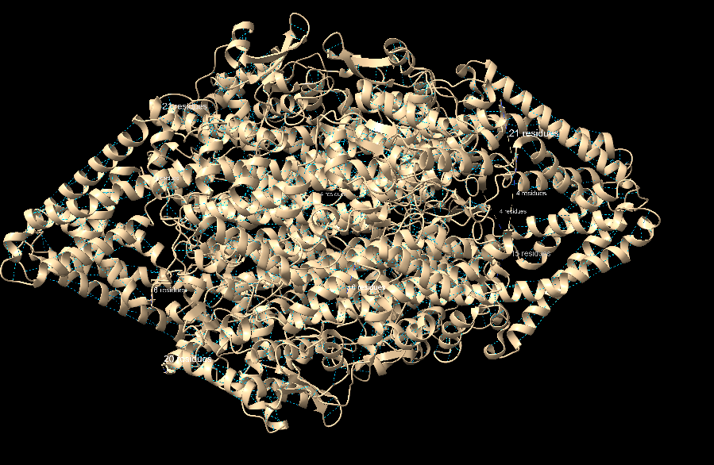
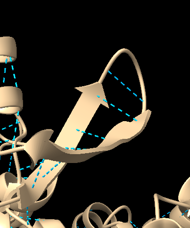
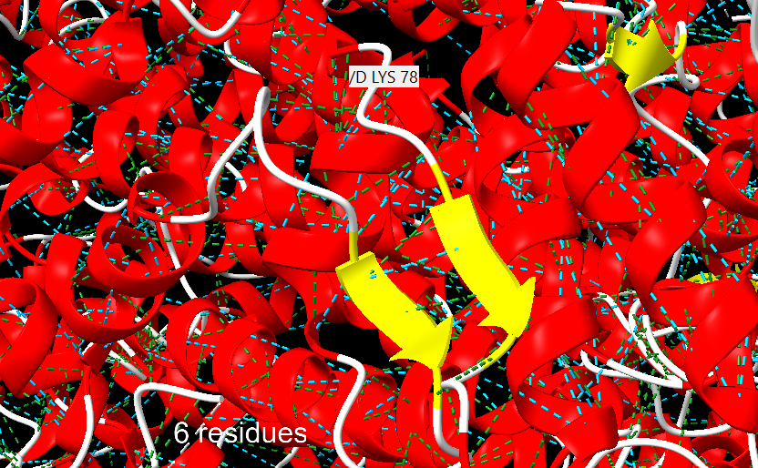

<h1> Anàlixi de les relacions structura-funció de la proteïna fenilalanina/tirosina amoníolasa (PAL) </h1>


- [Introducció](#introducció)
- [Sobre la proteïna](#sobre-la-proteïna)
  - [Cerca de la seqüència a UNIPROT](#cerca-de-la-seqüència-a-uniprot)
  - [Estructura de la proteïna (PDB o AlphaFold2)](#estructura-de-la-proteïna-pdb-o-alphafold2)
  - [Funció de la proteïna](#funció-de-la-proteïna)
- [Treball amb ChimeraX](#treball-amb-chimerax)
  - [Anàlisi d'estructures secundàries](#anàlisi-destructures-secundàries)
      - [Hèlix alfa:](#hèlix-alfa)
      - [Full beta](#full-beta)
  - [Anàlisi d'estructures supersecundàries](#anàlisi-destructures-supersecundàries)
  - [Estructura terciària (Plegament i SCOP) i estructura quaternària](#estructura-terciària-plegament-i-scop-i-estructura-quaternària)
- [Funció de la proteïna](#funció-de-la-proteïna-1)
  - [Centre actiu i residus rellevants](#centre-actiu-i-residus-rellevants)
  - [Funció biològica i mecanisme d'acció](#funció-biològica-i-mecanisme-dacció)
  - [Relació seqüència-estructura-funció](#relació-seqüència-estructura-funció)


---
# Introducció

En aquesta pràctica es va dur a terme un anàlisi detallat de la proteïna PAL (Phenylalanine Ammonia Lyase) de Rhodotorula toruloides, un llevat. 

L'objectiu principal va ser estudiar a partir de la seqüència d'una proteïna, l'estructura i la funció utilitzant eines bioinformàtiques com UNIPROT, Protein Data Bank (PDB) i ChimeraX. A més, es va explorar la relació entre la seqüència, l'estructura i la funció de la proteïna.

La seqüència proporcionada va estar:

```fasta
MAPSLDSISHSFANGVASAKQAVNGASTNLAVAGSHLPTTQVTQVDIVEKMLAAPTDSTLELDGYSLNLGDVVSAARKGRPVRVKDSDEIRSKIDKSVEFLRSQLSMSVYGVTTGFGGSADTRTEDAISLQKALLEHQLCGVLPSSFDSFRLGRGLENSLPLEVVRGAMTIRVNSLTRGHSAVRLVVLEALTNFLNHGITPIVPLRGTISASGDLSPLSYIAAAISGHPDSKVHVVHEGKEKILYAREAMALFNLEPVVLGPKEGLGLVNGTAVSASMATLALHDAHMLSLLSQSLTAMTVEAMVGHAGSFHPFLHDVTRPHPTQIEVAGNIRKLLEGSRFAVHHEEEVKVKDDEGILRQDRYPLRTSPQWLGPLVSDLIHAHAVLTIEAGQSTTDNPLIDVENKTSHHGGNFQAAAVANTMEKTRLGLAQIGKLNFTQLTEMLNAGMNRGLPSCLAAEDPSLSYHCKGLDIAAAAYTSELGHLANPVTTHVQPAEMANQAVNSLALISARRTTESNDVLSLLLATHLYCVLQAIDLRAIEFEFKKQFGPAIVSLIDQHFGSAMTGSNLRDELVEKVNKTLAKRLEQTNSYDLVPRWHDAFSFAAGTVVEVLSSTSLSLAAVNAWKVAAAESAISLTRQVRETFWSAASTSSPALSYLSPRTQILYAFVREELGVKARRGDVFLGKQEVTIGSNVSKIYEAIKSGRINNVLLKMLA
```


---

# Sobre la proteïna


## Cerca de la seqüència a UNIPROT

La seqüència de la proteïna PAL es va cercar a la base de dades UNIPROT realitzant un blast. El codi de la proteïna és: [P11544](https://www.uniprot.org/uniprotkb/P11544/entry1). Aquesta proteïna pertany al llevat Rhodotorula toruloides i la seva classificació enzimàtica és [EC 4.3.1.24](#https://www.brenda-enzymes.org/enzyme.php?ecno=4.3.1.24&UniProtAcc=P11544&OrganismID=5424) i [EC 4.3.1.25](#https://www.brenda-enzymes.org/enzyme.php?ecno=4.3.1.25&UniProtAcc=P11544&OrganismID=5424).

## Estructura de la proteïna (PDB o AlphaFold2)

L'estructura tridimensional de la proteïna es va trobar a la base de dades PDB sota el codi [1Y2M](#https://www.rcsb.org/structure/1Y2M), sent aquesta la estructura de major resolució disponible. 


## Funció de la proteïna

Es va determinar que la proteïna porta a terme una desaminació no oxidativa, eliminant el grup amino dels aminoàcids L-fenilalanina i L-tirosina sense involucrar processos d'oxidació. Com a resultat, la L-fenilalanina es transforma en àcid trans-cinàmic i la L-tirosina en àcid p-cumàric.


# Treball amb ChimeraX

## Anàlisi d'estructures secundàries

Per tal de detectar les estructures secundaries, determinar el tipus i la localització s'ha fet servir l'arxiu PDB de l'estrcutura d ela proteína ( [1Y2M](#https://www.rcsb.org/structure/1Y2M)). S'ha extret la longitud de l'estructura i la posició d'inici i fi.

#### Hèlix alfa:

| Hèlix nº | Inici         | Fi            | Longitud |
|----------|---------------|---------------|----------|
| 1        | ASN A 29      | GLY A 34      | 6        |
| 2        | THR A 43      | ALA A 53      | 11       |
| 3        | ASN A 68      | LYS A 78      | 11       |
| 4        | SER A 87      | ARG A 102     | 16       |
| 5        | THR A 124     | LEU A 139     | 16       |
| 6        | SER A 146     | PHE A 150     | 5        |
| 7        | PRO A 161     | THR A 177     | 17       |
| 8        | ARG A 184     | HIS A 197     | 14       |
| 9        | ASP A 214     | SER A 226     | 13       |
| 10       | ALA A 246     | PHE A 253     | 8        |
| 11       | LYS A 263     | ASN A 270     | 8        |
| 12       | THR A 272     | MSE A 304     | 33       |
| 13       | HIS A 307     | HIS A 316     | 10       |
| 14       | HIS A 322     | GLU A 337     | 16       |
| 15       | HIS A 344     | VAL A 349     | 6        |
| 16       | ARG A 362     | THR A 367     | 6        |
| 17       | THR A 367     | GLN A 392     | 26       |
| 18       | ALA A 415     | LEU A 444     | 30       |
| 19       | PRO A 453     | ALA A 457     | 5        |
| 20       | ASP A 460     | SER A 464     | 5        |
| 21       | CYS A 467     | ALA A 485     | 19       |
| 22       | VAL A 488     | VAL A 492     | 5        |
| 23       | LEU A 505     | GLY A 561     | 57       |
| 24       | ASN A 568     | GLU A 586     | 19       |
| 25       | ASP A 592     | LEU A 612     | 21       |
| 26       | SER A 618     | ALA A 647     | 30       |
| 27       | ALA A 648     | TYR A 657     | 10       |
| 28       | ARG A 661     | GLU A 671     | 11       |
| 29       | GLY A 680     | GLY A 685     | 6        |
| 30       | THR A 690     | SER A 704     | 15       |
| 31       | ILE A 707     | LEU A 715     | 9        |
| 32       | ASN B 29      | GLY B 34      | 6        |
| 33       | THR B 43      | ALA B 53      | 11       |
| 34       | ASN B 68      | LYS B 78      | 11       |
| 35       | SER B 87      | SER B 108     | 22       |
| 36       | THR B 124     | LEU B 139     | 16       |
| 37       | SER B 146     | PHE B 150     | 5        |
| 38       | PRO B 161     | THR B 177     | 17       |
| 39       | ARG B 184     | GLY B 198     | 15       |
| 40       | ASP B 214     | SER B 226     | 13       |
| 41       | ALA B 246     | PHE B 253     | 8        |
| 42       | LYS B 263     | ASN B 270     | 8        |
| 43       | THR B 272     | MSE B 304     | 33       |
| 44       | HIS B 307     | HIS B 316     | 10       |
| 45       | HIS B 322     | GLU B 337     | 16       |
| 46       | HIS B 344     | VAL B 349     | 6        |
| 47       | ARG B 362     | THR B 367     | 6        |
| 48       | THR B 367     | GLN B 392     | 26       |
| 49       | ALA B 415     | LEU B 444     | 30       |
| 50       | PRO B 453     | ALA B 457     | 5        |
| 51       | ASP B 460     | SER B 464     | 5        |
| 52       | CYS B 467     | ALA B 485     | 19       |
| 53       | VAL B 488     | VAL B 492     | 5        |
| 54       | LEU B 505     | GLY B 561     | 57       |
| 55       | LEU B 569     | THR B 588     | 20       |
| 56       | ASP B 592     | LEU B 612     | 21       |
| 57       | SER B 618     | ALA B 647     | 30       |
| 58       | ALA B 648     | TYR B 657     | 10       |
| 59       | ARG B 661     | GLU B 671     | 11       |
| 60       | GLY B 680     | GLY B 685     | 6        |
| 61       | THR B 690     | SER B 704     | 15       |
| 62       | ILE B 707     | LEU B 715     | 9        |
| 63       | ASN C 29      | GLY C 34      | 6        |
| 64       | THR C 43      | ALA C 53      | 11       |
| 65       | ASN C 68      | LYS C 78      | 11       |
| 66       | SER C 87      | SER C 103     | 17       |
| 67       | GLU C 125     | LEU C 139     | 15       |
| 68       | SER C 146     | PHE C 150     | 5        |
| 69       | PRO C 161     | THR C 177     | 17       |
| 70       | ARG C 184     | GLY C 198     | 15       |
| 71       | ASP C 214     | SER C 226     | 13       |
| 72       | ALA C 246     | PHE C 253     | 8        |
| 73       | LYS C 263     | ASN C 270     | 8        |
| 74       | THR C 272     | MSE C 304     | 33       |
| 75       | HIS C 307     | HIS C 316     | 10       |
| 76       | HIS C 322     | GLU C 337     | 16       |
| 77       | ARG C 362     | THR C 367     | 6        |
| 78       | THR C 367     | GLN C 392     | 26       |
| 79       | ALA C 415     | LEU C 444     | 30       |
| 80       | PRO C 453     | ALA C 457     | 5        |
| 81       | ASP C 460     | SER C 464     | 5        |
| 82       | CYS C 467     | ALA C 485     | 19       |
| 83       | VAL C 488     | VAL C 492     | 5        |
| 84       | LEU C 505     | THR C 565     | 61       |
| 85       | ASN C 568     | GLU C 586     | 19       |
| 86       | ASP C 592     | LEU C 612     | 21       |
| 87       | SER C 618     | SER C 646     | 29       |
| 88       | ALA C 648     | TYR C 657     | 10       |
| 89       | ARG C 661     | GLU C 671     | 11       |
| 90       | GLY C 680     | GLY C 685     | 6        |
| 91       | THR C 690     | SER C 704     | 15       |
| 92       | ILE C 707     | ALA C 716     | 10       |
| 93       | THR D 43      | ALA D 53      | 11       |
| 94       | ASN D 68      | LYS D 78      | 11       |
| 95       | SER D 87      | SER D 103     | 17       |
| 96       | THR D 124     | LEU D 139     | 16       |
| 97       | SER D 146     | PHE D 150     | 5        |
| 98       | PRO D 161     | THR D 177     | 17       |
| 99       | ARG D 184     | HIS D 197     | 14       |
| 100      | ASP D 214     | SER D 226     | 13       |
| 101      | ALA D 246     | PHE D 253     | 8        |
| 102      | LYS D 263     | ASN D 270     | 8        |
| 103      | THR D 272     | MSE D 304     | 33       |
| 104      | HIS D 307     | HIS D 316     | 10       |
| 105      | HIS D 322     | GLU D 337     | 16       |
| 106      | HIS D 344     | VAL D 349     | 6        |
| 107      | ARG D 362     | THR D 367     | 6        |
| 108      | THR D 367     | GLN D 392     | 26       |
| 109      | ALA D 415     | LEU D 444     | 30       |
| 110      | PRO D 453     | ALA D 457     | 5        |
| 111      | ASP D 460     | SER D 464     | 5        |
| 112      | CYS D 467     | ALA D 485     | 19       |
| 113      | LEU D 505     | THR D 565     | 61       |
| 114      | LEU D 569     | GLU D 586     | 18       |
| 115      | ASP D 592     | LEU D 612     | 21       |
| 116      | SER D 618     | SER D 646     | 29       |
| 117      | ALA D 648     | TYR D 657     | 5        |
| 118      | SER D 659     | GLU D 671     | 13       |
| 119      | GLY D 680     | GLY D 685     | 6        |
| 120      | THR D 690     | SER D 704     | 15       |
| 121      | ILE D 707     | ALA D 716     | 10       |


#### Full beta 

| Fulla Beta | Núm. Strand | Cadena | Residus inici | Residus final |
|------------|-------------|--------|---------------|---------------|
| A          | 1           | A      | LEU 60        | LEU 62        |
| A          | 2           | A      | VAL 82        | VAL 84        |
| B          | 1           | A      | THR 200       | PRO 201       |
| B          | 2           | A      | LYS 232       | HIS 237       |
| B          | 3           | A      | LYS 240       | TYR 245       |
| C          | 1           | A      | LEU 399       | ASP 401       |
| C          | 2           | A      | THR 406       | HIS 408       |
| D          | 1           | B      | LEU 60        | LEU 62        |
| D          | 2           | B      | VAL 82        | VAL 84        |
| E          | 1           | B      | THR 200       | PRO 201       |
| E          | 2           | B      | LYS 232       | HIS 237       |
| E          | 3           | B      | LYS 240       | TYR 245       |
| F          | 1           | B      | LEU 399       | ASP 401       |
| F          | 2           | B      | THR 406       | HIS 408       |
| G          | 1           | C      | LEU 60        | LEU 62        |
| G          | 2           | C      | VAL 82        | VAL 84        |
| H          | 1           | C      | THR 200       | PRO 201       |
| H          | 2           | C      | LYS 232       | HIS 237       |
| H          | 3           | C      | LYS 240       | TYR 245       |
| I          | 1           | C      | LEU 399       | ASP 401       |
| I          | 2           | C      | THR 406       | HIS 408       |
| J          | 1           | D      | LEU 60        | LEU 62        |
| J          | 2           | D      | VAL 82        | VAL 84        |
| K          | 1           | D      | THR 200       | PRO 201       |
| K          | 2           | D      | LYS 232       | HIS 237       |
| K          | 3           | D      | LYS 240       | TYR 245       |
| L          | 1           | D      | LEU 399       | ASP 401       |
| L          | 2           | D      | THR 406       | HIS 408       |


En color blau trobem els ponts d’hidrogen que presenta en aquest cas 8950. Els ponts d’hidrogen són interaccions clau que estabilitzen les estructures secundàries, aquests es produeixen entre un àtom d’hidrogen d’un grup amida i l’àtom d’oxigen carbonil d’un residu en la cadena polipeptídica.





En les hèlix alfa, aquests ponts es formen entre el grup carbonil d’un residu i el grup amino d’un altre residu, normalment quatre posicions més endavant. Això crea un patró helicoidal repetitiu que aporta estabilitat i rigidesa a la hèlix.


En canvi, en les fulles beta, els ponts d'hidrogen es formen entre els residus de cadenes laterals, que poden estar disposats de manera paral·lela o antiparal·lela. Les fulles antiparal·leles solen tenir ponts més estables i regulars, mentre que en les paral·leles la disposició pot ser una mica menys ordenada, tot i que també contribueix a la rigidesa de l'estructura.

Les interaccions clau que estabilitzen aquestes estructures son els ponts d’hidrogen, les forçes de Van der Waals i les interaccions hidrofòbiques. Aquests son els detalls fundamentals per tal d’entendre la estabilitat i funcionalitat de la proteïna. 





## Anàlisi d'estructures supersecundàries

Seguint amb el programa ChimeraX s'han analitzat les estructures supersecundàries trobades:

A la imatge es poden veure els ponts d’hidrogen en color blau i les forçes de van der Waals en color verd. 
També s'observa l'estructura hèlix α de color vermell, l'estructura full β de color groc i els llaços i girs de color blanc.


Tot i que es poden identificar motius d’estructura supersecundària, aquests consisteixen en combinacions d’hèlixs α i fulles β que s’organitzen en patrons regulars i estables per formar estructures més complexes, sense arribar a constituir per si mateixes una estructura terciària completa. En la lisozima C (1Y2M), es poden destacar els següents motius:

1. Motius β-α-β:
   Consisteixen en una fulla β seguida d’una hèlix α i una altra fulla β. La seva estabilitat s’aconsegueix gràcies als ponts d’hidrogen entre les fulles β i a les interaccions hidrofòbiques amb l’hèlix.


      


2. Gir β (Beta Turn):
   Representa una connexió breu entre dues fulles β antiparal·leles, estabilitzada per ponts d’hidrogen interns i interaccions dipol–dipol.


      


## Estructura terciària (Plegament i SCOP) i estructura quaternària

L'estructura terciària de la proteïna 1Y2M correspon a un plegament de tipus "Lisozima-like", segons la base de dades SCOPe. 

Aquest tipus de plegament pertany a la classe de proteïnes "α i β (a/b)", caracteritzades per la presència d'hèlixs α i fulles β disposades de manera específica per formar el nucli estructural.

Segons la classificació de SCOPe, la jerarquia per al plegament de la lisozima C és la següent:
   - Classe: α i β (a/b)
   - Plegament: Lisozima-like
   - Superfamília: Lisozima-like
   - Família: Lisozima C
   - Proteïna: Lisozima C
   - Espècie: Gallus gallus (ou de gallina)


La lisozima C és una proteïna monomèrica, la qual cosa significa que la seva forma funcional està constituïda per una sola cadena polipeptídica. Per tant, no presenta estructura quaternària com sí que ho fan altres proteïnes que necessiten diverses subunitats per a la seva funció biològica ja  que no s'associa amb altres cadenes per formar complexes multimerics. La estructura quaternària es refereix a la disposició d'unitats polipeptídiques en un complex proteic, és a dir, quan diverses cadenes polipeptídiques interactuen per formar una proteïna funcional.


# Funció de la proteïna

## Centre actiu i residus rellevants

El centre actiu de l'enzim PAL té el grup MIO (4-methylidene-imidazole-5-one), que és essencial per a la seva activitat. 

Al voltant d'aquest centre hi ha un bucle flexible format pels residus 102 a 124, que actua com una porta per al substrat. Els residus Tyr110 i Arg123 són molt importants. 

El residu Tyr110 és clau perquè, si es canvia, l'enzim perd la seva funció. Probablement ajuda a fixar o orientar el substrat amb ponts d'hidrogen o altres interaccions. 

El residu Arg123 també ajuda a mantenir la forma correcta del centre actiu mitjançant interaccions electrostàtiques i de Van der Waals. 

Tot i que a la estructura PDB no es veu cap substrat o inhibidor, segons la literatura, el substrat es connectaria al centre actiu a través d'aquestes mateixes interaccions, que són necessàries per a una bona fixació i reacció.


## Funció biològica i mecanisme d'acció

La funció de la proteïna PAL és fer una reacció de desaminació no oxidativa. Aquesta reacció elimina el grup amino de la fenilalanina, amb l'ajuda del cofactor MIO. 

El bucle flexible permet que el substrat entri al centre actiu, on les interaccions amb els residus clau asseguren que el substrat estigui ben col·locat per a la reacció.

Això transforma la L-fenilalanina en àcid trans-cinàmic i la L-tirosina en àcid p-cumàric, compostos que són importants en la via dels fenilpropanoides.


En el programa ChimeraX no es pot veure el centre actiu ni els residus importants. Al buscar els residus Tyr110 i Arg123 no apareixen. Com es pot veure a la imatge els dos residus marcats amb color groc no esta present a la estructura.

    


 
Això pot ser degut a flexibilitat del centre actiu i a la mobilitat del bucle que l'envolta (amb els residus importants) durant el procés de cristal·lització o perquè quan es van recollir les dades, la reacció ja havia ocorregut. 

## Relació seqüència-estructura-funció

La seqüència de la proteïna PAL permet que es formi el cofactor MIO de manera automàtica. Aquesta seqüència també fa que el centre actiu tingui la forma adequada i que el bucle flexible controli l'accés al centre catalític. 

Els residus Tyr110 i Arg123 són essencials per a la funció de l'enzim, ja que ajuden a mantenir la seva activitat i estabilitat. 

Canvis en la seqüència, com la mutació R91K, poden millorar l'estabilitat sense afectar el centre actiu. Això demostra com la seqüència influeix en l'estructura.

Altres variants de la proteïna també tenen implicacions funcionals importants. Les mutacions en els residus Tyr110 o Arg123 poden eliminar l'activitat enzimàtica, demostrant que aquests residus són crítics per al centre actiu.

S'han realitzat intents de reduir la mida de la proteïna, però aquests experiments van mostrar que les formes truncades, tot i tenir una bona expressió, no conserven l'activitat enzimàtica.