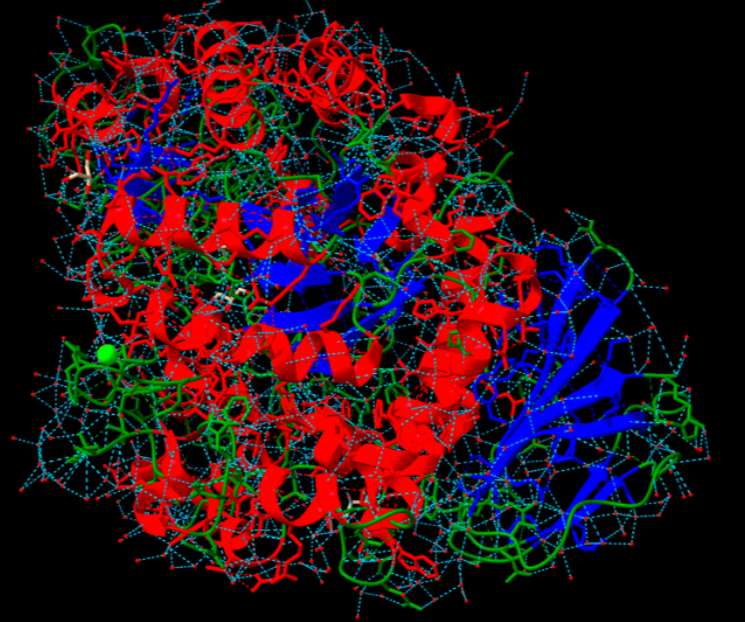
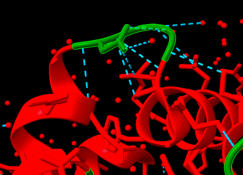
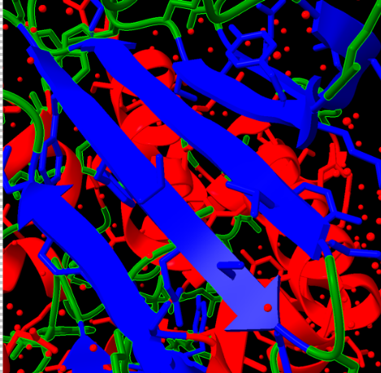

 
# PRÀCTICA 1
## Relacions estructura-funció de proteïnes
### Queralt Datzira, Elsa Gutiérrez i Ariadna Parisi

- [PRÀCTICA 1](#pràctica-1)
  - [Relacions estructura-funció de proteïnes](#relacions-estructura-funció-de-proteïnes)
    - [Queralt Datzira, Elsa Gutiérrez i Ariadna Parisi](#queralt-datzira-elsa-gutiérrez-i-ariadna-parisi)
- [Informació sobre la proteïna](#informació-sobre-la-proteïna)
- [Estructura de la proteïna](#estructura-de-la-proteïna)
  - [Treball amb ChimeraX](#treball-amb-chimerax)
    - [Tipus d'estructures secundàries detectades](#tipus-destructures-secundàries-detectades)
  - [Motius de l'estructura supersecundària](#motius-de-lestructura-supersecundària)
  - [Estructura terciària i classificació SCOP](#estructura-terciària-i-classificació-scop)
- [Funció de la proteïna](#funció-de-la-proteïna)
  - [Localització del centre actiu](#localització-del-centre-actiu)
    - [Residus rellevants](#residus-rellevants)
    - [Substrats i inhibidors](#substrats-i-inhibidors)
    - [Interaccions entre residus del centre actiu i substrat/inhibidor](#interaccions-entre-residus-del-centre-actiu-i-substratinhibidor)
        - [Ponts salins](#ponts-salins)
        - [Ponts d’hidrogen](#ponts-dhidrogen)
        - [Interaccions aromàtiques](#interaccions-aromàtiques)
  - [Funció de la proteïna i mecanisme de reacció](#funció-de-la-proteïna-i-mecanisme-de-reacció)
  - [Relació seqüència-estructura-funció](#relació-seqüència-estructura-funció)
    - [Residus clau per a la funció](#residus-clau-per-a-la-funció)
    - [Variants de la proteïna i efectes funcionals](#variants-de-la-proteïna-i-efectes-funcionals)

# Informació sobre la proteïna
La proteïna estudiada és **l'enzim isomerasa de sacarosa**, més concretament el gen **mutB** d'aquest enzim.
El codi Uniprot d'aquest enzim: [**M1E1F7**](https://www.uniprot.org/uniprotkb/M1E1F7/entry) i al tractar-se d'un enzim torbem també codi Brenda: [**EC.5.4.99.11**](https://www.brenda-enzymes.org/enzyme.php?ecno=5.4.99.11).
El codi PDB: [**4H2C**](https://www.rcsb.org/structure/4H2C), ens determina que només hi ha una estructura a 1,70Å vàlida.

La seqüència de la proteïna és: 

```fasta
>4H2C_1|Chain A|Sucrose isomerase|Rhizobium (1071045)
KPGAPWWKSAVFYQVYPRSFKDTNGDGIGDFKGLTEKLDYLKGLGIDAIWINPHYASPNTDNGYDISDYREVMKEYGTMEDFDRLMAELKKRGMRLMVDVVINHSSDQHEWFKSSRASKDNPYRDYYFWRDGKDGHEPNNYPSFFGGSAWEKDPVTGQYYLHYFGRQQPDLNWDTPKLREELYAMLRFWLDKGVSGMRFDTVATYSKTPGFPDLTPEQMKNFAEAYTQGPNLHRYLQEMHEKVFDHYDAVTAGEIFGAPLNQVPLFIDSRRKELDMAFTFDLICYDRALDRWHTIPRTLADFRQTIDKVDAIAGEYGWNTFFLGNHDNPRAVSHFGDDRPQWREASAKALATVTLTQRGTPFIFQGDELGMTNYPFKTLQDFDDIEVKGFFQDYVETGKATAEELLTNVALTSRDNARTPFQWDDSANAGFTTGKPWLKVNPNYTEINAAREIGDPKSVYSFYRNLISIRHETPALSTGSYRDIDPSNADVYAYTRSQDGETYLVVVNFKAEPRSFTLPDGMHIAETLIESSSPAAPAAGAASLELQPWQSGIYKVK
```
 
# Estructura de la proteïna
## Treball amb ChimeraX
### Tipus d'estructures secundàries detectades
Hem diferenciat les següents estructures secundàries en la proteïna:

- **Hèlix alfa**:
  - **Hèlix 3₁₀:** Més compacta, amb 3 residus per volta i ponts d’hidrogen entre residus separats per 3 posicions.
  - **Hèlix α:** La més comuna, amb 3.6 residus per volta estabilitzada per ponts d’hidrogen entre el C=O d’un residu i el N-H del residu situat 4 posicions més endavant.

- **Fulles beta:**
  - **Tipus 0:** Cadenes perfectament alineades sense desplaçament.
  - **Tipus 1:** Desplaçament d'un residu entre les cadenes.
  - **Tipus -1:** Desplaçament en direcció oposada.

- **Llaços:** 7 llaços connectant estructures secundàries i permeten canvis de direcció.

<figure>
  
  <figcaption>Figura 1: Estructura de la proteïna amb els ponts d'hidrogen marcats.</figcaption>
</figure>

Identifiquem 3158 **Ponts d'hidrogen interns** en total.
  - Que formen part d'**Hèlix alfa:** 838
  - Que formen part de **Fulles beta:** 273
  - I la resta, formen part d' **Altres interaccions:** 2047 (llaços, aigua, subunitats, etc.)

Per una millor visualització, hem assignat colors: vermell per a les hèlixs, blau per a les fulles i verd per als llaços.

<figure>
  
  <figcaption>Figura 2: Estructura de la porteïna amb diferenciació de colors segons les estructures.</figcaption>
</figure>

## Motius de l'estructura supersecundària
El motiu detectat és **helix-turn-helix**, freqüent en factors de transcripció.

<figure>
  
  <figcaption>Figura 3: Visualització d'un motiu helix-turn-helix a l'estructura de la proteïna.</figcaption>
</figure>

<figure>
  
  <figcaption>Figura 4: Motiu helix-turn-helix amb les interaccions ponts d'hidrogen marcats.</figcaption>
</figure>

Aquest motiu **beta-loop** és comú en estructures beta i permet la connexió entre dues làmines beta antiparal·leles mitjançant un gir.

<figure>
  
  <figcaption>Figura 5: Visualització d'un motiu beta-loop a l'estructura de la proteïna.</figcaption>
</figure>

<figure>
  
  <figcaption>Figura 6: Motiu beta-loop amb les interaccions ponts d'hidrogen marcats.</figcaption>
</figure>


Trobem **Interaccions estabilitzadores** com: 
  - **Ponts d’hidrogen** , els observem a través de les línies blaves discontínues i estabilitzen aquestes estructures.
  - **Interaccions van der Waals** entre diferents elements estructurals.

## Estructura terciària i classificació SCOP
L'estructura terciària es caracteritza per un **plegament globular** amb una disposició de **barrel α/β**, típic de les **isomerases de sucrosa**.

- **Codi SCOP:** `a.118.1.2`
- **Jerarquia SCOP:**
  - **Classe:** Proteïnes α/β
  - **Plegament:** Barrel α/β tancat
  - **Superfamília:** Barrel tipus isomerasa
  - **Família:** Barrel tipus isomerasa
  - **Proteïna:** Sucrose isomerase

Aquesta proteïna **no té una estructura quaternària**, ja que es presenta com una **proteïna monomèrica** i no forma complexos amb altres cadenes polipeptídiques.


# Funció de la proteïna
## Localització del centre actiu
El centre actiu de la proteïna es localitza al **domini A** i té forma de **butxaca**.

<figure>
  
  <figcaption>Figura 7: Centre actiu de l'enzim localitzat al domini A.</figcaption>
</figure>

### Residus rellevants
- **Un residu nucleòfil**
- **El residu que actua com a àcid/base general**: Glu254

<figure>
  
  <figcaption>Figura 8: Residu àcid/base de la cadena A de l'enzim isomerasa de sacarosa identificat com Glu254.</figcaption>
</figure>

- **El residu que estabilitza l'estat de transició**: Asp327 *(No localitzable per la cristal·lografia de raigs X)*

### Substrats i inhibidors
- **Substrat**: La **sacarosa**, que es transforma per una reacció d’isomerització a **isomaltulosa** i **trehalulosa**.
- **Inhibidors**:
  - **Glucosa**: Quan està unida al centre actiu, impedeix la unió del substrat i bloqueja la reacció.
  - **Deoxynojirimycin**: Mencionat com a possible inhibidor, però sense activitat inhibidora demostrada.

### Interaccions entre residus del centre actiu i substrat/inhibidor
##### Ponts salins
- **Arg414 - Asp61**
- **Arg414 - Asp384**
- Aquestes interaccions ajuden a mantenir la forma de butxaca funcional.

##### Ponts d’hidrogen
- **Wat4101** (*molècula d’aigua catalítica*) forma enllaços d’hidrogen amb:
  - Asn325
  - Asp327
  - Glu254

##### Interaccions aromàtiques
- **Phe164 i Phe280** estableixen interaccions aromàtiques amb la glucosa.


## Funció de la proteïna i mecanisme de reacció
L'**isomerasa de sacarosa** catalitza la conversió de **sacarosa** en **isomaltulosa** i **trehalulosa** per mitjà d’una **isomerització**, sense trencar la molècula. També pot hidrolitzar la sacarosa en monosacàrids.

<figure>
  
  <figcaption>
    Figura Figura 9: Mecanisme de reacció de l'enzim
    <p><a href="https://journals.iucr.org/paper?S0907444912045532">Acta Crystallographica</a></p>
  </figcaption>
</figure>


## Relació seqüència-estructura-funció

- **Centre actiu en forma de butxaca**: Impedeix l’entrada d’aigua i afavoreix la reacció d’isomerització.
- **Interaccions estabilitzadores**:
  - Ponts salins **(Arg414 - Asp61 - Asp384)** mantenen la forma de la butxaca.
  - **Residus aromàtics (Phe164, Phe280)** controlen la interacció amb el substrat.
  - **Asp327 i Glu254** són essencials per a la funció catalítica.
  - **Residus conservats (Asp61, Phe145, Phe164, Gln168, Arg414)** contribueixen al reconeixement del substrat i estabilització del complex.

### Residus clau per a la funció
- **Asp327 i Glu254**: Participen en la catàlisi mitjançant ponts d’hidrogen.
- **Phe164 i Phe280**: Regulen l’accés del substrat.
- **Arg414, Asp61 i Asp384**: Formen ponts salins per estabilitzar la conformació.

### Variants de la proteïna i efectes funcionals
S'han identificat mutacions en:
- **R284C i F164L**: Afecten el centre actiu, obrint la butxaca i permetent l’entrada d’aigua.
  - Això redueix la capacitat d’isomerització i afavoreix la hidròlisi de la sacarosa en glucosa i fructosa.

<figure>
  
  <figcaption>
    Figura 10: Funcionalitat de les variants de l'enzim
    <p><a href="https://journals.iucr.org/paper?S0907444912045532">Acta Crystallographica</a></p>
  </figcaption>
</figure>
