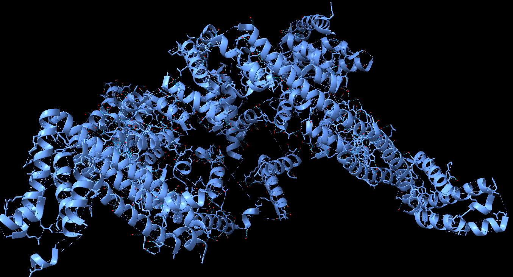
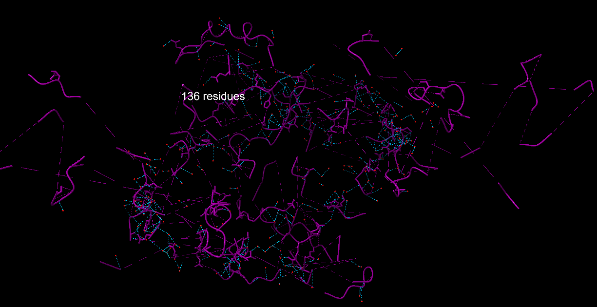
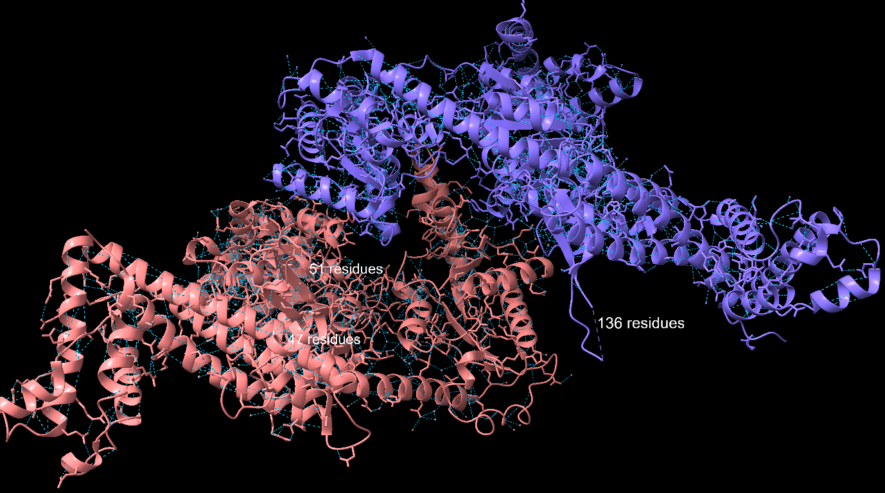
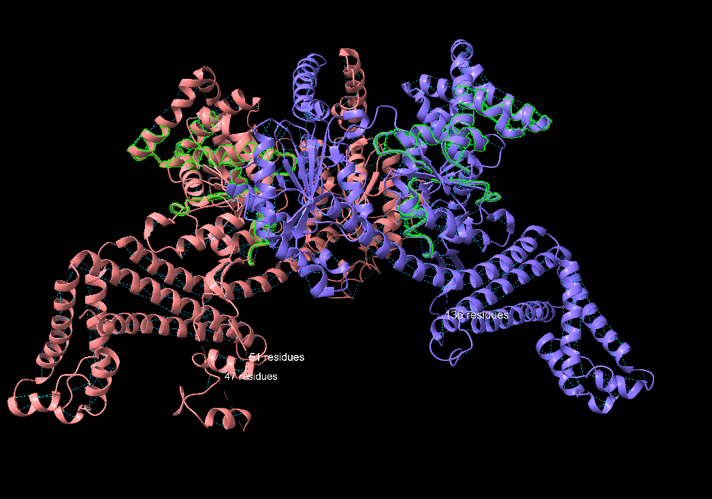
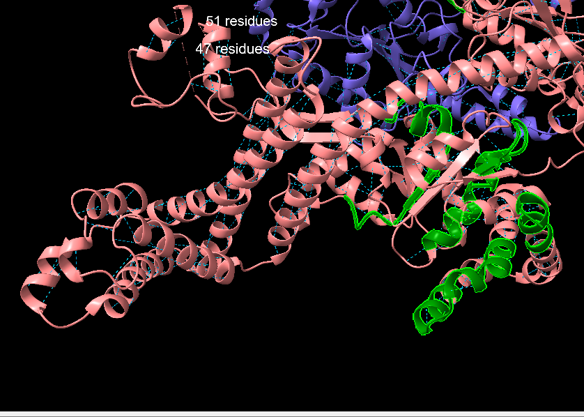
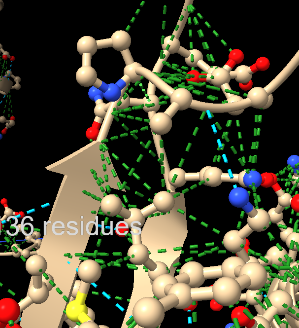
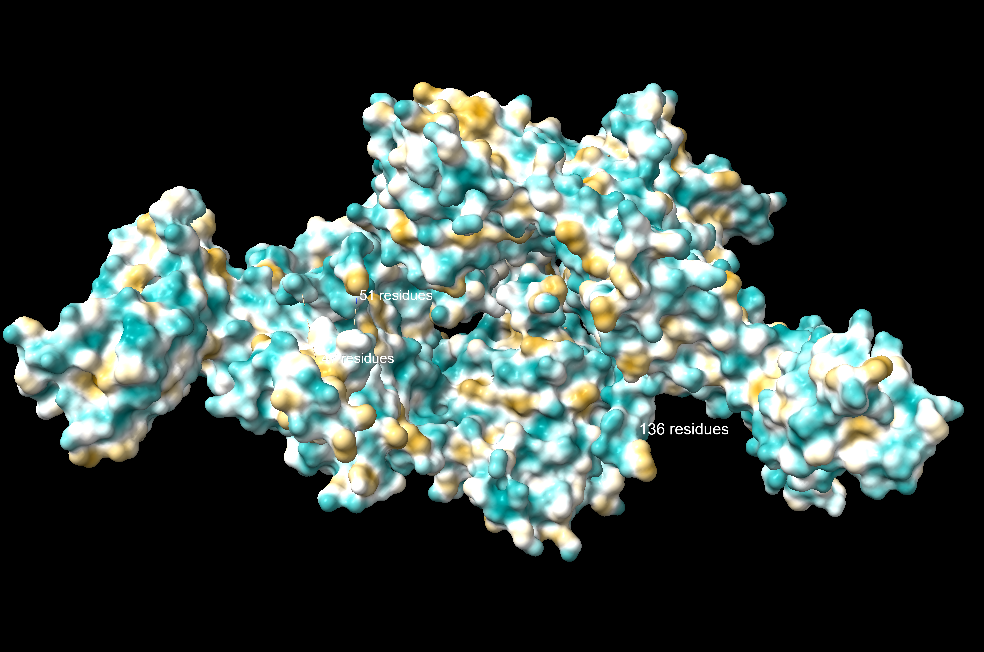
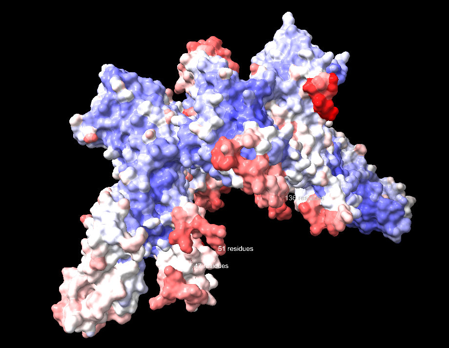
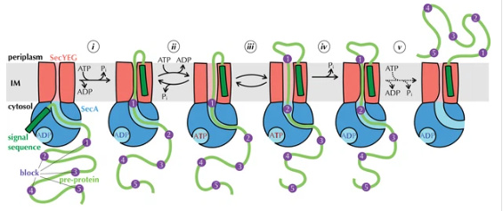

## Pràctica 1. 
### Grup G: Oriol Monte & Ainhoa González
| Seqüencia proteïna: |
|---------|
| MLIKLLTKVFGSRNDRTLRRMRKVVNIINAMEPEMEKLSDEELKGKTAEFRARLEKGEVLENLIPEAFAVVREASKRVFGMRHFDVQLLGGMVLNERCIAEMRTGEGKTLTATLPAYLNALTGKGVHVVTVNDYLAQRDAENNRPLFEFLGLTVGINLPGMPAPAKREAYAADITYGTNNEYGFDYLRDNMAFSPEERVQRKLHYALVDEVDSILIDEARTPLIISGPAEDSSEMYKRVNKIIPHLIRQEKEDSETFQGEGHFSVDEKSRQVNLTERGLVLIEELLVKEGIMDEGESLYSPANIMLMHHVTAALRAHALFTRDVDYIVKDGEVIIVDEHTGRTMQGRRWSDGLHQAVEAKEGVQIQNENQTLASITFQNYFRLYEKLAGMTGTADTEAFEFSSIYKLDTVVVPTNRPMIRKDLPDLVYMTEAEKIQAIIEDIKERTAKGQPVLVGTISIEKSELVSNELTKAGIKHNVLNAKFHANEAAIVAQAGYPAAVTIATNMAGRGTDIVLGGSWQAEVAALENPTAEQIEKIKADWQVRHDAVLEAGGLHIIGTERHESRRIDNQLRGRSGRQGDAGSSRFYLSMEDALMRIFASDRVSGMMRKLGMKPGEAIEHPWVTKAIANAQRKVESRNFDIRKQLLEYDDVANDQRRAIYSQRNELLDVSDVSETINSIREDVFKATIDAYIPPQSLEEMWDIPGLQERLKNDFDLDLPIAEWLDKEPELHEETLRERILAQSIEVYQRKEEVVGAEMMRHFEKGVMLQTLDSLWKEHLAAMDYLRQGIHLRGYAQKDPKQEYKRESFSMFAAMLESLKYEVISTLSKVQVRMPEEVEELEQQRRMEAERLAQMQQLSHQDDDSAAAAALAAQTGERKVGRNDPCPCGSGKKYKQCHGRLQ   |

# Preprotein translocase dimeric ATPase

## Informació sobre la proteïna
**Nom del gen**: secA
**Codi UNIPROT**: P10408
**Clasificació del enzim**: EC 7.4.2.8.
**Codi PDB**: 2FSF

Hi ha més d'una estructura disponible per a la proteïna a estudiar. Per això, fem una cerca amb blastp amb base de dades PDB. Els resultats obtinguts és el codi proporcionat de PDB on el query coverage és juntament amb la identitat de 100%. Aquests valors ens indiquen que tota la seqüència aportada es troba en aquesta estructura. L'enzim pertany a *Escherichia coli*.

**La translocasa de preproteïnes amb activitat ATPasa dimèrica**, correspon a la subunitat **SecA** del sistema Sec en bacteris. SecA és una ATPasa que impulsa la translocació de preproteïnes a través del canal de translocació format pel complex SecYEG a la membrana interna bacteriana utilitzant energia de la hidròlisi d'ATP.

> *Figura 1: Model amb la via explicada A i una a alternativa B per l'activació de SecA

> *Figura 2: Estructura cristalizada Preprotein translocase dimeric ATPase representada amb molècules aigua. Es pot observar que hi ha cadena A (vermell) i cadena B (verd)*

## Estructura proteïna. Treball amb ChimeraX
La proteïna 2FSF és l'estructura cristal·lina de la seca de l'E.coli. És un enzim, i està format per dues cadenes, les quals a ChimeraX anomena A i B. 
Aquesta proteïna té tres tipus destructura secundària, ja que té: fulles beta, hèlixs alfa i beta-girs. Les fulles beta semblen anar en sentit antiparal·lel en algunes parts, mentre que en altres són paral·leles. Té estructures enllaçants. 
Hi ha part de la seqüència de la proteïna que no té estructura secundària, que podem considerar com només la cadena d'aminoàcids a la seva estructura primària.

> *Figura 3: Mostra de l'estructura secundària de la proteïna 2FSF. Representació de les hèlix alfa (blau) amb els ponts d'hidrogen presents (1424).*

> *Figura 4: Mostra de l'estructura secundària de la proteïna 2FSF. Representació de les fulles beta (vermell) amb els ponts d'hidrogen presents (228).*

> *Figura 5: Mostra de l'estructura secundària de la proteïna 2FSF. Representació dels beta-girs (lila) amb els ponts d'hidrogen presents (594).*

### Motius d'estructura supersecundària i interaccions
L'estructura de SecA presenta motius d'estructura supersecundària, com hèlixs α i làmines β organitzades en dominis funcionals. Aquests motius faciliten la interacció de SecA amb altres proteïnes i components de la membrana durant la translocació de preproteïnes.
Les hèlixs α i les làmines β de SecA estan estabilitzades per:
**Ponts d'hidrogen**: Entre els grups carbonil i amino de l'esquelet peptídic.

> *Figura 6: Mostra de l'estructura secundària de la proteïna 2FSF. Representació dels ponts d'hidrogen totals (2544).*

> *Figura 7: Ponts d'hidrogen on estabilitzen l'estructura entre les hèlix alfa i les làmines beta.

> *Figura 8: Regions seleccionades en verd: A:10-20 & :A:50-70 & :A:100-120 & :A:200-220.

> *Figura 9: Zoom in a les regions seleccionades en verd fosfor poden contenir hèlixs embolicades. 

β-hairpin --> EDSYRKQVVIDGETCLLDILDT
P-loop / Walker motif -->	GAGGVGKS
Motius β-α-β --> SAMRDQYMRTGEGFLCVFAINNTKSFEDIHQYREQIKRVKDSDDVPMVL VGNKCDLAARTVESRQAQDLARSYGIPYIETSAKTRQGVEDAFYTLVREIR

**Interaccions de Van der Waals**: Entre les cadenes laterals dels aminoàcids propers.

L'estructura terciària de SecA es caracteritza per dominis rics en hèlixs α i làmines β, formant una arquitectura complexa que facilita la seva funció com a motor ATPàsic en la translocació de proteïnes. 
SecA funciona com a dímer en el seu estat actiu. Aquesta estructura és quaternària i és molt important per a la seva funció en la translocació de proteïnes, ja que permet la interacció eficient amb el complex de translocació SecYEG i la translocació efectiva de preproteïnes a través de la membrana citoplasmàtica

### Cerca del plegament a la base de dades SCOP

La proteïna es classifica de la següent manera dins de SCOP:
1. Classe g: Small proteins [56992] → Proteïnes petites que depenen d’ions metàl·lics o ponts disulfur per a la seva estabilitat.
2. Plegament g.74: Sec-C motif [103641] → Plegament unit a metalls (zinc).
3. Superfamília g.74.1: Sec-C motif [103642] → Conté proteïnes amb funció similar.
4. Família g.74.1.1: Sec-C motif [103643] → Família específica dins de la superfamília.
5. Proteïna: Domini C-terminal de la translocasa de preproteïnes SecA [103644]

> *Figura 10: Dominis segons SCOP. Preprotein translocase SecA C-terminal domain.*

Es tracta d'una proteïna α/β, amb un plegament de tipus G-domain-like, el representant del qual és PDB:1CTQ segons la classificació a SCOP.
A més, forma part de la superfamília P-loop containing nucleotide triosephosphate hydrolases segons CATH.

## Funció de la proteïna

Amb la cerca: https://www.ebi.ac.uk/interpro/protein/UniProt/P10408/#table

Explorem l'entrada per a aquest domini específic: PFAM: PF00071, i observem que es tracta d'una GTPasa. El domini concret Ras està altament distribuït, trobat en més de 1500 arquitectures diferents, vora 2000 espècies.

L'estudi del logo HMM ens mostra una regió molt enriquida en glicines corresponent al P-loop, i també la gran conservació de la Treonina 35 del fitxer PDB (posició 31 en el logo HMM), que és essencial per a la coordinació de l'ió magnesi, que participa en la reacció GTPasa, com es pot apreciar en el centre actiu de la proteïna:

> *Figura 11: Centre actiu

Centre actiu de la proteïna UNIPROT: P10408. S'aprecia que l'ió magnesi està coordinat per 6 àtoms d'oxigen: dos provinents de sengles molècules d'aigua, dos dels fosfats β i γ del GTP, un de la serina 17 i un altre de la treonina 35 (aquests dos residus, altament conservats en les posicions 13 i 31 del logo HMM).

Altres residus altament conservats que s'aprecien al logo PFAM tenen tasques importants en l'activitat de la proteïna Ras.

 
> *Figura 12: Regions Hidrophobiques de la molècula.

> *Figura 13: Ilustració del b-factor de la molècula.

SecA s'uneix a les preproteïnes mitjançant la seva seqüència senyal i regions riques en aminoàcids hidrofòbics, unió on es donara el procés de translocació.

Les molècules d'aigua interaccionen amb SecA mitjançant ponts d'hidrogen i forces de Van der Waals.

Aquestes interaccions són importants per a l'estabilitat de l'estructura de SecA i per a la coordinació d'ions magnesi (Mg²⁺) durant la hidròlisi d'ATP.
- L'ATP s'uneix a SecA en presència d'ions magnesi (Mg²⁺), que són necessaris per a l'activitat ATPasa de SecA.

> *Figura 14: Interacció secA i SecYEG

SecA passa per múltiples estats conformacionals durant el cicle de translocació, que inclouen la unió a ATP, la hidròlisi d'ATP i l'alliberament d'ADP i fosfat inorgànic

SecA també interacciona amb els lípids de la membrana interna, cosa que ajuda a la seva ancoratge i estabilitat durant el procés de translocació.

### Resum de funció i interacció SecA

| Funció/Interacció             |Descripció   |
|--------------------|----------------------------------|
| Unió a preproteïnes  | SecA s'uneix a les preproteïnes mitjançant la seqüència senyal |
| Hidròlisi d'ATP | Utilitza l'energia de la hidròlisi d'ATP per impulsar la translocació |
| Interacció amb SecYEG |   Forma un canal de translocació funcional amb el complex SecYEG  |
| Interacció amb lípids | S'ancora a la membrana interna mitjançant interaccions amb lípids |
|Interacció amb Mg²⁺| Coordina ions magnesi per a l'activitat ATPasa |
|Interacció amb aigua| Forma ponts d'hidrogen i forces de Van der Waals amb molècules d'aigua |

### Bibliografia
NCBI BLAST. (s.d.). WP_139496339 - Protein sequence alignment. National Center for Biotechnology Information. https://blast.ncbi.nlm.nih.gov/Blast.cgi#alnHdr_WP_139496339

UniProt. (s.d.). P10408 - Preprotein translocase subunit SecA (E. coli). UniProt Knowledgebase. https://www.uniprot.org/uniprotkb/P10408/entry

RCSB PDB. (s.d.). Structure of the SecA C-terminal domain (PDB: 2FSF). Research Collaboratory for Structural Bioinformatics. https://www.rcsb.org/structure/2FSF#entity-1

SCOPe. (s.d.). Preprotein translocase SecA C-terminal domain (SunID: 103644). Structural Classification of Proteins — extended (SCOPe). https://scop.berkeley.edu/sunid=103644

InterPro. (s.d.). P10408 - Preprotein translocase subunit SecA (E. coli). European Bioinformatics Institute (EBI). https://www.ebi.ac.uk/interpro/protein/UniProt/P10408/#table

Hendrickson, C., Brawley, D., Boyd, D., Beckwith, J., & Kendall, D. A. (2022). Dynamic interaction of SecA with precursor proteins during bacterial protein translocation. eLife, 11, e77586. https://doi.org/10.7554/eLife.77586

