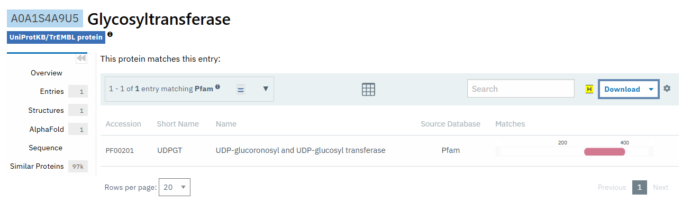

 <head>
    <meta charset="utf-8">
    <title>{{ page.title }}</title>
<script src="https://cdn.jsdelivr.net/npm/babel-polyfill/dist/polyfill.min.js"></script>
    <!-- Web component polyfill (only loads what it needs) -->
<script src="https://cdn.jsdelivr.net/npm/@webcomponents/webcomponentsjs/webcomponents-lite.js" charset="utf-8"></script>
    <!-- Required to polyfill modern browsers as code is ES5 for IE... -->
<script src="https://cdn.jsdelivr.net/npm/@webcomponents/webcomponentsjs/custom-elements-es5-adapter.js" charset="utf-8"></script>

<link rel="stylesheet" type="text/css" href="https://www.ebi.ac.uk/pdbe/pdb-component-library/css/pdbe-molstar-1.2.1.css">
<script type="text/javascript" src="https://www.ebi.ac.uk/pdbe/pdb-component-library/js/pdbe-molstar-component-1.2.1.js"></script>
<style>
        #myViewer{
          float:none;
          width:400px;
          height:400px;
          position:relative;
        }
    </style>
  </head>
  

<h1> Anàlisi de les relacions seqüència-estructura-funció de la proteïna glicosiltransferasa a Nicotiana tabacum (PDB: 8CHD)</h1>

- [Estructura secundària](#estructura-secundària)
- [Estructura supersecundària](#estructura-supersecundària)
- [Plegament](#plegament)
- [Funció](#funció)


 El codi [PDB:8CHD](https://www.rcsb.org/structure/8CHD) correspon a l'estructura de la proteïna glicosiltransferasa,codi [UNIPROT:A0A1S4A9U5](https://www.uniprot.org/uniprot/A0A1S4A9U5), amb una gran conservació de seqüència pel que es pot veure a l'[alineament](https://www.rcsb.org/uniprot/A0A1S4A9U5) que el propi PDB ens dona.
```fasta
>8CHD
MEATQRDGGAQSPTPHVVMLPSPGMGHLIPLLEFAKRLLFLHRFTVTFAIPSGDPPSKAQISILSSLPSGIDYVFLPPVNFHDLPKDTKAGVFIVLAVARSLPSFRDLFKSMVANTNLVALVVDQFGTDAFDVAREFNVSPYIFFPCAAMTLSFLLRLPEFDETVAGEYRELPEPIRLSGCAPIPGKDLAGPFHDRENDAYKLFLHNAKRYALADGIFLNSFPELEPGAIKALLEEESRKPLVHPVGPLVQIDSSGSEEGAECLKWLEEQPHGSVLFVSFGSGGALSSDQINELALGLEMSGHRFIWVVRSPSDEAANASFFSVHSQNDPLSFLPEGFLEGTRGRSVVVPSWAPQAQILSHSSTGGFLSHCGWNSTLESVVYGVPLIAWPLYAEQKMNAILLTEDIKAALRPKINEESGLIEKEEIAEVVKELFEGEDGKRVRAKMEELKDAAVRVLGEDGSSSTLSEVVQKWKRKISG
```

Pots visualitzar la proteïna en aquesta finestra proveïda per [Pdb*](https://www.rcsb.org/3d-view/8chd):

  
## Estructura secundària

L'estructura presenta tant hèlix alfa com fulles beta
La següent figura mostra la seqüència de la proteïna i les regions amb hèlix alfa (blau fluix) i fulles beta (blau fosc)

||
|:--:|
|Imatge de la proteïna mostrant els elements d'estructura secundària.|


||
|:--:|
|Seqüència de la proteïna mostra tota l'estructura amb les diferents estructures secundàries|
## Estructura supersecundària

Malauradament el fitxer PBD no conté massa informació sobre l'estructura secundària i no en podem treure massa profit, en aquest cas.

## Plegament

La glicosiltransferasa amb codi PDB: 8CHD presenta un plegament característic de la superfamília de les nucleotidil-difosfat-sugar transferases. Aquest tipus de plegament es caracteritza per un nucli central format per una làmina β de set filaments, flanquejada per hèlixs α en ambdós costats, formant una estructura $\alpha/\beta$. 
Aquestes característiques són comunes en enzims que catalitzen la transferència de grups glicosil de nucleòtids-sugar activats a acceptors específics, com sucres, lípids o proteïnes.

Pel que fa a l'estructura quaternària, la majoria de les glicosiltransferases funcionen com a monòmers. No obstant això, algunes poden formar dímeres o altres oligòmers per a la seva activitat biològica. En el cas específic de la proteïna 8CHD, les dades cristal·logràfiques suggereixen que aquesta proteïna actua com a monòmer.

## Funció
Podem començar per [cercar a PFAM el codi uniprot de la proteïna](https://www.ebi.ac.uk/interpro/protein/UniProt/A0A1S4A9U5/entry/pfam/#table). Veiem que es tracta d'una proteïna amb un sol domini ben caracteritzat:

||
|:--:|
|Taula resum dels dominis PFAM per al PDB:8CHD, UNIPROT: A0A1S4A9U5|

Podem aleshores explorar l'entrada per a aquest domini específic: PFAM: PF00201, i observem que es tracta d'una UGT. El domini està altament distribuït, trobat en més de [1065 arquitectures de domini](https://www.ebi.ac.uk/interpro/entry/pfam/PF00201/domain_architecture/)

||
|:--:|
|Taula resum dels dominis PFAM per al PDB:8CHD, UNIPROT: A0A1S4A9U5
|

Un cop explorem aquest domini, ens adonem que es tracta d’una UDP-glycosyl transferase. 

Aquesta familia d’enzims catalitza la transferència d’una molècula de glucosa (o altre sucres) des de uridine diphosphate-sugars (UDP-sucres) fins a molècules acceptores, generalment un compost hidroxilat, com un fenol, alcohol, amina o àcid carboxílic. 

​​Aquest procés es coneix com a glucosilació o glicosiltransferència.
Influència processos metabòlics clau, com la modificació de proteïnes i la biosíntesi de metabòlits secundaris.

||
|:--:|
|Imatge d'un exemple de reacció catalitzada per l'enzim PDB:8CHD, UNIPROT: A0A1S4A9U5
|


||
|:--:|
|Centre actiu de la proteïna PDB:8CHD. En aquest cas no es veu definit un ió que destaqui sobre la resta com a centre actiu, però els residus que fan que l'enzim pugui fer la seva funció son els non-standresidues que es troben a diferents punts de l'estructura de l'enzim|

