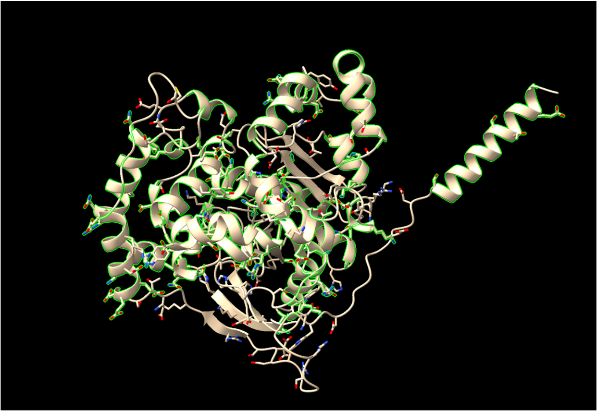

# Pràctica 1. Anàlisi proteïna Microsomal Epoxide Hydrolase 1 (EPHX1)
## Grup J: Baquero Matabacas Laia, Fernández Marín Lidia i Sastre Miralles Mariona

<!--- TOC--->
- [Pràctica 1. Anàlisi proteïna Microsomal Epoxide Hydrolase 1 (EPHX1)](#pràctica-1-anàlisi-proteïna-microsomal-epoxide-hydrolase-1-ephx1)
  - [Grup J: Baquero Matabacas Laia, Fernández Marín Lidia i Sastre Miralles Mariona](#grup-j-baquero-matabacas-laia-fernández-marín-lidia-i-sastre-miralles-mariona)
  - [1. Sobre la proteïna](#1-sobre-la-proteïna)
    - [**Cerqueu la seqüència donada a UNIPROT i trobeu el nom del gen corresponent. Anoteu el codi UNIPROT i també la classificació EC.X.X.X.X, en cas que es tracti d'un enzim, segons la base de dades BRENDA.**](#cerqueu-la-seqüència-donada-a-uniprot-i-trobeu-el-nom-del-gen-corresponent-anoteu-el-codi-uniprot-i-també-la-classificació-ecxxxx-en-cas-que-es-tracti-dun-enzim-segons-la-base-de-dades-brenda)
    - [**Cerqueu a la base de dades del Protein Data Bank si l'estructura de la proteïna és coneguda i, en aquest cas, doneu-ne el codi PDB (si n'hi ha més d'un justifiqueu amb quin treballareu a partir d'aquest punt en base a la resolució de l'experiment on s'ha resolt l'estructura i també la cobertura de seqüència que s'ha fet). En cas que no trobeu la proteïna al PDB, useu la interfície d'Alphafold2 o bé la pròpia base de dades del programa Alphafold2 per trobar una predicció de la seva estructura.**](#cerqueu-a-la-base-de-dades-del-protein-data-bank-si-lestructura-de-la-proteïna-és-coneguda-i-en-aquest-cas-doneu-ne-el-codi-pdb-si-nhi-ha-més-dun-justifiqueu-amb-quin-treballareu-a-partir-daquest-punt-en-base-a-la-resolució-de-lexperiment-on-sha-resolt-lestructura-i-també-la-cobertura-de-seqüència-que-sha-fet-en-cas-que-no-trobeu-la-proteïna-al-pdb-useu-la-interfície-dalphafold2-o-bé-la-pròpia-base-de-dades-del-programa-alphafold2-per-trobar-una-predicció-de-la-seva-estructura)
    - [**Expliqueu breument la funció de la proteïna.**](#expliqueu-breument-la-funció-de-la-proteïna)
  - [2.Treball amb ChimeraX](#2treball-amb-chimerax)
    - [**Obriu l'estructura del PDB amb el programa ChimeraX**](#obriu-lestructura-del-pdb-amb-el-programa-chimerax)
    - [**Detecteu les diferents estructures secundàries de la proteïna i determineu-ne el tipus (fulles, hèlix, llaços i les seves diferents variants). Mireu de descriure amb un cert detall els diferents tipus d'interaccions que podeu trobar dins aquestes estructures secundàries (mostreu els ponts d'hidrogen interns d'aquestes estructures secundàries).**](#detecteu-les-diferents-estructures-secundàries-de-la-proteïna-i-determineu-ne-el-tipus-fulles-hèlix-llaços-i-les-seves-diferents-variants-mireu-de-descriure-amb-un-cert-detall-els-diferents-tipus-dinteraccions-que-podeu-trobar-dins-aquestes-estructures-secundàries-mostreu-els-ponts-dhidrogen-interns-daquestes-estructures-secundàries)
    - [**Podeu detectar-hi motius d'estructura supersecundària? Mostreu les interaccions (ponts d'hidrogen, van der Waals) entre els diferents elements que constitueixen aquestes estructures supersecundàries.**](#podeu-detectar-hi-motius-destructura-supersecundària-mostreu-les-interaccions-ponts-dhidrogen-van-der-waals-entre-els-diferents-elements-que-constitueixen-aquestes-estructures-supersecundàries)
    - [**L'estructura terciària de la proteïna, a quin tipus de plegament correspon? Busqueu el plegament a la base de dades SCOP, anoteu el codi que us dona aquesta base de dades per al plegament i mostreu la jerarquía d'aquest plegament. En cas que existeixi estructura quaternària, discutiu-la també.**](#lestructura-terciària-de-la-proteïna-a-quin-tipus-de-plegament-correspon-busqueu-el-plegament-a-la-base-de-dades-scop-anoteu-el-codi-que-us-dona-aquesta-base-de-dades-per-al-plegament-i-mostreu-la-jerarquía-daquest-plegament-en-cas-que-existeixi-estructura-quaternària-discutiu-la-també)
  - [3.Funció de la proteïna:](#3funció-de-la-proteïna)
    - [**Identifiqueu el centre actiu de la proteïna. Quins residus són rellevants, a partir de la literatura? L'estructura que heu explorat, inclou algun substrat o inhibidor? Podeu descriure les interaccions que presenten entre ells els residus del centre actiu i, eventualment, d'aquests amb el possible substrat/inhibidor (ponts d'hidrogen, van der Waals, càrregues, etc)?**](#identifiqueu-el-centre-actiu-de-la-proteïna-quins-residus-són-rellevants-a-partir-de-la-literatura-lestructura-que-heu-explorat-inclou-algun-substrat-o-inhibidor-podeu-descriure-les-interaccions-que-presenten-entre-ells-els-residus-del-centre-actiu-i-eventualment-daquests-amb-el-possible-substratinhibidor-ponts-dhidrogen-van-der-waals-càrregues-etc)
    - [**Cerqueu informació sobre la funció fa aquesta proteïna?**](#cerqueu-informació-sobre-la-funció-fa-aquesta-proteïna)
    - [**Podeu mostrar el mecanisme detallat que segueix si es tracta d'un enzim? (mireu la figura 6.5.1 d'aquest enllaç per entendre a què ens referim amb el mecanisme de reacció d'un enzim)**](#podeu-mostrar-el-mecanisme-detallat-que-segueix-si-es-tracta-dun-enzim-mireu-la-figura-651-daquest-enllaç-per-entendre-a-què-ens-referim-amb-el-mecanisme-de-reacció-dun-enzim)
    - [**Relació seqüència-estructura-funció: Com relacionaríeu l'estructura que heu analitzat amb la funció de la proteïna?**](#relació-seqüència-estructura-funció-com-relacionaríeu-lestructura-que-heu-analitzat-amb-la-funció-de-la-proteïna)
    - [**Quins elements estructurals participen en aquesta funció? Quins residus en concret són claus per a la funció?**](#quins-elements-estructurals-participen-en-aquesta-funció-quins-residus-en-concret-són-claus-per-a-la-funció)
    - [**Cerqueu eventuals variants de la proteïna que tinguin implicacions funcionals i comenteu els seus efectes a nivell molecular.**](#cerqueu-eventuals-variants-de-la-proteïna-que-tinguin-implicacions-funcionals-i-comenteu-els-seus-efectes-a-nivell-molecular)

<!--- /TOC--->

## 1. Sobre la proteïna

### **Cerqueu la seqüència donada a UNIPROT i trobeu el nom del gen corresponent. Anoteu el codi UNIPROT i també la classificació EC.X.X.X.X, en cas que es tracti d'un enzim, segons la base de dades BRENDA.**

<u>Seqüència donada:</u> 
MWLEILLTSVLGFAIYWFISRDKEETLPLEDGWWGPGTRSAAREDDSIRPFKVETSDEEIHDLHQRIDKFRFTPPLEDSCFHYGFNSNYLKKVISYWRNEFDWKKQVEILNRYPHFKTKIEGLDIHFIHVKPPQLPAGHTPKPLLMVHGWPGSFYEFYKIIPLLTDPKNHGLSDEHVFEVICPSIPGYGFSEASSKKGFNSVATARIFYKLMLRLGFQEFYIQGGDWGSLICTNMAQLVPSHVKGLHLNMALVLSNFSTLTLLLGQRFGRFLGLTERDVELLYPVKEKVFYSLMRESGYMHIQCTKPDTVGSALNDSPVGLAAYILEKFSTWTNTEFRYLEDGGLERKFSLDDLLTNVMLYWTTGTIISSQRFYKENLGQGWMTQKHERMKVYVPTGFSAFPFELLHTPEKWVRFKYPKLISYSYMVRGGHFAAFEEPELLAQDIRKFLSVLERQ

Un cop buscada aquesta seqüència a la base de dades UNIPROT, ens dona com a resultat que la nostra proteïna és la registrada amb el codi P07099 (Microsomal Epixode hydrolase 1) (https://www.uniprot.org/uniprotkb/P07099), amb la classificació EC següent: EC:3.3.2.9 (https://www.brenda-enzymes.org/enzyme.php?ecno=3.3.2.3). 

    EC TREE:
        3 Hydrolases
        3.3 Acting on ether bonds
        3.3.2 Ether hydrolases
        3.3.2.9 Microsomal Expoxida hydrolase

A més, veiem que aquesta proteïna codifica pel gen EPHx1. 

### **Cerqueu a la base de dades del Protein Data Bank si l'estructura de la proteïna és coneguda i, en aquest cas, doneu-ne el codi PDB (si n'hi ha més d'un justifiqueu amb quin treballareu a partir d'aquest punt en base a la resolució de l'experiment on s'ha resolt l'estructura i també la cobertura de seqüència que s'ha fet). En cas que no trobeu la proteïna al PDB, useu la interfície d'Alphafold2 o bé la pròpia base de dades del programa Alphafold2 per trobar una predicció de la seva estructura.**

Un cop vist el resultat de la recerca, hem vist que la base de dades del Protein Data Bank no ens serveix, ja que no ens surt cap codi PDB. En aquest cas, sí que ens surt un codi AlphaFold (AF-P07099-F1), per tant, és en aquesta base de dades on hem de buscar l'estructura de la proteïna.

Si només podem trobar l'estructura a AlphaFold2, ens indica que la nostra proteïna no ha estat vista experimentalment, i, per tant, la seva estructura ha estat reproduïda mitjançant intel·ligència artificial basant-se en dades de seqüències d'aminoàcids conegudes.

### **Expliqueu breument la funció de la proteïna.**

La proteïna Microsomal Epixode hydrolase 1, és un enzim involucrat en la detoxificació de compostos tòxics, ja que té capacitat per hidrolitzar epòxids. Un cop els hidrolitza, els converteix en diols, facilitant la seva eliminació.

## 2.Treball amb ChimeraX

### **Obriu l'estructura del PDB amb el programa ChimeraX**
### **Detecteu les diferents estructures secundàries de la proteïna i determineu-ne el tipus (fulles, hèlix, llaços i les seves diferents variants). Mireu de descriure amb un cert detall els diferents tipus d'interaccions que podeu trobar dins aquestes estructures secundàries (mostreu els ponts d'hidrogen interns d'aquestes estructures secundàries).**

Gràcies al programa Chimera X, hem pogut extreure les següents conclusions:

<u>Fulles beta:</u> En total trobem 9 làmines beta. Les trobem a les posicions de la cadena A de la proteïna: 48-51, 115-120, 132-130, 142-147, 178-183, 220-224, 243-248, 396-400, 420-425. En total, hi han 431 àtoms implicats, 438 enllaços químics i 52 aminoàcids totals.
    

    Podem veure les fulles beta de color verd en la imatge.

<u>Hèlix alfa:</u> En total tenim 23 fulles. Les trobem a les posicions de la cadena A de la proteïna:2-20, 57-68, 87-99, 103-112, 154-157, 161-163, 168-170, 201-214, 226-238, 256-272, 276-282, 285-296, 298-305, 307-316, 318-331, 335-339, 345-347, 351-347, 351-364, 367-378, 386-388, 410-416, 433-436, 438-454. En total, trobem implicats 1901 àtoms en l'estructura, 1927 enllaços químics i 224 aminoàcids totals.

    En aquesta imatge les hèlix alfa estan reasaltades en color verd.

<u>Loops:</u> En total tenim 33 loops (més regions desordenades). Implicats tenim 1418 àtoms, 1439 enllaços químics i 179 aminoàcids totals.

    Podem veure els loops i regions desordenades en color verd

### **Podeu detectar-hi motius d'estructura supersecundària? Mostreu les interaccions (ponts d'hidrogen, van der Waals) entre els diferents elements que constitueixen aquestes estructures supersecundàries.**

<u>Ponts d'hidrògen:</u> Trobem 449 ponts d'hidrògen.

    Veiem els ponts d'hidrogen marcats amb colors

<u>Ponts disulfur:</u> en la nostra proteïna trobem un total de 4 ponts.

    Veiem els 4 ponts marcats en verd

<u>Enllaços de Van der Waalls:</u> Trobem 2861 enllaços de Van der Waals

    A la imatge estan marcades de color verd les regions on es poden ocasionar aquests enllaços.

### **L'estructura terciària de la proteïna, a quin tipus de plegament correspon? Busqueu el plegament a la base de dades SCOP, anoteu el codi que us dona aquesta base de dades per al plegament i mostreu la jerarquía d'aquest plegament. En cas que existeixi estructura quaternària, discutiu-la també.**

Com hem comentat anteriorment, la nostra proteïna no consta de codi PDB i la seva estructura és obtinguda gràcies a la base de dades d'AiphaFold. Per això al buscar el tipus de plegament d'aquesta, no podem trobar-la, ja que al anar seguint el llinatge ens trobem en un punt on tots els resultats són amb entrades de PDB. Adjuntem imatge de fins on es pot seguir la classificació. 

## 3.Funció de la proteïna:

### **Identifiqueu el centre actiu de la proteïna. Quins residus són rellevants, a partir de la literatura? L'estructura que heu explorat, inclou algun substrat o inhibidor? Podeu descriure les interaccions que presenten entre ells els residus del centre actiu i, eventualment, d'aquests amb el possible substrat/inhibidor (ponts d'hidrogen, van der Waals, càrregues, etc)?**

El centre actiu està format per una tríada catalítica que inclou els següents residus:

    - Asp: donant de protons que ajuda a l'obertura de l'anell epoxid.
    - Glu: Participa en l'estabilització intermèdia de la reacció i la transferència de protons.
    - His: Operativa com a base general; en el context de la catàlisi, accepta i dona protons

Un cop explorat el nostre enzim mitjançant la aplicació Chimera, hem pogut comprovar que no s'inclouen lligands com substrats o inhibidors. d'aquesta manera podriem establir que l'estructura representada no té en compte molècules petites que puguin estar associades al seu centre actiu.

Aquests formen una sèrie d'interaccions a través de les quals es produeix la catàlisi:

    - Enllaç d'hidrogen: entre els residus de la tríada i els residus del substrat es produeixen un paper estabilitzador en l'estat de transició.
    - Interaccions elèctriques: Ajuda el substrat a orientar-se correctament en el lloc actiu.
    - Forces de Van der Waals: Estabilitzen el complex enzim-substrat.

### **Cerqueu informació sobre la funció fa aquesta proteïna?**

Com ja hem comentat, la nostra proteïna (Microsomal Epixode hydrolase) és un enzim que la seva funció és catalitzar la hidròlisi d'epòxids. Aquesta acció dona lloc a dihidrodiols menys reactius i més solubles en aigua. 
A més, té un paper fonamental en el metabolisme dels lípids, sobretot en la transformació d'àcids grassos que contenen epòxids i la detoxificació de compostos lipofílics. 

### **Podeu mostrar el mecanisme detallat que segueix si es tracta d'un enzim? (mireu la figura 6.5.1 d'aquest enllaç per entendre a què ens referim amb el mecanisme de reacció d'un enzim)**

Respecte al mecanisme que segueix el nostre enzim, segueix uns passos molt concrets per tal de dur a terme la seva funció. L'activitat comença quan l'epòxid s'uneix al centre actiu del nostre enzim, on un residu d'aminoàcid (ASP) començarà la reacció. Aquest atacarà un dels carbonis de l'anell epòxid, fent que aquest s'obri i formi una unió d'un intermediari covalent entre el substrat i l'enzim. L'acció permetrà que entri una molècula d'aigua al centre actiu i serà activada per altres residus (GLU i HIS), realitzant una hidròlisi sobre l'intermediari covalent. Per últim, l'aigua atacarà el centre actiu i donarà lloc a un dihidrol, el producte serà alliberat del centre actiu i ara podrà ser eliminat més fàcilment en reaccions futures. L'enzim es regenera per el següent cícle catalític.

### **Relació seqüència-estructura-funció: Com relacionaríeu l'estructura que heu analitzat amb la funció de la proteïna?**

- **Centre actiu i residus catalítics:** El centre actiu de l'EPHX1 conté un mecanisme catalític de tipus hidròlisi covalent, en què un residu de Histidina (His) i un de Àcid Aspàrtic (Asp) participen en l'activació de la molècula d'aigua per facilitar l’atac nucleofílic sobre l’epòxid. A més, altres aminoàcids del centre actiu estabilitzen l'estat de transició del substrat i contribueixen a la seva selectivitat, assegurant una conversió eficient dels epòxids en diols mitjançant hidròlisi.

- **Domini estructural principal:** EPHX1 pertany a la família α/β-hidrolasa, caracteritzada per un domini central format per una estructura de fulla β plegada envoltada per hèlix α. Aquesta disposició estructural facilita la interacció del substrat amb el centre actiu i permet la seva correcta orientació per a la catàlisi, garantint l'eficiència del mecanisme d'hidròlisi dels epòxids.

- **Motiu catalític conservat:** Com moltes altres hidrolases, EPHX1 presenta un motiu catalític conservat (Glu-X-X-X-X-Asp-His) essencial per a la seva funció. En moltes epòxid hidrolases, els residus Asp i His formen una diada catalítica, on Asp actua com a base general i His facilita l'activació de la molècula d'aigua, permetent així l'hidròlisi eficient dels epòxids

### **Quins elements estructurals participen en aquesta funció? Quins residus en concret són claus per a la funció?**

Diversos estudis de mutagènesi i modelatge estructural indiquen que els següents residus són essencials per a l'activitat enzimàtica de l’EPHX1:

    - Asp226: Paper en l'activació de l'aigua com a base catalítica
    - His431: Essencial per estabilitzar l'estat de transició i facilitar la hidròlisi.
    - Tyr374: Pot jugar un paper en la unió del substrat.
    - Arg287: Pot estabilitzar la càrrega negativa en la transició del substrat.

Aquestes posicions poden variar segons la numeració exacta de la seqüència de la proteïna.

### **Cerqueu eventuals variants de la proteïna que tinguin implicacions funcionals i comenteu els seus efectes a nivell molecular.**

El polimorfisme Tyr113His (rs1051740) dona lloc a un canvi d’aminoàcid de tirosina (Tyr) a histidina (His) en la posició 113 de la proteïna EPHX1. Aquesta variant es troba a l’exó 3 i disminueix l’activitat de l’enzim fins a un 50%, fet que podria impactar la seva funció en la desintoxicació de compostos epòxid reactius. En termes funcionals, aquesta reducció de l’activitat enzimàtica podria afectar la seva capacitat per metabolitzar certes substàncies tòxiques.

El polimorfisme His139Arg (rs2234922) provoca un canvi d’aminoàcid de histidina (His) a arginina (Arg) en la posició 139. Aquesta variant es troba a l’exó 4 i causa un increment del 25% en l’activitat de l’enzim. Com a conseqüència, pot augmentar la velocitat de metabolisme dels epòxids, alterant la resposta de l’organisme a determinats fàrmacs i compostos tòxics. Tot i que aquest augment en l’activitat pot ser beneficiós en alguns casos, també pot provocar una major propensió al dany oxidatiu en les cèl·lules hepàtiques i modificar la farmacocinètica de diversos medicaments, com els quimioteràpics.

Quan es consideren ambdues variants en conjunt (haplotips), els individus poden presentar una activitat baixa, intermèdia o alta de l’enzim EPHX1. Aquells amb dues còpies de Tyr113His mostren una activitat disminuïda i poden tenir un major risc d’acumulació de compostos tòxics, mentre que els que tenen dues còpies de His139Arg presenten una activitat elevada, fet que podria modificar la metabolització de fàrmacs.
