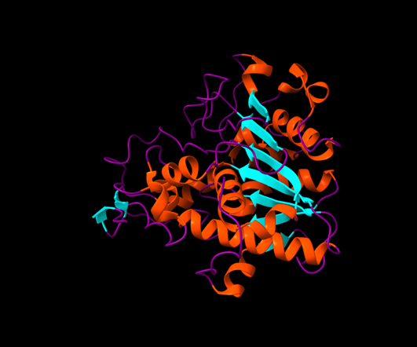
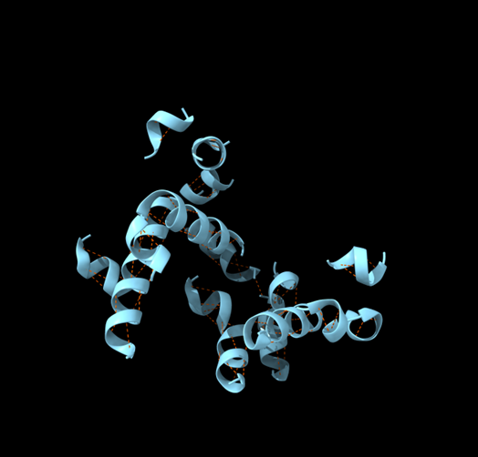
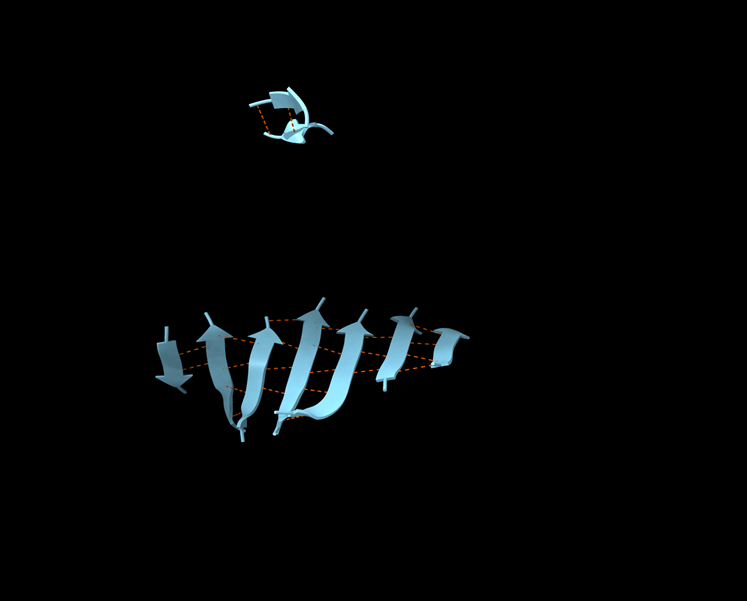
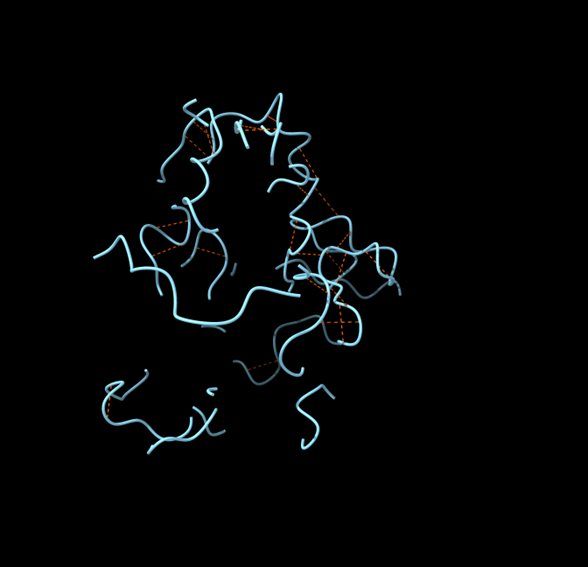
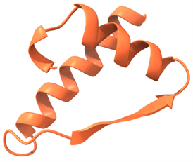
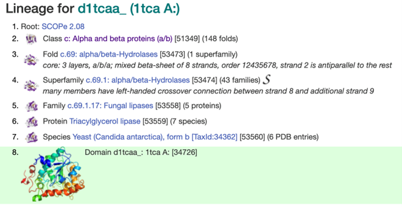
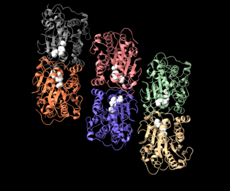
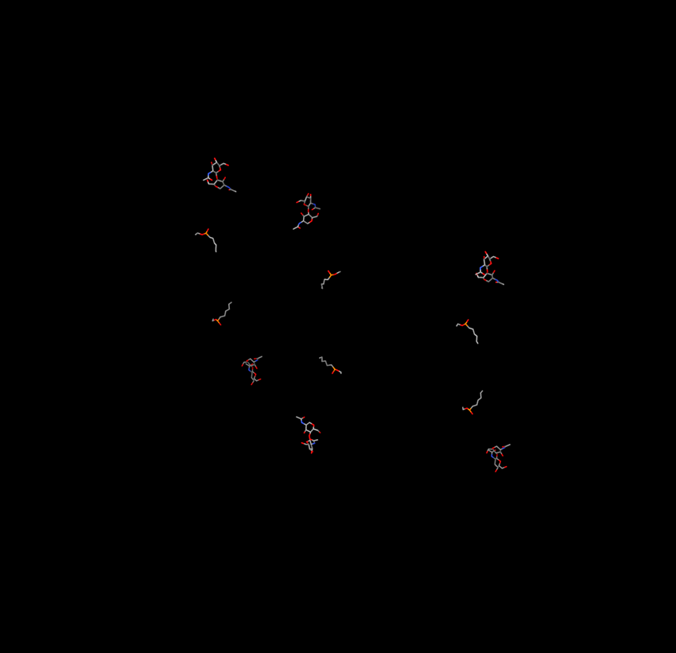
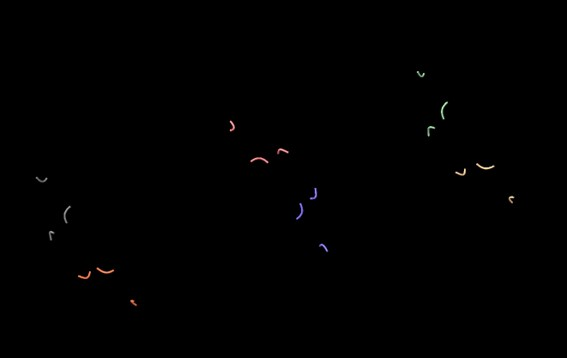
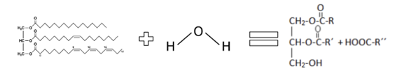

# **Pràctica 1. Relacions estructura-funció de proteïnes: Lipasa B**

### Grup M: Aina Altimiras, Pere Lorente, Arturo Martinez

## Índex

1. [Introducció a la proteïna](#introducció-a-la-proteïna)
2. [Estructura](#estructura)
3. [Funció](#funció)
4. [Treball amb l’aplicació ChimeraX](#treball-amb-laplicació-chimerax)
    - [Estructures secundàries](#estructures-secundàries)
    - [Estructures supersecundàries](#estructures-supersecundàries)
    - [Estructura terciària](#estructura-terciària)
    - [Centre actiu](#centre-actiu)
    - [Funció de la proteïna](#funció-de-la-proteïna)
    - [Relació seqüència-estructura-funció](#relació-seqüència-estructura-funció)
5. [Bibliografia](#bibliografia)

## Introducció a la proteïna

**Nom de la proteïna:** Lipasa B

**Organisme:** _Candida antarctica_

**Codi UNIPROT:** P41365

**Gen:** LIPB\_PSEA2

**Classificació EC:** EC:3.1.1.3

### Estructura:

Codis PDB: 

*   1LBS (inclou tots els dominis)
    
*   3ICV i 4K5Q (domini A amb molt millor resolució)
    
*   5A71 (dominis A i B amb molt millor resolució).
    

Donat que la Lipasa B té 6 subunitats o cadenes idèntiques, és més precís analitzar-la amb l’estructura de qualsevol dels 6 dominis que tingui major resolució. Per tant, treballarem amb el codi **4K5Q**, ja que al tenir millor resolució que el codi que inclou tots els dominis ens permetrà analitzar l’estructura secundària amb més detall i concreció.

### Funció:

La Lipasa B és un enzim del grup de les hidrolases que està majorment implicada en la hidròlisi (degradació) de triglicèrids (lípids), per proporcionar energia i components estructurals a l’organisme. Actua trencant els enllaços èster dels triacilglicèrids, alliberant àcids grassos i glicerol, que després poden ser metabolitzats. Aquesta funció és essencial per al reciclatge de nutrients i l’adaptació d’organismes com Candida antarctica a diferents fonts de carboni en el seu medi natural. També s’ha vist que pot tenir rols importants en la síntesi de glucolípids.

## Treball amb l’aplicació ChimeraX
### Estructures secundàries
#### **Detecteu les diferents estructures secundàries de la proteïna i determineu-ne el tipus (fulles, hèlix, llaços i les seves diferents variants). Mireu de descriure amb un cert detall els diferents tipus d’interaccions que podeu trobar dins aquestes estructures secundàries (mostreu els ponts d’hidrogen interns d’aquestes estructures secundàries).**

La Lipasa B té 6 cadenes idèntiques (A, B, C, D, E, F). Cadascuna compta amb una estructura secundària ben definida que li confereix estabilitat i funcionalitat en la seva activitat catalítica. Aquesta estructura està composta principalment per **hèlixs α, làmines β i llaços o girs**, cadascun dels quals té un paper fonamental en la conformació i activitat de l’enzim.

Les **hèlixs α** són una de les estructures predominants en la lipasa B i es troben estabilitzades per **ponts d’hidrogen interns**. Aquestes estructures helicoidals contribueixen a la **flexibilitat i estabilitat** de l’enzim..

Les **làmines β** constitueixen una altra part essencial de l’arquitectura secundària de l’enzim. Aquestes estructures estan estabilitzades per **ponts d’hidrogen entre cadenes polipeptídiques adjacents**, que poden ser **paral·leles o antiparal·leles** segons el seu sentit. A més, aquestes làmines formen part del **nucli hidrofòbic** de l’enzim, ajudant a protegir els residus apolars del contacte amb el medi aquós i conferint estabilitat a l’estructura tridimensional.

Els **girs i llaços** tenen la funció de connectar les hèlixs α i les làmines β, permetent la flexibilitat necessària per als **canvis conformacionals** que tenen lloc durant la catàlisi. Aquestes regions també són importants per la seva **interacció amb el medi extern** (normalment aigua), ja que estabilitzen certes conformacions mitjançant **ponts d’hidrogen amb molècules d’aigua** i altres forces electrostàtiques.

A més dels **ponts d’hidrogen**, hi ha altres interaccions internes contribueixen a la conformació estable de la lipasa B. Entre elles, destaquen les **interaccions hidrofòbiques**, que mantenen agrupats els residus no polars en el centre de l’enzim, i els **enllaços iònics**, que es formen entre residus carregats positivament i negativament, reforçant l’estabilitat estructural.

En general, la combinació d’aquestes estructures secundàries i les seves interaccions internes proporciona a la lipasa B de _Candida antarctica_ una elevada **estabilitat estructural i funcionalitat enzimàtica**, fent-la una eina essencial en aplicacions industrials com la síntesi de biodièsel, la indústria farmacèutica i l’elaboració de productes alimentaris modificats.

 
**Figura 1.** Imatges de la lipasa B amb les seves 6 corresponents cadenes.

**Figura 2.** Imatge de la cadena A de la lipasa B. En color lila s’observen les estructures secundàries de coil, en vermell les hèlixs alfa i en blau cel les làmines B.

Al visualitzar la seqüència de cada subunitat de manera individual, les zones marcades en color groc són **hèlixs alfa**, mentre que les marcades en verd són **fulles beta**. Té una llargada de 317 aminoàcids, amb el primer sent una Leucina i l’últim una Prolina.

### Estructures supersecundàries
#### **Podeu detectar-hi motius d'estructura supersecundària? Mostreu les interaccions (ponts d'hidrogen, van der Waals) entre els diferents elements que constitueixen aquestes estructures supersecundàries.**

**Figura 3.** Ponts d’hidrogen (vermell) estabilitzant làmines beta, coils i hèlixs alfa.

**Figura 4.** Motiu α-β-α d’una de les subunitats de la lipasa.

En l’estructura de la Lipasa B de Candida antarctica, es poden identificar diversos motius d’estructura supersecundària (combinacions d’elements secundaris estabilitzats per enllaços no covalents), visibles en les figures 3. Entre aquests, destaquen els motius α-β-α, en què una làmina β es troba limitada per dues hèlixs α (Figura 4), estabilitzades per ponts d’hidrogen (marcat en vermell a les imatges de la figura 3). També es poden observar làmines β paral·leles disposades en un pla torsionat, estabilitzades per ponts d’hidrogen (primera imatge de la Figura 3).
### Estructura terciària
#### **L'estructura terciària de la proteïna, a quin tipus de plegament correspon? Busqueu el plegament a la** [base de dades SCOP](https://scop.berkeley.edu)**, anoteu el codi que us dona aquesta base de dades per al plegament i mostreu la jerarquía d'aquest plegament. En cas que existeixi estructura quaternària, discutiu-la també.**

**Figura 5.** Jerarquia del plegament de la Lipasa B de Candida antarctica en la base de dades SCOPe (https://scop.berkeley.edu/sunid=34726)

Pel que fa a l’estructura quaternària, la Lipasa B és un hexàmer, ja que està formada per sis subunitats idèntiques que interaccionen entre elles per formar un complex funcional. 
### Centre actiu
**Identifiqueu el centre actiu de la proteïna. Quins residus són rellevants, a partir de la literatura? L'estructura que heu explorat, inclou algun substrat o inhibidor? Podeu descriure les interaccions que presenten entre ells els residus del centre actiu i, eventualment, d'aquests amb el possible substrat/inhibidor (ponts d'hidrogen, van der Waals, càrregues, etc)?**

La Lipasa B té un centre actiu format per Ser105-His224-Asp187, que és característic de moltes lipases i altres hidrolases de la família α/β. La serina (Ser105) actua com a nucleòfil, realitzant l’atac directe sobre l’enllaç èster del substrat, mentre que la histidina (His224) facilita aquest procés actuant com a base general. L’àcid aspàrtic (Asp187) estabilitza la histidina mitjançant interaccions electrostàtiques.
L’estructura resolta al PDB amb el codi 4K5Q inclou la presència d’un inhibidor, el metilhexanoat, que simula la interacció amb el substrat natural (lípids). Aquest inhibidor estableix ponts d’hidrogen amb la histidina i l’àcid aspàrtic del centre actiu, i gràcies a les interaccions hidrofòbiques amb altres residus del centre catalític es facilita la seva unió. A més, el centre actiu es troba parcialment cobert per un “tap” estructural, un element característic de les lipases que regula l’accés del substrat al lloc catalític i que es reconfigura quan la proteïna interacciona amb una superfície lipídica.
 

**Figura 6.** La primera imatge mostra la proteïna amb el centre actiu de cadescuna de les seves cadenes marcat en blanc mentre que a la tercera s’aprecia l’estructura secundària d’aquests centres actius (coils).  La segona, correspon als lligands externs tan substrats com  inhibidors .

### Funció de la proteïna
#### **Cerqueu informació sobre la funció fa aquesta proteïna. Podeu mostrar el mecanisme detallat que segueix si es tracta d'un enzim? (mireu la figura 6.5.1 d'**[aquest enllaç](https://bio.libretexts.org/Bookshelves/Biochemistry/Fundamentals_of_Biochemistry_%28Jakubowski_and_Flatt%29/01%3A_Unit_I-_Structure_and_Catalysis/06%3A_Enzyme_Activity/6.05%3A_Enzymatic_Reaction_Mechanisms) **per entendre a què ens referim amb el mecanisme de reacció d'un enzim)**

Les lipases són hidrolases, que són enzims que catalitzen la ruptura d’enllaços químics per mitjà de l'addició d’aigua. La Lipasa B de _Candida antarctica_ (CalB) és un enzim que catalitza la hidròlisi d'èsters, especialment triglicèrids, mitjançant un mecanisme basat en una tríada catalítica formada per Serina 105 (Ser105), Histidina 224 (His224) i Aspàrtic 187 (Asp187)(Fojan et al., 2000). Aquesta és la reacció catalítica: 

**Figura 7.** Reacció catalítica de l'enzim.

**Triacylglycerol + H(2)O = diacylglycerol + a carboxylate**.

La Lipasa B (CalB), quan entra en contacte amb una interfície aigua-lípid, l'enzim adopta una conformació catalíticament activa(Pleiss, Fischer, & Schmid, 1998). Un cop ha entrat en aquesta fase, el substrat (triglicèrid o èster) entra a l'interior del centre actiu de l'enzim. La Serina 105 actua com a nucleòfil i està preparada per atacar l'enllaç èster del substrat (Uppenberg et al., 1995). Quan la serina ataca el carboni carbonílic del substrat, es forma un intermedi acil-enzim covalent. En aquest procés:

*   La Histidina 224 actua com a base general, facilitant la transferència de protons i activant la serina.
    
*   L'Aspàrtic 187 estabilitza la histidina mitjançant un pont d'hidrogen(Fojan et al., 2000).
    

Aquest pas és fonamental per a la catàlisi i determina la velocitat de reacció.Després de la formació de l'intermedi, una molècula d'aigua ataca l'enllaç acil-enzim, provocant la ruptura de l'enllaç èster i la formació del producte final (un àcid gras i un monoglicèrid/glicerol)(Uppenberg et al., 1995). Això permet que l'enzim torni al seu estat original i pugui catalitzar una nova reacció.
### Relació seqüència-estructura-funció
#### **Relació seqüència-estructura-funció: Com relacionaríeu l'estructura que heu analitzat amb la funció de la proteïna? Quins elements estructurals participen en aquesta funció? Quins residus en concret són claus per a la funció? Cerqueu eventuals variants de la proteïna que tinguin implicacions funcionals i comenteu els seus efectes a nivell molecular.**

El centre actiu de l’enzim es troba a la part hidrofòbica del enzim, el qual facilita la interacció amb els substrats lipídics. Addicionalment, l’estructura α/β proporciona estabilitat a la proteïna. Com hem comentat anteriorment, el centre actiu està conformat per Ser105-His224-Asp187. Mutacions com la S105A, en què la serina del centre actiu (posició 105) es substitueix per una alanina, provoquen la pèrdua total d’activitat catalítica, ja que la serina és imprescindible per al trencament de l’enllaç èster. De manera similar, la mutació H224Q, que substitueix la histidina per una glutamina, redueix dràsticament l’activitat de l’enzim, ja que la histidina també és fonamental per activar la serina durant la catàlisi. Tot i així, a diferència de l’anterior, només redueix la velocitat, però segueix permetent l’activitat enzimàtica.

## Bibliografia

*   Fojan, P., Jonson, P. H., Petersen, M. T. N., & Petersen, S. B. (2000). _What distinguishes a lipase from an esterase?_ Biochimie, 82(11), 1033-1041. https://doi.org/10.1016/S0300-9084(00)01188-3 
    
*   Pleiss, J., Fischer, M., & Schmid, R. D. (1998). _Anatomy of lipase binding sites: the scissile fatty acid binding site._ Chemistry and Physics of Lipids, 93(1-2), 67-80. https://doi.org/10.1016/S0009-3084(98)00030-9 
    
*   Uppenberg, J., Hansen, M. T., Patkar, S., & Jones, T. A. (1995). _The sequence, crystal structure determination and refinement of two crystal forms of lipase B from Candida antarctica._ Structure, 3(3), 293-308.- https://www.cell.com/structure/fulltext/S0969-2126(00)00031-9 