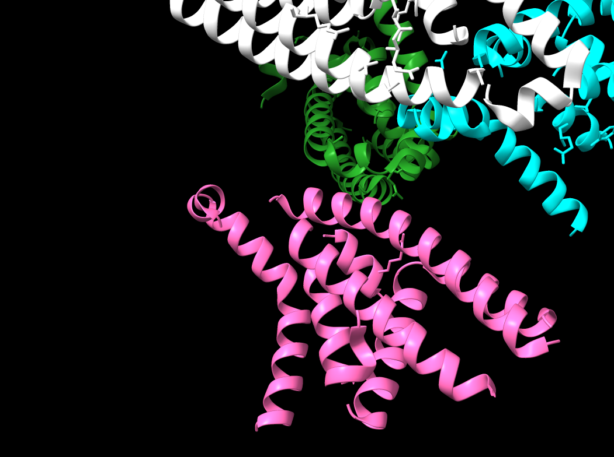
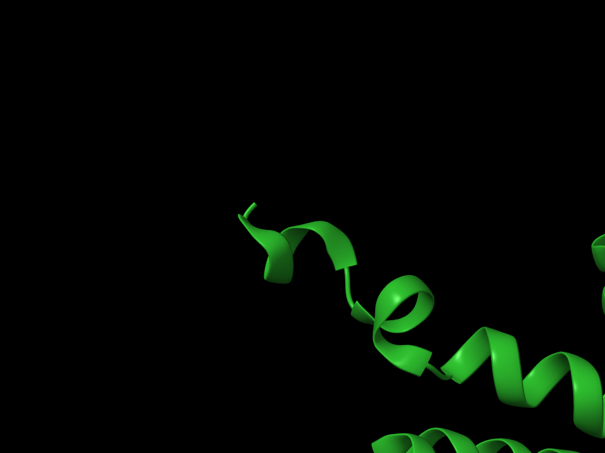
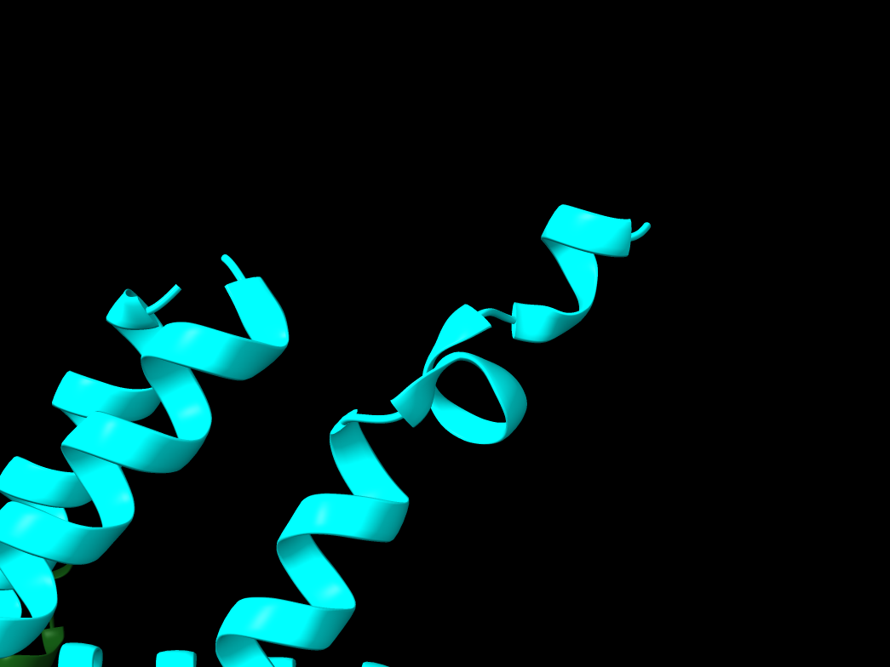
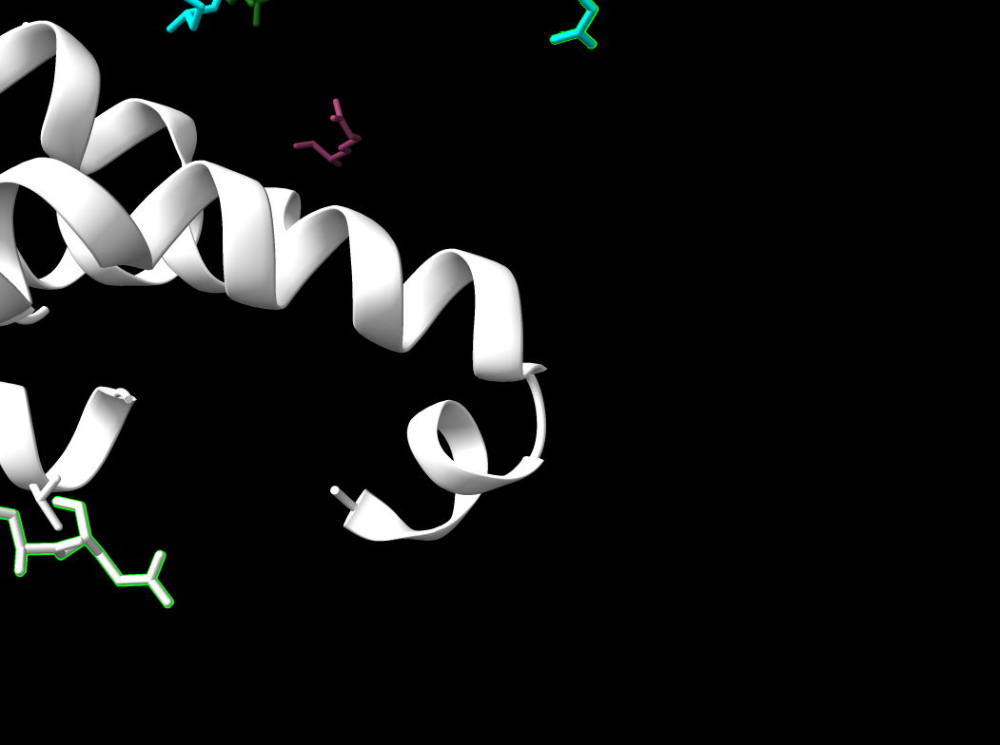
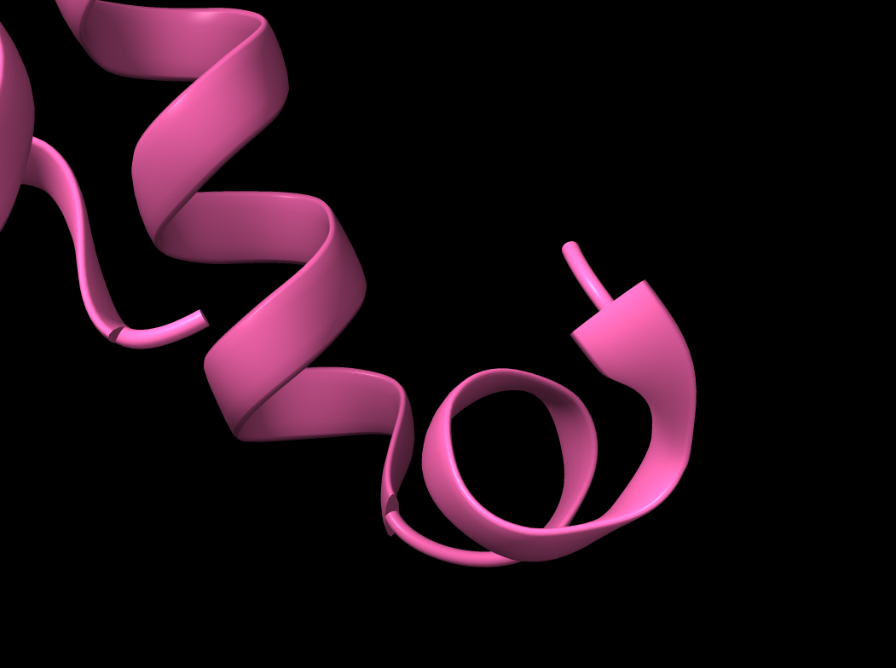
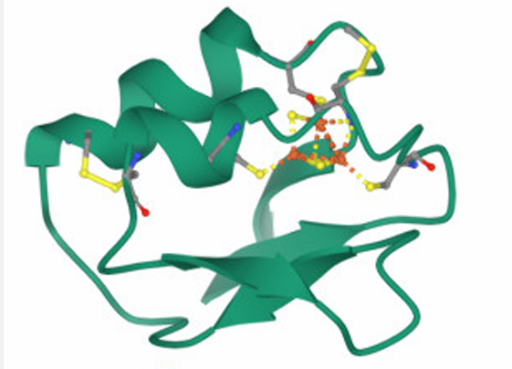
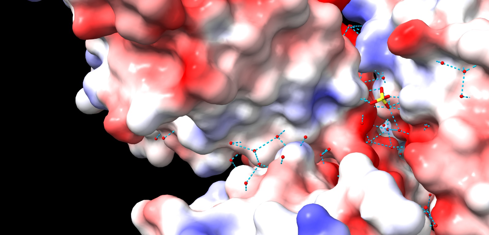

<p class="qiep-group-label"><strong>Grup B</strong></p>
<style>
p {
  text-align: justify;
}
</style>

```{r setup, include=FALSE}
knitr::opts_chunk$set(echo = TRUE)
```

#  Grup B · Context
Aquesta pràctica té com a finalitat familiaritzar-se amb l’ús d’eines de bioinformàtica estructural, especialment ChimeraX, i amb la consulta de bases de dades de proteïnes com el Protein Data Bank (PDB) i PDBsum. A partir d’una seqüència proteica inicial, es treballa la cerca d’homologies amb eines com BLAST i la identificació d’estructures relacionades, així com la interpretació dels diferents nivells d’organització estructural (secundària, terciària i quaternària). L’objectiu final és adquirir habilitats en la representació i interpretació d’estructures proteiques, identificant els elements que les caracteritzen i que poden estar relacionats amb les seves propietats.


# Introducció

En aquest treball s’ha analitzat una proteïna a partir d’una seqüència aminoacídica inicial, utilitzant eines de bioinformàtica estructural com BLAST, UniProt, el Protein Data Bank (PDB) i ChimeraX. La cerca inicial va permetre identificar estructures relacionades i accedir a informació associada a un article científic vinculat al disseny de la proteïna. A partir d’aquestes dades, s’ha dut a terme una anàlisi detallada de l’estructura tridimensional amb l’objectiu d’estudiar la seva organització i estabilitat, així com la relació entre els diferents nivells estructurals i les seves propietats.

# Sobre la proteïna

### Seqüència donada

Cada cadena té aquesta seqüència, amb una llargada de 211 aa. La proteïna està formada per quatre cadenes amb una llargada total de 844 aa.

```{r message=FALSE, warning=FALSE, include=FALSE, paged.print=FALSE}
chain<-("PDFTGARERFLAGDVTIVLLIAESHDAPYRLANPEDPEADLSDEQLERALAAYLTLVETLFPELYAEMKAALAAAKTPEEKIAVFREYNARFLAEFDALIDQAFARLKADSLTLKIHLSQGKGSYEIIFPPEVQADPERAAAIEALWKPTLDQLLAVLQEKHKGKPATTVTYEISAETLRAAVAALARAAEAALRRKVGSLESSGLEVLFQ")
```

```{r echo=FALSE, results='asis'}
cat(paste0(
 '<div style="overflow-x:auto; white-space:nowrap; background:#1e1e1e; color:#00ffcc; padding:12px; border-radius:12px; font-family:monospace; font-size:14px;">', 
 as.character(chain), 
 '</div>'
))

```

No s'ha obtingut cap resultat coherent a UniProt, la llargada de la proteïna que donava UniProt no correspon amb la llargada de la seqüència.

### Classificació EC.X.X.X.X

No és un enzim.

### Organisme d'expressió

*Escherichia coli*.

### PDB ID

8YL8 Extended : pdb_00008yl8

Existeixen dues estructures corresponents a la mateixa proteïna dissenyada de novo mitjançant el mètode RSO, però obtingudes en diferents condicions de cristal·lització (Form 1 i Form 2).[@bank] Ambdues estan dipositades en el Protein Data Bank i constitueixen validacions experimentals del model.

S'ha seleccionat l'estructura 8YL8, ja que presenta una millor qualitat estructural en comparació amb 8YL4. En concret, posseeix una resolució de 2.21 Å, inferior als 2.88 Å de 8YL4, la qual cosa indica un major nivell de detall atòmic. A més, presenta valors de R-free (0.244) i R-work (0.201) més baixos que els de 8YL4, la qual cosa reflecteix un millor ajust entre el model estructural i les dades experimentals. Per això, 8YL8 es considera l'opció més fiable per a l'anàlisi estructural posterior.

### Funció resumida

La proteïna corresponent a l'estructura 8YL8 no presenta una funció biològica natural coneguda, ja que es tracta d'una proteïna dissenyada de novo mitjançant el mètode RSO. El seu propòsit principal és actuar com a model experimental per a validar la capacitat de disseny estructural de l'algorisme RSO, demostrant que és possible generar proteïnes sintètiques que adopten amb alta precisió la conformació tridimensional predita. L'estructura 8YL8 presenta un ió sulfat (SO₄²⁻), el qual probablement prové de les condicions en el buffer de cristal·lització (sulfat d’amoni, HEPES i PEG 400). Aquest ió pot establir interaccions electroestàtiques o ponts d'hidrogen amb residus de la proteïna, però no representa un substrat fisiològic ni indica activitat catalítica, i, per tant, no permet afirmar que aquesta sigui la seva funció ni que es tracti d'un enzim. [bank]

# Treball amb ChimeraX

## Proteïna amb ChimeraX

**Totes les imatges i figures han estat elaborades amb ChimeraX, excepte les extretes de les presentacions i Jalview **

Tot l'anàlisi pertany al mateix fitxer PDB.

::::::::::::::::::::::::::::::: {style="text-align: center;"}
<video width="500" autoplay loop muted>

<source src="video.mp4" type="video/mp4">

</video>

**Fig.1**. Rotativa de la proteïna en primer pla.

:::

**Cadena A** Verda --\> 1668 àtoms, 1611 enllaços, 

**Cadena B** Turquesa --\> 1676 àtoms, 1629 enllaços, 

**Cadena C** Rosa --\> 1624 àtoms, 1560 enllaços, 

**Cadena D** Blanca --\> 1582 àtoms, 1537 enllaços, 

**Residus (No estàndard)**: Groc --\> Molècules d'aigua (HOH), Ions sulfat (SO₄) --\> 354 àtoms, 24 enllaços, 

::: {style="overflow-x: auto; white-space: nowrap;"}

:::

L’estructura quaternària de la proteïna està formada per quatre cadenes polipeptídiques idèntiques, que s’associen per formar un homotetràmer. Aquesta organització s’ha pogut confirmar mitjançant l’alineament estructural de les quatre cadenes, que mostra una elevada similitud entre elles, indicant que es tracta de subunitats equivalents tant estructuralment com funcionalment.

## Estructures secundàries de la proteïna

### Làmines (Taronja)

::::::::::::::::::::::::::::: {style="text-align: center;"}
<video width="500" autoplay loop muted>

<source src="movie1.mp4" type="video/mp4">

</video>

**Fig.2**. Rotativa de la proteïna en primer pla amb làmines ꞵ ressaltades.

**680 àtoms, 680 enllaços, 84 residus**

:::

:::::::::::::::::::::::::::: {style="text-align: center;"}
<video width="500" autoplay loop muted>

<source src="movie4.mp4" type="video/mp4">

</video>

**Fig.3**. Rotativa de la proteïna en primer pla únicament de les làmines ꞵ de la proteïna.

:::

Làmines $\beta$ antiparal·leles vistes en les 4 cadenes

### Hèlix alfa (vermell)

::::::::::::::::::::::::::: {style="text-align: center;"}
<video width="500" autoplay loop muted>

<source src="movie2.mp4" type="video/mp4">

</video>

**Fig.4**. Rotativa de les làmines $\beta$ antiparal·leles de les 4 cadenes.

 **4575 àtoms, 462 enllaços, 602 residus.**

:::

::: {style="text-align: center;"}

:::

**Fig.5**. Rotativa de les làmines $\beta$ antiparal·leles en les 4 cadenes.

S'ha identificat en la majoria d'hèlixs, hèlixs $\alpha$ tipus $3_.16.$ en el model analitzat

:::

::: {style="text-align: center;"}

:::

::: {style="text-align: center;"}

:::

::: {style="text-align: center;"}

:::

::: {style="text-align: center;"}

:::

**Fig.6, 7, 8, 9.** Tram curt compatible amb hèlix $\alpha$ $3_.10.$.

En els extrems hèlix $\alpha$ de les cadenes **A** **B** **C** **D** s'observa un tram curt compatible amb hèlix $\alpha$ $3_.10.$.

:::

En aquest model no s'ha observat hèlix $\alpha$ $4.4_16$ ni $2.2_7$.

:::

### Coils (groc)

::::::::::::::::::::: {style="text-align: center;"}
<video width="500" autoplay loop muted>

<source src="movie3.mp4" type="video/mp4">

</video>

**Fig.10**. Rotativa en primer pla de la proteïna amb els coils ressaltats.

**1296 àtoms, 1287 enllaços, 189 residus**.

:::

## Interaccions

**Interaccions de van der Waals entre les diferents estructures secundàries.**

:::::::::::::::::::: {style="text-align: center;"}
<video width="500" autoplay loop muted>

<source src="movie6.mp4" type="video/mp4">

</video>

**Fig.11**. Rotativa en primer pla de la proteïna amb les interaccions de van der Waals ressaltades.

**4672 interaccions**

:::

### **Ponts d'hidrogen**

::::::::::::::::::: {style="text-align: center;"}
<video width="500" autoplay loop muted>

<source src="movie7.mp4" type="video/mp4">

</video>

**Fig.12**. Rotativa en primer pla de la proteïna amb els ponts d’hidrogen ressaltats.

**1337 enllaços d'hidrogen** Ponts d'hidrogen entre les estructures secundàries i estabilitzen l'estructura quaternària unint les 4 cadenes

:::

### **Interaccions proteïna lligand**

:::::::::::::::::: {style="text-align: center;"}
<video width="500" autoplay loop muted>

<source src="movie8.mp4" type="video/mp4">

</video>

**Fig.13**. Rotativa en primer pla de la proteïna i de molècules sulfat i aigua.

**30 àtoms, 24 enllaços, 6 residus** **HOH + SO4**

:::

### **Interaccions amb ions**

::::::::::::::::: {style="text-align: center;"}
<video width="500" autoplay loop muted>

<source src="movie9.mp4" type="video/mp4">

</video>

**Fig.14**. Rotativa de la proteïna interaccionant amb els ions corresponents (H2O i SO4)

:::

### **Interaccions amb el solvent (H2O)**

:::::::::::::::: {style="text-align: center;"}
<video width="500" autoplay loop muted>

<source src="movie10.mp4" type="video/mp4">

</video>

**Fig.15**. Rotativa de les interaccions amb el solvent (H2O)
:::

## Motius supersecundaris i les seves interaccions

En totes les cadenes trobem $\beta$ hairpins

::::::::::::::: {style="text-align: center;"}
<video width="500" autoplay loop muted>

<source src="movie18.mp4" type="video/mp4">

</video>

**Fig.16**. Rotativa de les $\beta$ hairpins.

:::

En totes les cadenes trobem $\beta$ $\alpha$ $\beta$.

:::::::::::::: {style="text-align: center;"}
<video width="500" autoplay loop muted>

<source src="movie19.mp4" type="video/mp4">

</video>

**Fig.17**. Rotativa de les $\beta$ $\alpha$ $\beta$.

:::

En totes les cadenes trobem "helix-turn-helix".

::::::::::::: {style="text-align: center;"}
<video width="500" autoplay loop muted>

<source src="movie15.mp4" type="video/mp4">

</video>

**Fig.18**. Rotativa de les "helix-turn-helix".
:::

Interaccions dels $\beta$ hairpins, $\beta$ $\alpha$ $\beta$ i "helix-turn-helix" **van der Waals**.

:::::::::::: {style="text-align: center;"}
<video width="500" autoplay loop muted>

<source src="movie16.mp4" type="video/mp4">

</video>

**Fig.19**. Rotativa de les interaccions dels $\beta$ hairpins, $\beta$ $\alpha$ $\beta$ i "helix-turn-helix" **van der Waals**.
:::

Ponts d'hidrogen dels $\beta$ hairpins, $\beta$ $\alpha$ $\beta$ i helix-turn-helix.

::::::::::: {style="text-align: center;"}
<video width="500" autoplay loop muted>

<source src="movie7.mp4" type="video/mp4">

</video>

**Fig.20**. Rotativa dels ponts d'hidrogen dels $\beta$ hairpins, $\beta$ $\alpha$ $\beta$ i "helix-turn-helix".
:::

## Estructura terciària de la proteïna i el tipus de plegament al qual correspon.

:::::::::: {style="text-align: center;"}
<video width="500" autoplay loop muted>

<source src="movie20.mp4" type="video/mp4">

</video>

**Fig.21**. Rotativa de l'estructura terciària de la proteïna i a quin tipus de plegament correspon.
:::

L’estructura terciària presenta un plegament de tipus α+β, caracteritzat per la presència d’hèlix α i làmines β disposades en regions diferenciades. Aquestes estructures secundàries es troben segregades tant en el mapa topològic com en l’organització tridimensional de la proteïna, un patró típic observat en proteïnes com les ribonucleases. [Tema4]

:::

::: {style="text-align: center;"}

:::

**Fig.22**. Imatge extreta del PowerPoint "Tema 4 - Teoria". 

::: {style="text-align: center;"}
:::

S'ha observat un "helical bundle".

::::::: {style="text-align: center;"}
<video width="500" autoplay loop muted>

<source src="movie23.mp4" type="video/mp4">

</video>

**Fig.23**. Rotativa on podem observar "l'helical bundle".
:::

### Estudi dels dominis i de la família estructural

Pel que fa a la classificació estructural, no ha estat possible assignar directament aquesta proteïna a una família dins de bases de dades com CATH o SCOPe, degut al fet que es tracta d’una proteïna de disseny de novo. Aquest tipus de proteïnes no sempre es troben representades en bases de dades estructurals clàssiques, ja que no tenen un equivalent evolutiu natural clar. A més, tot i que la cerca amb BLAST mostra proteïnes amb certa similitud de seqüència, aquestes també corresponen majoritàriament a dissenys de novo o seqüències artificials. Aquesta proteïna ha estat dissenyada amb l’objectiu de validar eines de predicció estructural, com el mètode RSO, demostrant la seva capacitat per generar estructures tridimensionals estables a partir de seqüències artificials.

# Funció de la proteïna

### Centre actiu

En la proteïna 8YL8 no s’identifica un centre actiu catalític, ja que es tracta d’una proteïna de disseny de novo amb una funció principalment estructural. Per aquest motiu, tampoc es troba cap substrat ni inhibidor co-cristal·litzat, i la proteïna es presenta en estat apo.

:::

::: {style="text-align: center;"}


**Fig.24**. Interaccions entre els ponts d'hidrogen i les zones amb càrrega.

:::

::: {style="text-align: center;"}
:::

### Interaccions

Tot i això, l’estructura presenta diverses interaccions que contribueixen a la seva estabilitat. S’observen interaccions de van der Waals entre les diferents estructures secundàries, així com ponts d’hidrogen que contribueixen a la unió i estabilització de les quatre cadenes polipeptídiques, formant un homotetràmer.

:::: {style="text-align: center;"}
<video width="500" autoplay loop muted>

<source src="movie22.mp4" type="video/mp4">

</video>

**Fig.25**. Visualització de la superfície molecular i distribució de càrregues de la proteïna d'estudi. Les regions representades en vermell indiquen un potencial negatiu, mentre que les blaves indiquen un potencial positiu i les blanques zones neutres o hidrofòbiques.

:::

### Distribució de càrregues

A partir de la visualització en ChimeraX, es distingeix la distribució de residus segons les seves propietats: els residus apolars es representen en blanc, els residus amb càrrega negativa en vermell i els residus amb càrrega positiva en blau. Aquesta distribució reflecteix l’organització estructural típica de proteïnes globulars, on les interaccions hidrofòbiques i electrostàtiques són clau per a l’estabilitat del plegament.

### Informació sobre la funció de la proteïna

Atès que es tracta d’una proteïna de disseny de novo, no se li pot assignar una funció biològica natural coneguda. La seva finalitat principal és experimental, ja que ha estat generada per validar mètodes de predicció i disseny de proteïnes amb RSO, demostrant la capacitat de produir estructures tridimensionals estables i correctament plegades. No obstant això, a partir de les característiques estructurals observades, es podria especular amb possibles funcions potencials, com ara la capacitat d’estabilització estructural o d’interacció amb altres molècules, tot i que aquestes hipòtesis no tenen evidència funcional experimental.

### Modificacions post-traduccionals

No es disposa d’informació experimental sobre modificacions post-traduccionals específiques per a la proteïna 8YL8, atès que es tracta d’una proteïna de disseny de novo. Per aquest motiu, no s’han descrit modificacions concretes associades a la seva funció biològica. Tanmateix, considerant proteïnes amb plegament similar de tipus α+β (com les ribonucleases), es poden inferir possibles modificacions post-traduccionals habituals en aquest tipus de proteïnes, com la formació de ponts disulfur en residus de cisteïna, així com possibles fosforilacions en residus de serina, treonina o tirosina, que en proteïnes naturals poden participar en processos d’estabilització o regulació.

## Relació seqüència–estructura–funció

Atès que es tracta d’una proteïna dissenyada mitjançant el mètode RSO, és probable que la seva funció principal sigui validar la capacitat d’aquest sistema per generar estructures estables i correctament plegades, més que no pas exercir una funció biològica específica.

No obstant això, a partir de l’anàlisi de la seva estructura i seqüència, es poden inferir possibles funcions, tot i que aquestes no es poden confirmar experimentalment en tractar-se d’una proteïna de disseny.

La proteïna presenta característiques pròpies de les proteïnes fibroses, ja que la seva estructura primària mostra una baixa diversitat seqüencial i una alta repetició. Això és coherent amb el fet que està formada per quatre subunitats idèntiques (homotetràmer).

Per tant, es pot plantejar la hipòtesi que la seva funció podria ser estructural.

A més, la distribució relativament homogènia de residus polars i apolars suggereix que la proteïna no presenta un nucli hidrofòbic clàssic ben definit a nivell monomèric. En canvi, les interaccions hidrofòbiques semblen estar implicades en l’estabilització de les interfícies entre subunitats, fet coherent amb la seva organització homotetramèrica.

Les β làmines contribueixen a l’estabilitat local i a la correcta organització estructural, reforçant una funció principalment estructural o d’acoblament

### Relació estructura amb la funció

L’estructura tridimensional de la proteïna està dominada per α-hèlixs, que formen una arquitectura compacta i probablement s’empaqueten entre elles generant un helical bundle. Aquest tipus d’organització és característic de proteïnes estructurals, ja que proporciona estabilitat i resistència mecànica.

A més, la presència de β-làmines antiparal·leles, tot i ser menys abundants, té un paper rellevant en la rigidesa local de l’estructura. En particular, la identificació de motius β–α–β indica una organització supersecundària que contribueix al correcte plegament i pot actuar com a element d’unió entre diferents regions estructurals.

En conjunt, la combinació d’una estructura rica en α-hèlixs, una organització quaternària simètrica i la distribució de les interaccions hidrofòbiques entre subunitats suggereix que la proteïna podria actuar com a element estructural o scaffold, participant en l’estabilització de complexos macromoleculars o en processos d’autoassemblatge.

### Elements estructurals que participen en la funció


 -  **α hèlixs abundants** : Responsables de l’estabilitat global i de l’empaquetament estructural
 
 -  **β làmines antiparal·leles**: Aporten rigidesa local i estabilitzen regions específiques.

 -  **Motiu βαβ** : Contribueix a l’organització del plegament Estructura quaternària (homotetràmer).

 Permet la formació d’interfícies d’interacció entre subunitats Interfícies hidrofòbiques. Estabilitzen l’assemblatge oligomèric

 
 **Els residus** més rellevants per a la funció estructural de la proteïna es poden agrupar en dos grans tipus: segons les seves propietats fisicoquímiques. D’una banda, destaquen els residus hidrofòbics, com Leu (L), Ile (I), Val (V), Ala (A) i Phe (F), que tenen un paper clau en l’estabilitat estructural. Aquests residus participen principalment en l’empaquetament de les α-hèlixs i en la estabilització de les interfícies entre subunitats, mitjançant interaccions hidrofòbiques que afavoreixen l’assemblatge del complex homotetramèric. D’altra banda, els
residus polars i carregats, com Lys (K), Arg (R), Asp (D), Glu (E), Ser (S), Thr (T) i Gln (Q), es localitzen majoritàriament a la superfície de la proteïna. Aquests residus intervenen en les interaccions amb el solvent, contribueixen a la formació de possibles ponts salins entre subunitats i participen en la estabilització superficial de l’estructura proteica.


Tot i que hi ha una barreja aparent de residus polars i apolars al llarg de la seqüència, això no implica absència d’organització, sinó que reflecteix una distribució funcional adaptada a una estructura oligomèrica, on les interaccions es donen tant dins com entre subunitats.

::: {style="text-align: center;"}
<video width="500" autoplay loop muted>

<source src="movie24.mp4" type="video/mp4">

</video>

**Fig.26**. Rotativa de la proteïna i les seves regions hidrofíliques i hidrofòbiques. 

:::

Una possible **variant estructural** és la proteïna 8YL4, també obtinguda experimentalment mitjançant difracció de raigs X. Aquesta presenta una resolució de 2,88 Å, inferior a la de la proteïna analitzada, fet que implica una menor precisió estructural i una possible incertesa en la posició exacta d’alguns residus.

A nivell funcional, tot i que la seqüència i l’estructura global siguin similars, petites diferències en la resolució o en el model estructural poden afectar la interpretació de les interaccions moleculars, la identificació de possibles interfícies d’unió i la precisió en la descripció del plegament proteic.


# Conclusió

En aquest treball s’ha analitzat la proteïna 8YL8, dissenyada de novo mitjançant el mètode RSO, demostrant que és possible generar estructures tridimensionals estables a partir de seqüències artificials. L’anàlisi estructural ha revelat una organització quaternària en forma d’homotetràmer i un plegament de tipus α+β, dominat per α-hèlixs i complementat amb làmines β i motius supersecundaris.

Les interaccions hidrofòbiques, els ponts d’hidrogen i les forces de van der Waals tenen un paper clau en l’estabilitat global de la proteïna i en l’assemblatge de les seves subunitats. Tot i no presentar una funció biològica definida ni un centre actiu, les seves característiques estructurals suggereixen un possible paper com a proteïna estructural o scaffold.

A més, el mètode RSO (Relaxed Sequence Optimization) representa un avenç important en el disseny de proteïnes, ja que es basa en l’ús de seqüències relaxades, en les quals cada posició pot representar una combinació de diversos aminoàcids en lloc d’un de sol. Aquesta aproximació permet una optimització més suau i eficient, evitant les limitacions de treballar amb seqüències fixes i facilitant l’obtenció d’estructures estables. A més, no requereix el reentrenament del model per a cada nou problema, fet que el converteix en una eina flexible i aplicable a diferents estratègies de disseny.

En conjunt, aquest estudi confirma la relació seqüència–estructura i posa en valor el potencial del disseny de novo per generar proteïnes funcionals i estables amb aplicacions futures en biotecnologia.

# Bibliografia


RCSB Protein Data Bank. (2024). Crystal structure of the de novo designed protein 200 AA in the crystal form 1 (PDB ID: 8YL4). https://www.rcsb.org/structure/8YL4


National Center for Biotechnology Information (NCBI). (n.d.). Protein database search: 8YL8. https://www.ncbi.nlm.nih.gov/protein/?term=8YL8


Universitat de Vic. (n.d.). Tema 4 – Estructura de proteïnes, Química i Enginyeria de Proteïnes. https://aules.uvic.cat/pluginfile.php/2282213/mod_resource/content/1/Tema4_Moodle.pdf


Universitat de Vic. (n.d.). Tema 5 – Tipus de proteïnes i les seves funcions, Química i Enginyeria de Proteïnes. https://aules.uvic.cat/pluginfile.php/2285134/mod_resource/content/1/Tema%205.pdf


Frank, C., Khoshouei, A., Fu, L., Schiwietz, D., Putz, D., Weber, L., Zhao, Z., Hattori, M., Feng, S., de Stigter, Y., Ovchinnikov, S., & Dietz, H. (2024). Scalable protein design using optimization in a relaxed sequence space. Science, 386, 439–445. https://doi.org/10.1126/science.adq1741
