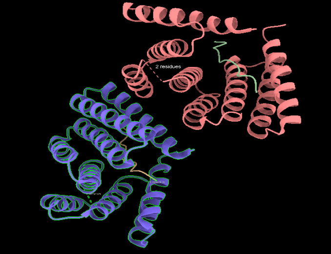
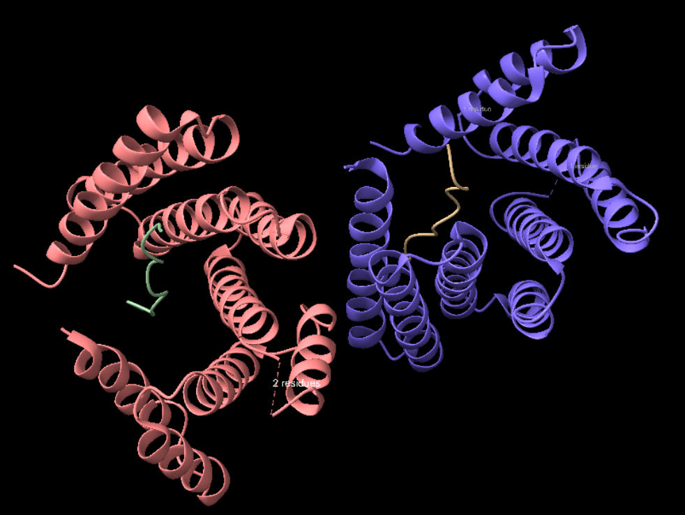
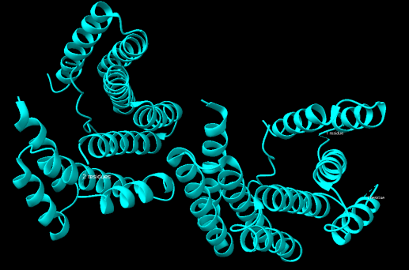
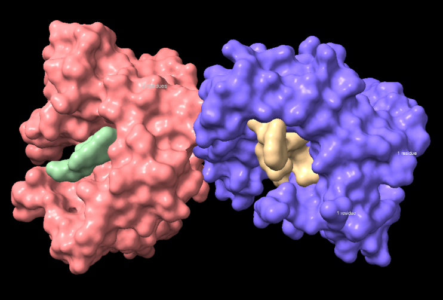

<strong>Grup D</strong>

#  Grup D · **Pràctica 1. Relacions estructura-funció de proteïnes**
### Grup JC_D: Luca Espinola, Daniela García, Manel Garcia, Oriol García, Guillem Fortea

## Índex

1. [Introducció a la proteïna](#introducció-a-la-proteïna)
2. [Estructura](#estructura)
3. [Funció](#funció)
4. [Treball amb l’aplicació ChimeraX](#treball-amb-laplicació-chimerax)
    - [Estructures secundàries](#estructures-secundàries)
    - [Estructures supersecundàries](#estructures-supersecundàries)
    - [Estructura terciària](#estructura-terciària)
    - [Estructura quaternària](#estructura-quaternària)
    - [Funció de la proteïna](#funció-de-la-proteïna)
5. [Bibliografia](#bibliografia)

## Introducció a la proteïna

**Nom de la proteïna:** Proenkephalin-B

**Organisme:** Homo sapiens (Human)

**Codi UNIPROT:** P01213

**Gen:** PDYN

**Aminoàcids:** 254

**Classificació EC:** No té, ja que no és un enzim.

### Estructura:

Codis PDB:**9CCE**

Aquesta estructura correspon al complex format per la proteïna dissenyada computacionalment i el seu lligand diana (un fragment de la Dinorfina A). Hem escollit aquesta estructura perquè representa de forma completa i a una resolució de 3.15 Å com la proteïna sintètica s'acobla perfectament a un pèptid que, de manera natural, és intrínsecament desordenat.
    

### Funció:

La funció d'aquesta proteïna sintètica no és enzimàtica, sinó de **reconeixement molecular**. Ha estat dissenyada específicament per unir-se amb alta afinitat i especificitat a un fragment de la Dinorfina A (un pèptid opioide humà). Actua com una mena de "receptor artificial" o anticòs sintètic, estabilitzant la conformació del pèptid dins d'una butxaca d'unió creada a mida.

## Treball amb l’aplicació ChimeraX

### Estructures secundàries

#### **Detecteu les diferents estructures secundàries de la proteïna i determineu-ne el tipus (fulles, hèlix, llaços i les seves diferents variants). Mireu de descriure amb un cert detall els diferents tipus d’interaccions que podeu trobar dins aquestes estructures secundàries (mostreu els ponts d’hidrogen interns d’aquestes estructures secundàries).**

L'estructura de la proteïna principal (el receptor sintètic) presenta una organització altament estable dominada quasi exclusivament per **hèlixs alfa**. 
Aquestes hèlixs s'estabilitzen internament mitjançant ponts d'hidrogen entre els grups amida i carbonil de l'esquelet polipeptídic. A diferència d'altres proteïnes globulars més complexes, en aquest disseny no s'observen estructures de làmina beta. Els diferents segments helicoïdals estan connectats per petits **llaços o girs (loops)**, que atorguen la flexibilitat just per connectar el feix d'hèlixs però mantenint una gran rigidesa estructural global.

Les **hèlixs α** són l'estructura secundària predominant (i pràcticament exclusiva) en aquest receptor sintètic, i es troben fortament estabilitzades per ponts d’hidrogen interns al llarg de l'esquelet polipeptídic. Aquestes estructures helicoidals s'empaqueten formant una bastida summament rígida i estable, la qual és essencial per mantenir la forma exacta de la butxaca on s'unirà el pèptid diana.

Els **girs i llaços (loops)** tenen la funció de connectar les diferents hèlixs α entre si, permetent que la cadena polipeptídica canviï de direcció i es pugui tancar sobre si mateixa (cal destacar que en aquesta proteïna dissenyada no hi ha làmines β). Com que aquestes regions flexibles solen quedar exposades a la superfície, són molt importants per a la interacció amb el medi extern (el solvent aquós), ajudant a mantenir la proteïna soluble i estabilitzant la conformació global mitjançant ponts d’hidrogen amb molècules d’aigua i altres interaccions electrostàtiques.

**Figura 1.** Imatges de PDB 9CCE (cadena A)

**Figura 2.** Imatge de l'estructura secundària.

### Estructures supersecundàries

**Figura 3.** Fragment proteic utilitzada per a l’anàlisi de motius supersecundaris

L’anàlisi dels motius d’estructura supersecundària del fragment no permet identificar la presència de patrons estructurals clàssics. En concret, no s’observen motius com hèlix-turn-hèlix o beta-hairpins, fet que es pot atribuir principalment a la mida reduïda del fragment estudiat.

Les interaccions entre els diferents elements estructurals són, en general, locals i limitades, sense donar lloc a una organització superior definida. Aquest comportament és coherent amb la manca d’elements d’estructura secundària ben establerts descrita anteriorment.

Pel que fa als ponts d’hidrogen, aquests es troben majoritàriament dins de regions locals i contribueixen a l’estabilització puntual de l’estructura, però no formen patrons extensos ni estructures regulars.

D’altra banda, les interaccions de van der Waals també participen en l’estabilitat del fragment, tot i que la seva contribució és moderada i no condueix a la formació de motius estructurals complexos.

### Estructura terciària

**Figura 4.** Representació de la superfície molecular del fragment.

L’anàlisi de l’estructura terciària del fragment indica que no presenta un plegament globular definit. Aquesta manca d’organització tridimensional és coherent amb la naturalesa parcial de l’estructura estudiada.

Pel que fa a la seva classificació estructural, no és possible assignar-la a cap categoria dins dels sistemes CATH o ECOD. Aquesta limitació es deu a l’absència d’una estructura terciària completa que permeti identificar patrons estructurals reconeguts.

De la mateixa manera, no s’identifiquen dominis estructurals diferenciats dins del fragment analitzat. Això reforça la idea que es tracta d’una regió amb una organització limitada i sense subdivisions estructurals clares.

### Estructura quaternària

L’anàlisi de l’estructura quaternària indica que el fragment estudiat es troba en forma de monòmer. No s’observen associacions amb altres subunitats ni la formació de complexes multimèrics.

En conseqüència, tampoc s’identifiquen interfícies rellevants d’interacció quaternària. Aquesta absència és coherent amb la naturalesa del fragment i amb el fet que no representa la proteïna completa.

Des d’un punt de vista funcional, la manca d’estructura quaternària no té un impacte significatiu, ja que la funció de la prodinorfina no depèn de l’associació entre subunitats, sinó del seu processament proteolític.

### Funció de la proteïna

#### Centre actiu de la proteïna

La prodinorfina no és un enzim i, per tant, no presenta un centre actiu en el sentit clàssic. La seva funció no es basa en una activitat catalítica, sinó en la seva capacitat de generar molècules actives a partir de la seva pròpia seqüència.

En aquest context, és més adequat parlar de regions funcionals dins de la seqüència que, després del processament proteolític, donen lloc a pèptids actius. Entre aquestes regions destaquen les que originen la leu-encefalina, la dinorfina A (en les formes 1-8, 1-13 i 1-17) i la big dynorphin.

#### Substrat o inhibidor

L’estructura 9CCE no mostra la presència d’un substrat o inhibidor típic d’una reacció enzimàtica, fet coherent amb la naturalesa no enzimàtica de PDYN.

En aquest cas, l’estructura està associada al reconeixement d’un fragment de dinorfina. Per tant, es tracta d’una interacció de tipus proteïna-pèptid i no d’un procés catalític.

#### Funció de la proteïna

La funció principal de la prodinorfina és actuar com a precursor de pèptids opioides endògens.

Aquests pèptids presenten activitats similars a les dels opiacis i participen en processos com la percepció del dolor i la resposta a l’estrès. En particular, les dinorfines actuen sobre el receptor opioide kappa, mentre que altres pèptids derivats contribueixen a la regulació de la senyalització neuronal.

#### Modificacions post-traduccionals

La modificació més rellevant de la prodinorfina és el seu processament proteolític. Aquest procés implica la seva escissió en punts concrets de la seqüència, donant lloc als pèptids actius responsables de la seva funció.

Tot i que també s’han descrit altres possibles modificacions, com la formació de ponts disulfur o modificacions de tipus fosforilació o acetilació, el processament proteolític és, amb diferència, el mecanisme més important des del punt de vista funcional.

#### Relació seqüència-estructura-funció

En el cas de la prodinorfina, la funció depèn principalment de la seva seqüència més que no pas d’una estructura tridimensional complexa.

La seqüència conté els llocs de tall proteolític i les regions que es transformaran en pèptids actius. Això fa que la seva funció estigui directament relacionada amb la seva capacitat de ser processada i generar molècules amb activitat biològica.

#### Variants amb implicacions funcionals

Les variants descrites per PDYN afecten principalment la seva expressió i no tant la seva estructura.

Algunes variants genètiques s’han associat amb processos com l’addicció, alteracions en la resposta a l’estrès i diversos trastorns neurològics. En aquests casos, l’efecte no es produeix sobre un centre actiu, sinó sobre la quantitat de proteïna produïda i, en conseqüència, sobre la quantitat de pèptids opioides generats.

## Bibliografia

UniProt Consortium. UniProt: the Universal Protein Knowledgebase. Disponible a:
https://www.uniprot.org (consulta de l’entrada P01213, PDYN_HUMAN).

Berman, H. M., Westbrook, J., Feng, Z., et al. (2000). The Protein Data Bank. Nucleic Acids
Research, 28(1), 235–242. Disponible a: https://www.rcsb.org (consulta de l’estructura
9CCE).

RCSB Protein Data Bank. Structure of peptide related to dynorphin (PDB: 9CCE). Disponible
a: https://www.rcsb.org/structure/9CCE

Peterson, G. L. (1977). A simplification of the protein assay method of Lowry et al. Analytical
Biochemistry, 83(2), 346–356. (mètodes de quantificació de proteïnes).

Bradford, M. M. (1976). A rapid and sensitive method for the quantitation of microgram
quantities of protein utilizing the principle of protein-dye binding. Analytical Biochemistry, 72,
248–254.

Kieffer, B. L., & Gavériaux-Ruff, C. (2002). Exploring the opioid system by gene knockout.
Progress in Neurobiology, 66(5), 285–306.

