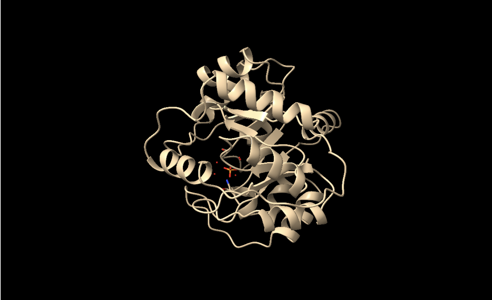
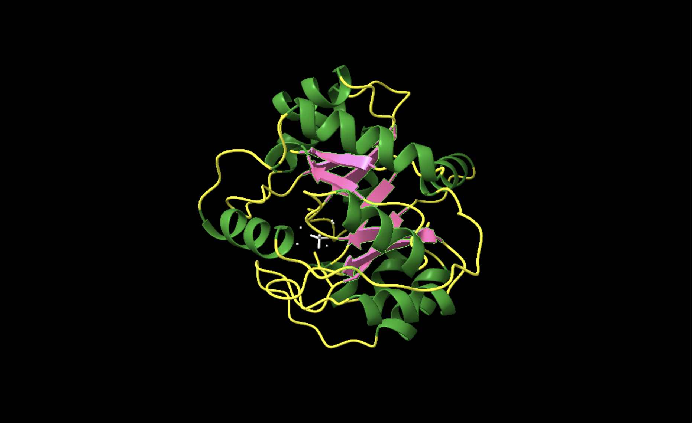
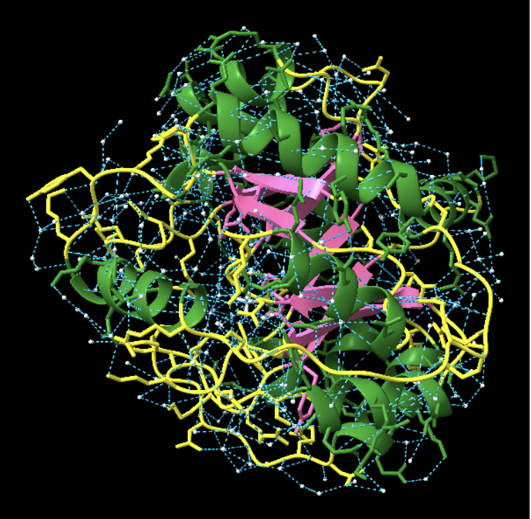
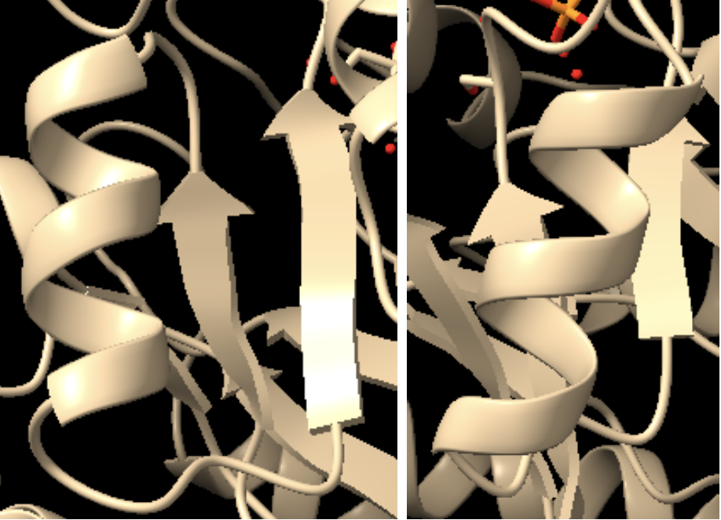
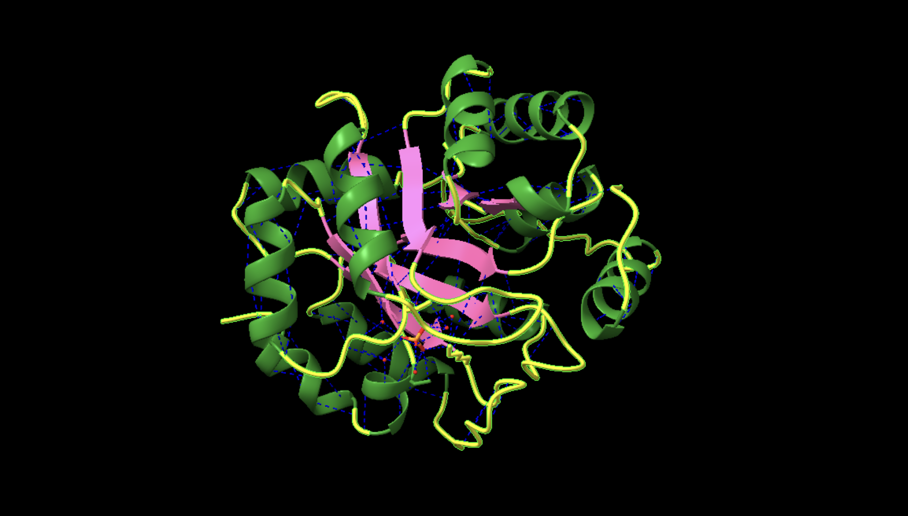
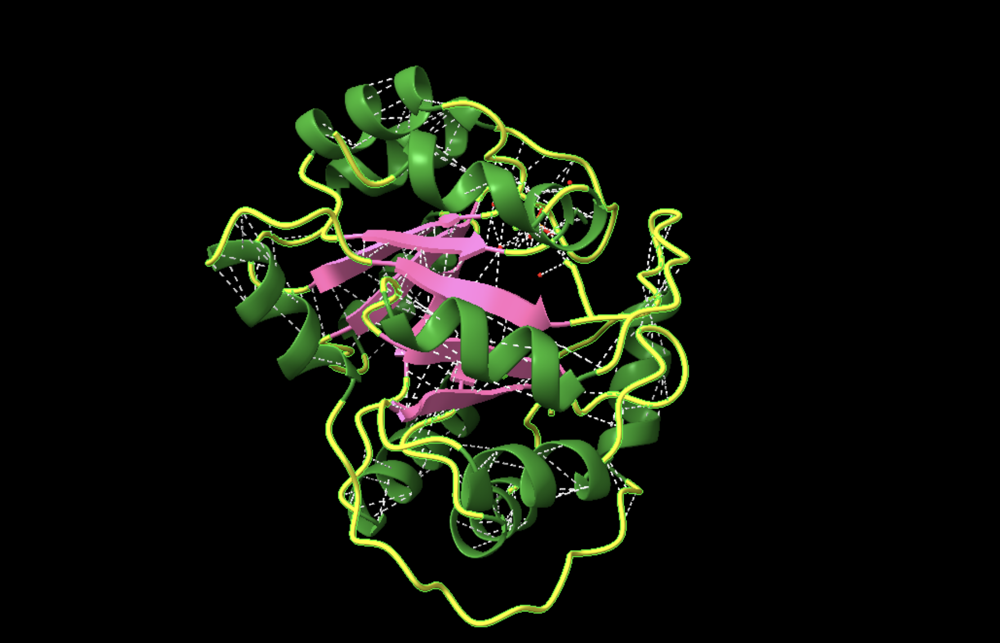
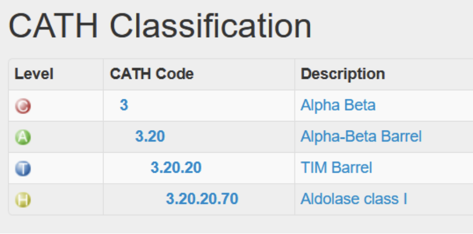
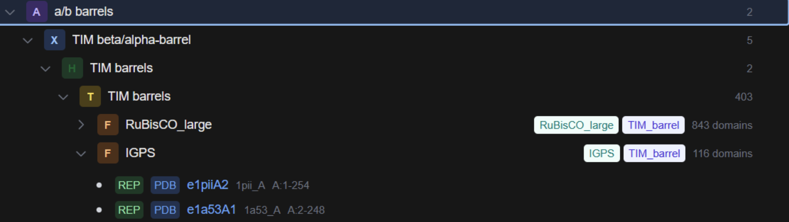
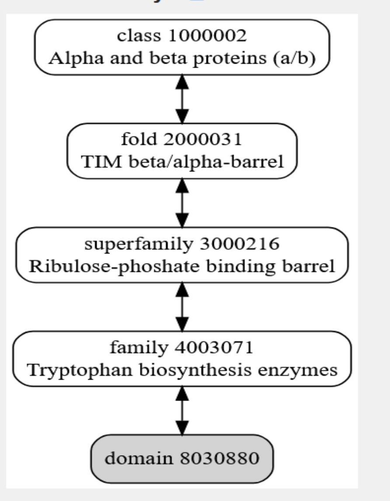
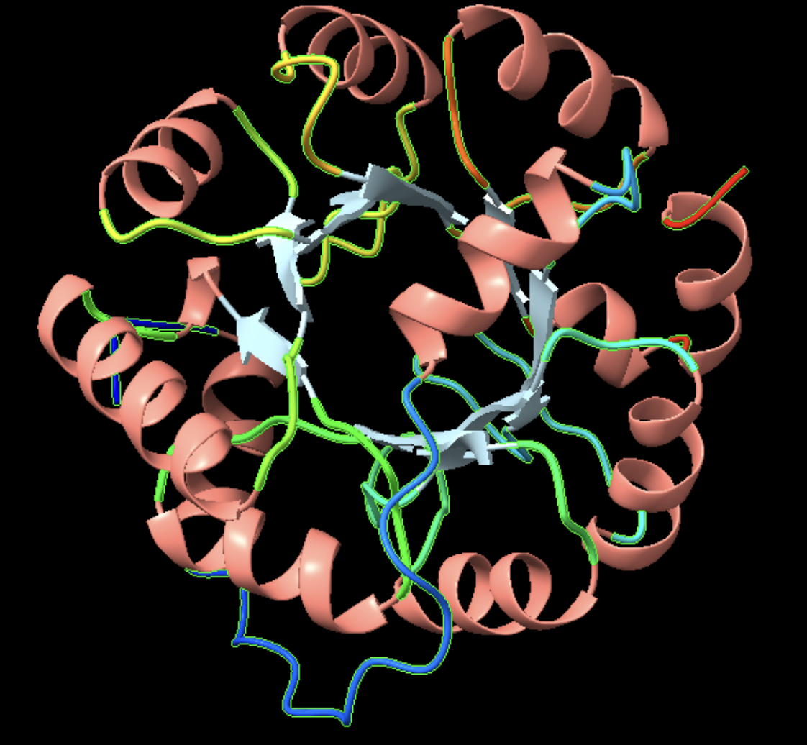

<strong>Grup F</strong>

**Grup F**: Carlota Pérez, Elsa Benito, Marc Rovira, Jordi Solà i Aina Seguí

#### Seqüència
MPRYLKGWLEDVVQLSLRRPSVHASRQRPIISLNERILEFNKRNITAIIAYYLRKSPSGLDVERDPIEYAKYMEPYAVGLSIKTEEKYFDGSYEMLRKIAS
SVSIPILMNDFIVKESQIDDAYNLGADTVLLIVEILTERELESLLEYARGYGMEPLILINDENDLDIALRIGARFITIYSMNFETGEINKENQRKLISMIP
SNVVKVPLLDFFEPNEIEELRKLGVNAFMISSSLMRNPEKIKELIEGSLEHHHHHH

## **Objectiu de la pràtica**

L’objectiu d’aquesta pràctica és analitzar l’estructura tridimensional d’una proteïna utilitzant eines de bioinformàtica estructural, especialment ChimeraX i bases de dades com el Protein Data Bank (PDB). Es pretén identificar els diferents nivells d’organització estructural de la proteïna, així com els residus i elements estructurals implicats en la seva funció biològica.A més, es busca establir la relació entre la seqüència d’aminoàcids, l’estructura tridimensional i la funció de la proteïna, interpretant el paper del centre actiu i de les interaccions moleculars que permeten l’activitat catalítica de l’enzim.

#  Grup F · Introducció de la proteïna
**Nom del gen**: trpC

**Codi UniProt**: Q06121

**Classificació**:  4.1.1.48

**Nom de la proteïna**:  Indole-3-glycerol phosphate synthase

## Estrucutra a la proteïna

La proteïna estudiada presenta diverses estructures disponibles a la base de dades Protein Data Bank (PDB), obtingudes mitjançant difracció de raigs X. Aquestes estructures poden variar en resolució, cobertura de la seqüència o presència de lligands.

Per a la realització d’aquesta pràctica hem seleccionat l’estructura amb codi PDB 1IGS, ja que presenta una resolució de 2.00 Å i una cobertura gairebé completa de la seqüència proteica (247 de 248 aminoàcids). A més, aquesta estructura no presenta mutacions, fet que ens permet treballar amb una forma molt propera a l’estructura nativa de la proteïna.

Tot i que existeixen altres estructures disponibles al PDB, hem escollit aquesta perquè ofereix una bona qualitat experimental i permet analitzar amb detall les característiques estructurals de la proteïna.

## Funció de la proteïna

La proteïna indole-3-glycerol phosphate synthase és un enzim que participa en la biosíntesi del triptòfan, un aminoàcid essencial en molts organismes. Aquest enzim catalitza un pas concret dins d’aquesta via metabòlica, transformant un intermedi en indole-3-glycerol phosphate.
Aquesta funció és important perquè permet la producció de triptòfan, necessari per a la síntesi de proteïnes i per al funcionament normal del metabolisme cel·lular.

# Treball amb l’aplicació ChimeraX

##### **1.Detecteu les diferents estructures secundàries de la proteïna i determineu-ne el tipus: fulles, hèlixs, llaços i les seves diferents variants. Mireu de descriure amb un cert detall els diferents tipus d'interaccions que podeu trobar dins aquestes estructures secundàries. Mostreu els ponts d'hidrogen interns d'aquestes estructures secundàries.**

------

Com podem apreciar en la imatge, l’enzim té diverses estructures secundàries. Les estructures acolorides de color verd corresponen a estructures hèlix-alfa, i les de color rosa corresponen a làmines beta. Entre aquestes, les estructures de color groc que es mostren corresponen a seqüències d’aminoàcids que les uneixen, però que no presenten una estructura secundària definida.

---------------------

------ 

La imatge següent ens mostra de color blau els ponts d’hidrogen presents a la proteïna. Hi ha un total de 926 ponts d’hidrogen presents. Podem distingir que tots els enllaços es donen entre les estructures secundàries, o bé a les hèlix alfa o bé les fulles beta. A més a més, també es veuen involucrades en les estructures supersecundàries que es formen els motius Beta. Hi ha connexió entre làmines paral·leles i estabilització del nucli.

#### **2.Detecteu, si n'hi ha, motius d'estructura supersecundària. Mostreu les interaccions, ponts d'hidrogen i interaccions de van der Waals, entre els diferents elements que constitueixen aquestes estructures supersecundàries.**

Com podem veure en la següent imatge es poden observar estructures supersecundàries beta-alpha-beta. Aquests tipus d’estructures són la forma més habitual de connectar dues fulles beta paral·leles.

---------

--------

Les interaccions de Van der Waals tenen un paper clau en l’estabilització de l’estructura tridimensional de la proteïna. Aquestes interaccions es produeixen principalment entre residus hidrofòbics situats a l’interior del barril TIM, contribuint a un empaquetament compacte del nucli proteic.
Aquest empaquetament hidrofòbic és essencial per mantenir la integritat estructural del barril α/β i assegurar la correcta orientació dels residus del centre actiu. A més, dins de la cavitat catalítica, les interaccions de Van der Waals també contribueixen a l’estabilització del substrat, especialment en les regions no polars o aromàtiques.

# Interacions de la proteïna

-------

#### **3.L’estructura terciària de la proteïna, a quin tipus de plegament correspon?**

**CATH**
------

-----

**Classe (C)**: Proteïnes Alfa-Beta (α−β).

**Arquitectura (A)**: Barril Alfa-Beta (El tub central tancat per les làmines i envoltat d'hèlixs).

**Topologia (T)**: Barril TIM (Topologia específica de 8 elements repetits).

**Superfamília Homòloga (H)**: Família del barril d'unió a la Ribulosa-fosfat / Enzims tipus Aldolasa. S'agrupen aquí perquè es considera que tots van divergir d'un avantpassat comú antic, adaptant el mateix "motlle" físic per catalitzar diferents reaccions químiques.

-----

# **ECOD**

----
**Arquitectura (A)**: Barrils α/β.

**X-grup (X)**: TIM-barrel (El grup d'homologia llunyana).

**H-grup (H)**: Enzims tipus unió a ribulosa-fosfat / rutes de síntesi d'aminoàcids (que comparteixen dominis evolutivament relacionats per al metabolisme de sucres fosfatats i anàlegs).

**F-grup / T-grup**: Família de les sintases del Triptòfan (IGPS).

----

# **SCOP**

--------

-------

## Estructura quaternària

### En el cas de la proteïna 1A53:

Té una estructura quaternària que és monomèrica.

Això vol dir que la unitat biològica funcional de l'enzim a l'interior de l'arqueobacteri consta d'una sola cadena polipeptídica (la cadena A de 247 aminoàcids).

A diferència d'altres enzims que necessiten associar-se (formant dímers o tetràmers) per crear el lloc actiu o estabilitzar-se, el barril TIM de la IGPS és una unitat independent i completament funcional per si sola; de fet, el lloc actiu on es fa la reacció química es troba en un dels extrems “oberts" del centre del barril.

# Funció de la proteïna

#### **1.Identifiqueu el centre actiu de la proteïna. Quins residus són rellevants, segons la literatura? L'estructura que heu explorat inclou algun substrat o inhibidor? Podeu descriure les interaccions entre els residus del centre actiu i, eventualment, entre aquests residus i el possible substrat o inhibidor, com ara ponts d'hidrogen, interaccions de van der Waals o càrregues?**

**a)** Els residus més rellevants del centre actiu són:

**Lys53**, pot formar un pont salí amb el grup carboxilat del substrat i orientar-lo dins del centre actiu. 

**Lys110** i **Glu159**: intervenen en la transferència de protons durant la reacció.

**Asn180**: ajuda a mantenir l’entorn catalític correcte i és necessari per conservar l’activitat de l’enzim.

**b)** L’estructura 1IGS no inclou el substrat complet ni un inhibidor específic, l’únic lligand associat a aquesta estructura és un ió fosfat. Per tant, les interaccions del següent apartat s’han deduït d’altres estructures amb substrat.

**c)** Altres interaccions observades són l’estabilització mitjançant ponts d’hidrogen de la part fosfatada del lligant amb els residus polars del centre actiu, i interaccions de van der Waals dins de la cavitat per estabilitzar la part aromàtica del substrat. 

#### **2.Cerqueu informació sobre la funció que fa aquesta proteïna. Si es tracta d'un enzim, podeu mostrar i explicar el mecanisme detallat de la reacció que catalitza.**

L’enzim indole-3-glycerol phosphate synthase (IGPS) catalitza la conversió de CdRP en IGP mitjançant un mecanisme que inclou ciclació, descarboxilació i deshidratació.

Durant la reacció, residus com Lys53 ajuden a orientar el substrat dins del centre actiu, mentre que Glu159 i Lys110 participen en la transferència de protons i en l’estabilització dels intermediaris.

El microentorn del centre actiu, mitjançant ponts d’hidrogen i interaccions electrostàtiques, permet estabilitzar els intermediaris i afavoreix la formació de l’anell indòlic del producte final.

#### **3.Cerqueu informació sobre modificacions post-translacionals que es coneguin que afecten la proteïna o bé proteïnes similars. Identifiqueu els residus que podrien ser-ne diana.**

No hi ha una PTM específica demostrada, però en proteïnes similars i en arqueus relacionats les PTMs més probables són acetilació de lisines, acetilació N-terminal i possiblement fosforilació. Les dianes més rellevants que es poden proposar per aquesta proteïna són Lys53 i Lys110 i, com a possibles dianes addicionals, residus polars de la cavitat activa com Ser56, Ser58, Ser211 i Ser234. 
En resum, no hi ha PTM no descrites per IGPS específicament.

#### **4.Relació seqüència-estructura-funció: com relacionaríeu l'estructura que heu analitzat amb la funció de la proteïna? Quins elements estructurals participen en aquesta funció? Quins residus, en concret, són claus per a la funció? Cerqueu eventuals variants de la proteïna que tinguin implicacions funcionals i comenteu-ne els efectes a nivell molecular.**

**a)** L’estructura explica la funció perquè mostra una cavitat catalítica ben definida, amb els residus actius en la posició adequada i amb una organització química compatible amb la unió del substrat i la catàlisi.

**b)** Els principals elements estructurals que participen en la funció són el barril TIM (β/α), la cavitat del centre actiu i els residus Lys53, Lys110 i Glu159, juntament amb la regió d’unió del fosfat.

**c)** No s’han trobat variants anotades per a Q06121, així que ens basem en variants experimentals. Les variants més clares són les que afecten els residus del centre actiu. Les variants a continuació demostren que la funció d’aquesta proteïna depèn dels residus catalítics i de l’organització i flexibilitat de l’entorn estructurañ que els envolta.

- La variant K53Q, mostra una gran pèrdua d’activitat per l’eliminació de la càrrega positiva de la lisina, debilitant la interacció electrostàtica amb el substrat.

- La variant N90A disminueix l’eficiència catalítica, fent més lenta la deshidratació.

- La doble mutant R664A/D65A produeix una baixada d’afinitat pel substrat i una reducció de l’eficiència catalítica.

# Bibliografia

Proteïna a Uniprot: https://www.uniprot.org/uniprotkb/Q06121/entry
UniProt Consortium. (2025). UniProt: The Universal Protein Knowledgebase in 2025. Nucleic Acids Research, 53(D1), D609–D617.

Proteïna a PDB: https://www.rcsb.org/structure/1A53

Tema 4: https://aules.uvic.cat/pluginfile.php/2282213/mod_resource/content/1/Tema4_Moodle.pdf

Hennig, M., Darimont, B. D., Jansonius, J. N., Kirschner, K., & Sterner, R. (2002). The catalytic mechanism of indole-3-glycerol phosphate synthase: Crystal structures of complexes of the enzyme from Sulfolobus solfataricus with substrate analogue, substrate, and product. Journal of Molecular Biology, 319(3), 757–766.

