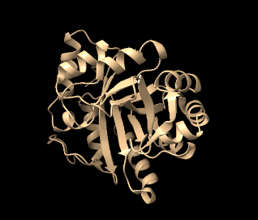
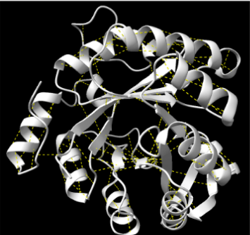
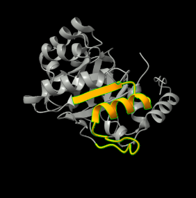
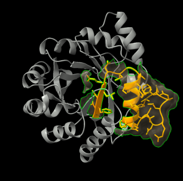
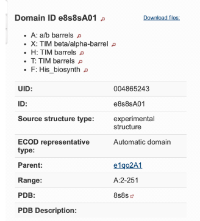

<strong>Grup I</strong>

#  Grup I · **Pràctica 1. Relacions estructura-funció de proteïnes: Imidazole glycerol phosphate synthase subunit HisF**
### Grup I: Gerard Pañach, Ester Forés, Clara Alabau, Txell Cassases, Estel Àlvarez

## Índex

1.  [Introducció a la proteïna](#introducció-a-la-proteïna)
2.  [Estructura](#estructura)
3.  [Funció](#funció)
4.  [Treball amb l’aplicació ChimeraX](#treball-amb-laplicació-chimerax)
    -   [Estructures secundàries](#estructures-secundàries)
    -   [Estructures supersecundàries](#estructures-supersecundàries)
    -   [Estructura terciària](#estructura-terciària)
    -   [Centre actiu](#centre-actiu)
    -   [Funció de la proteïna](#funció-de-la-proteïna)
    -   [Modificacions
        post-translacionals](#modificacions-post-translacionals)
    -   [Relació
        seqüència-estructura-funció](#relació-seqüència-estructura-funció)
5.  [Bibliografia](#bibliografia)

## Introducció a la proteïna {#introducció-a-la-proteïna}

**Nom de la proteïna:** Imidazole glycerol phosphate synthase subunit
HisF

**Organisme:** thermotoga maritima

**Codi UNIPROT:** WP_004080486

**Gen:** hisF

**Aa:** 253

**Classificació EC:** EC:4.3.2.10

### Estructura: {#estructura}

Codi PDB: pdb_00008s8s

La proteïna està ben caracteritzada estructuralment al PDB amb múltiples
entrades. Entre elles, 8S8S és l’opció òptima per continuar el treball
perquè maximitza la qualitat estructural sense perdre informació de
seqüència.

### Funció: {#funció}

L'enzim està involucrat a la biosíntesi d'histidina, així com a la
biosíntesi de nucleòtids de purina. Els enzims d'arquees i bacteris són
heterodimèrics. Un component de glutaminasa (cf. EC 3.5.1.2,
glutaminasa) produeix una molècula d'amoníac que es transfereix per un
túnel de 25 Å a un component de ciclasa, que l'afegeix a l'anell
d'imidazol, cosa que porta a la lisi de la molècula ia la ciclificació
d'un. La subunitat de glutminasa només està activa dins el complex
dimèric. En fongs i plantes, les dues subunitats es combinen en un sol
polipèptid.

## Treball amb l’aplicació ChimeraX {#treball-amb-laplicació-chimerax}

### Estructures secundàries {#estructures-secundàries}

#### **Detecteu les diferents estructures secundàries de la proteïna i determineu-ne el tipus (fulles, hèlix, llaços i les seves diferents variants). Mireu de descriure amb un cert detall els diferents tipus d’interaccions que podeu trobar dins aquestes estructures secundàries (mostreu els ponts d’hidrogen interns d’aquestes estructures secundàries).**

La subunitat HisF de la imidazole‑glycerol‑phosphate synthase està
formada per una única cadena polipeptídica. Aquesta cadena presenta una
estructura secundària ben definida, composta principalment per hèlixs α,
làmines β i llaços o girs, elements que contribueixen de manera
essencial a l’estabilitat del seu plegament en barril TIM i a la seva
funció catalítica.

Les **hèlixs α** es formen quan la cadena polipeptídica s’enrotlla sobre
si mateixa. Els ponts d’hidrogen (línies discontínues grogues) es formen
de manera intercatenària entre l’oxigen del grup carbonil d’un
aminoàciid i l’hidrogen del grup amino de l’aminoàcid situat quatre
posicions més endavant, fet que aporta rigidesa i estabilitat a
l’estructura.

Les **làmines β** constitueixen una altra part essencial, la direcció de
la fletxa indica el sentit de la cadena. Els ponts d’Hidrogen són
intercatenaris. Poden ser paral.leles (les cadenes van en el mateix
sentit) o antiparal.leles (les cadenes van en sentis oposats, solen ser
més estables), i formen el nucli estructural del plegament.

Els **girs i llaços** connecten les hèlixs α i les làmines β,
proporcionant la flexibilitat necessària perquè la proteïna pugui dur a
terme els seus canvis conformacionals durant la catàlisi. Aquestes
regions, més flexibles que els elements regulars d’estructura
secundària, poden estabilitzar els canvis de direcció mitjançant ponts
d’hidrogen amb l’aigua o amb altres parts de la proteïna, contribuint
així al plegament i a la dinàmica funcional de l’enzim.

Els **ponts d’hidrogen** estabilitzen l’estructura de la proteïna. En
les hèlixs α i les làmines β mantenen la seva forma característica,
mentre que en els girs i llaços ajuden a fixar els canvis de direcció i
aporten flexibilitat.

El conjunt d’hèlixs α, làmines β i llaços, amb els ponts d’hidrogen
ajuden a estabilitzar i confereix a la subunitat HisF una elevada
estabilitat estructural i la flexibilitat necessària per dur a terme la
seva funció catalítica dins del complex ImGPS.

**Figura 1.** Imatge de HisF amb el programa ChimeraX amb una única
cadena polipeptídica

{width="318"} **Figura 2.** Imatge de la cadena
polipeptídica de HisF. On en color taronja es veuen les hèlix α, en lila
les fulles β i en rosa els llaços.

### Estructures supersecundàries {#estructures-supersecundàries}

#### **Podeu detectar-hi motius d'estructura supersecundària? Mostreu les interaccions (ponts d'hidrogen, van der Waals) entre els diferents elements que constitueixen aquestes estructures supersecundàries.**

{width="318"} **Figura 3.**
Imatge mostrant els ponts d'hidrogen d'aquesta estructura secundària amb
color groc.

{width="318"}
**Figura 4_a.** Ponts d’hidrogen (groc) estabilitzant làmines beta,
coils i hèlixs alfa.

{width="318"} **Figura 4_b.** Interaccions de van
der Waals (verd).

{width="318"}
**Figura 4_c.**Motiu beta-alpha-beta.

{width="318"} **Figura
4_d.**TIM barrel.

En l’estructura de la subunitat HisF es poden identificar diversos
motius supersecundaris formats per la combinació d’hèlixs α i làmines β.
Entre aquests destaca el motiu β‑α‑β, on una làmina β es connecta amb
una hèlix α mitjançant un llaç, contribuint a l’organització del barril
TIM. També s’observen β‑hairpins, formats per dues cadenes de làmina
unides per un gir curt, que reforcen el nucli central de la proteïna.
Aquestes estructures es mantenen gràcies a ponts d’hidrogen entre les
cadenes de les làmines β i als ponts d’hidrogen interns de les hèlixs α,
mentre que les interaccions de van der Waals entre les cadenes laterals
afavoreixen l’empaquetament compacte del nucli proteic.

A la imatge 4_d podem veure en color groc, una de les unitats
repetitives que conformen l'arquitectura de barril TIM (TIM barrel), on
s'observa la connexió entre una làmina beta i una hèlix alpha. La
superfície representada en gris fosc (trensparent)evidencia
l'empaquetament hidrofòbic del nucli proteic, fonamentat en interaccions
de Van der Waals entre les cadenes laterals de les estructures
secundàries, essent aquest motiu estructural el responsable de
l'estabilitat i la rigidesa necessàries per a la funció catalítica de
l'enzim.

### Estructura terciària {#estructura-terciària}

#### **L'estructura terciària de la proteïna, a quin tipus de plegament correspon? Per a l'estudi dels dominis i de la família estructural, useu preferentment CATH i/o ECOD, perquè són recursos més actius per a classificació de dominis i relacions evolutives. Podeu usar SCOPe com a recurs complementari o de contrast. Anoteu els codis i la jerarquia que obtingueu, i discutiu també l'estructura quaternària si escau.**

**Figura 5.** Jerarquia feta per ECOD per al domini e8s8sA01

La jerarquia ECOD per al domini e8s8sA01 (cadena A, residus 2-251) és
molt clara:

-   X (Architecture): TIM beta/alpha-barrel. Aquest és el plegament de
    l'estructura terciària.

-   H (Homology): TIM barrels.

-   T (Topology): TIM barrels.

-   F (Functional Family): His_biosynth (Biosíntesi d'Histidina).

**Discussió del plegament (Estructura Terciària):**

El plegament de tipus **TIM barrel** (barril TIM o (\\alpha/\\beta)) és
un dels més comuns i estables en la natura. Consisteix en 8 làmines
\\beta paral·leles que formen un cilindre central (el barril),
envoltades per 8 hèlixs alpha externes que es connecten a les làmines
mitjançant bucles (loops).

Si busquem el codi PDB **8S8S** a CATH, la jerarquia corresponent seria:

-   **C (Class):** 3 (Alpha Beta).

-   **A (Architecture):** 3.20 (Alpha-Beta Barrel).

-   **T (Topology):** 3.20.20 (TIM Barrel).

-   **H (Homologous Superfamily):** 3.20.20.120 (Aldolase).

om que és un barril TIM, l'estructura es basa en la repetició del motiu
supersecundari **\\beta-\\alpha-\\beta**.

-   **Interaccions:** El barril es manté tancat gràcies als **ponts
    d'hidrogen** entre les làmines \\beta paral·leles del nucli.

**Estabilitat:** Les forces de **Van der Waals** i l'**efecte
hidrofòbic** són crítics en la interfície entre el barril \$\\beta\$
intern i les hèlixs \\alpha externes, empaquetant les cadenes laterals
apolars per evitar el contacte amb l'aigua.

En cuant a la estructura quaternaria el codi PDB 8S8S correspon a una
Imidazoleglycerol-phosphate dehydratase (IGPD) de Schizosaccharomyces
pombe.

### Centre actiu {#centre-actiu}

**Identifiqueu el centre actiu de la proteïna. Quins residus són
rellevants, segons la literatura? L'estructura que heu explorat inclou
algun substrat o inhibidor? Podeu descriure les interaccions entre els
residus del centre actiu i, eventualment, entre aquests residus i el
possible substrat o inhibidor, com ara ponts d'hidrogen, interaccions de
van der Waals o càrregues?**

El centre actiu de l'enzim HisF de Thermotoga maritima es localitza a
l'extrem C-terminal del seu barril TIM, concretament en una cavitat
formada pels bucles que connecten les làmines beta amb les hèlixs alpha,
on s'allotja un complex mecanisme de catàlisi i unió; aquest espai conté
quatre residus fonamentals (Asp11, His228, Asp130 i His178) que
configuren un doble sistema de relleu de protons essencial per a la
ciclació del substrat, a més de residus com l'Arg5, la Lys19 i la Thr164
que actuen com a ancoratges electrostàtics per als grups fosfat del
PRFAR, permetent que el substrat s'estabilitzi mitjançant una xarxa de
ponts d'hidrogen amb aspartats i histidines, interaccions de càrrega amb
aminoàcids positius i forces de Van der Waals que asseguren un encaix
induït perfecte dins la cavitat hidrofòbica de l'enzim.

En la imatge 2_b es mostra l'esquelet de la proteïna envoltat per una
densa xarxa de línies blaves que representen els ponts d'hidrogen
essencials per a la seva estabilitat tèrmica. En color blau clar es
ressalten els residus clau del centre actiu, situats a la cavitat
superior del barril TIM, que són els responsables de la catàlisi química
necessària per a la síntesi d'histidina.

{width="318"} **Figura 6_a.** Residus del centre
actiu com Asp 11 o His228.

{width="318"} **Figura 6_b.** Xarxa
d'estabilització i centre actiu de l'HisF.

### Funció de la proteïna {#funció-de-la-proteïna}

#### **Cerqueu informació sobre la funció que fa aquesta proteïna. Si es tracta d'un enzim, podeu mostrar i explicar el mecanisme detallat de la reacció que catalitza.**

L'IGPS catalitza la conversió de PRFAR i glutamina a IGP, AICAR i
glutamat. La subunitat HisF catalitza l'activitat de ciclació que
produeix IGP i AICAR a partir de PRFAR utilitzant l'amoníac proporcionat
per la subunitat HisH.

 **Figura 7.**Conversió de PRFAR i glutamina a
IGP, AICAR i glutamat.

### Modificacions post-translacionals {#modificacions-post-translacionals}

#### **Cerqueu informació sobre modificacions post-translacionals que es coneguin que afecten la proteïna o bé proteïnes similars. Identifiqueu els residus que podrien ser-ne diana.**

Les modificacions post-traduccionals (PTMs) són molt importants per
regular l’activitat i l’estabilitat de les proteïnes. En el cas de la
subunitat HisF de la IGP sintasa, no hi ha gaires modificacions
descrites de manera específica, però es poden inferir a partir del que
s’observa en altres enzims metabòlics similars.

Les modificacions més probables inclouen la fosforilació, que pot
regular l’activitat enzimàtica, i l’acetilació, molt habitual en enzims
del metabolisme, que pot influir en la seva funció. També es poden donar
oxidacions en residus sensibles, així com, en menor mesura, metilacions
o ubiquitinacions. Pel que fa als residus implicats, la fosforilació sol
produir-se principalment en serines, treonines i tirosines. La lisina és
clau per a processos com l’acetilació i la ubiquitinació. La cisteïna
pot patir oxidacions relacionades amb l’estat redox de la cèl·lula. A
més, la histidina també podria ser modificada, tenint en compte la seva
importància en el centre actiu de molts enzims.

En una proteïna com HisF (253 aminoàcids), és probable que hi hagi
diversos residus susceptibles de modificació al llarg de la seqüència,
especialment lisines, serines, treonines i cisteïnes, que podrien actuar
com a punts de regulació de l’activitat enzimàtica.

### Relació seqüència-estructura-funció {#relació-seqüència-estructura-funció}

#### **Relació seqüència-estructura-funció: com relacionaríeu l'estructura que heu analitzat amb la funció de la proteïna? Quins elements estructurals participen en aquesta funció? Quins residus, en concret, són claus per a la funció? Cerqueu eventuals variants de la proteïna que tinguin implicacions funcionals i comenteu-ne els efectes a nivell molecular**

La subunitat HisF de Thermotoga maritima funciona com un barril rígid de
tipus TIM que li permet resistir temperatures extremes i, gràcies a un
túnel intern de 25 Å, canalitza l’amoníac de forma segura cap al seu
centre actiu per fabricar histidina. Aquest centre actiu, situat al
final de les làmines, utilitza uns "relleus" de protons formats pels
parells Asp11-His228 i Asp130-His178 per completar la reacció. La
importància d'aquesta estructura es veu en les mutacions: si canviem els
aspartats clau per alanines (D130A, D11A), l'enzim perd la seva
capacitat química tot i mantenir la seva forma. Si les mutacions afecten
les zones de contacte amb l'altra subunitat (com Arg5 o Lys19),
l'amoníac s'escapa pel camí i la feina es torna molt ineficient.
Finalment, si s'altera el nucli interior de la proteïna, el barril perd
la seva solidesa i es desmunta amb la calor. En definitiva, la seqüència
està optimitzada per garantir que l'enzim mantingui la seva forma i
pugui moure els protons amb precisió, assegurant que la síntesi funcioni
correctament en l'ambient termòfil on viu l'organisme.

{width="318"} **Figura 8.** Canal intern i centre
actiu de l'HisF.

A la figura 8 tenim la representació en superfície semitransparent que
permet observar el túnel intern de 25 Å que travessa el barril TIM,
facilitant el transport segur de l'amoníac. Els residus marcats en
vermell identifiquen el centre actiu a l'extrem del canal, on es
produeix la catàlisi essencial per a la biosíntesi d'histidina,
demostrant la integració entre l'estructura interna i la funció
enzimàtica.

## Bibliografia {#bibliografia}

SCOPe: Structural Classification of Proteins — extended. Release 2.08
(updated 2023-01-06, stable release September 2021). (n.d.).
Berkeley.edu. Retrieved April 13, 2026, from
<https://scop.berkeley.edu/>

UniProt. (n.d.). UniProt. Retrieved April 13, 2026, from
<https://www.uniprot.org/uniprotkb/O29439/entry>

InterPro. (n.d.). Ebi.ac.uk. Retrieved April 13, 2026, from
<https://www.ebi.ac.uk/interpro/entry/InterPro/IPR010139/>

CATH: Protein structure classification database at UCL. (n.d.).
Cathdb.Info. Retrieved April 13, 2026, from <https://www.cathdb.info/>

Evolutionary classification of protein domains. (n.d.). Swmed.edu.
Retrieved April 13, 2026, from <http://prodata.swmed.edu/ecod/>

Wurm, J. P., Sung, S., Kneuttinger, A. C., Hupfeld, E., Sterner, R.,
Wilmanns, M., & Sprangers, R. (2021). Molecular basis for the allosteric
activation mechanism of the heterodimeric imidazole glycerol phosphate
synthase complex. Nature Communications, 12(1), 2748.
<https://doi.org/10.1038/s41467-021-22968-6>
