<p class="qiep-group-label"><strong>Grup J</strong></p>

#  Grup J · **Pràctica 1. Seqüència, estructura i funció**
## Objectius

L'objectiu d'aquest treball és realitzar un estudi de la proteïna, utilitzant eines de bioinformàtica estructural per explorar la seva seqüència, estructura i funció. Aquesta investigació pretén identificar connexions entre els elements estructurals de la proteïna i les seves funcions biològiques, així com explorar les possibles modificacions que podrien influir en la seva activitat.

Seqüència a analitzar:

```         
> JC J
MTIKEMPQPKTFGELKNLPLLNTDKPVQALMKIADELGEIFKFEAPGRVTRYLSSQRLIKEACDESRFDKNLSQALKFVRDFLGDGLATSWTHEKNWKKAHNILLPSFSQQAMKGYHAMMVDIAVQLVQKWERLNADEHIEVSEDMTRLTLDTIGLCGFNYRFNSFYRDQPHPFIISMVRALDEVMNKLQRANPDDPAYDENKRQFQEDIKVMNDLVDKIIADRKARGEQSDDLLTQMLNGKDPETGEPLDDGNIRYQIITFLLAGHEGTSGLLSFALYFLVKNPHVLQKVAEEAARVLVDPVPSYKQVKQLKYVGMVLNEALRLWPTVPAFSLYAKEDTVLGGEYPLEKGDEVMVLIPQLHRDKTVWGDDVEEFRPERFENPSAIPQHAFKPFGNGQRASIGQQFALHEATLVLGMMLKHFDFEDHTNYELDIKETLSLKPKGFVVKAKSKKIPLGGIPSPSTLEHHHHHH
```

## Introducció sobre la proteïna

La proteïna estudiada és el citocroms P450, concretament al citocrom P450 BM3 del bacteri *Bacillus megaterium*. (https://www.uniprot.org/uniprotkb/P14779/entry)

Nom del gen: **cyp102A1**

Codi UniProt: **P14779**

Segons la base de dades Brenda, formen part de la família d’enzims oxidoreductases que catalitzen reaccions d’oxidació incorporant oxigen molecular en substrats orgànics, funció monooxigenasa.(https://www.brenda-enzymes.org/enzyme.php?OrganismID=656&UniProtAcc=P14779&ecno=1.14.14.1&utm_source=chatgpt.com). 

Classificació brenda: **EC 1.14.14.1**

A nivell funcional, catalitza la hidroxilació d’acids grassos de cadena mitja i llarga i participen en processos metabòlics i en la regulació de la fluidesa de membranes (https://www.rcsb.org/groups/summary/polymer_entity/P14779?utm_source=chatgpt.com) 

### Funció bàsica de la proteïna

Cyp102A1 és un enzim de la família dels citocroms P450 que actua com a un fatty acid monooxygenase. Segons UniProt, catalitza la hidroxilació d'àcids grassos en posició omega-1, omega-2 i omega-3, mostrant més activitat òptima en cadenes llargues i mitjanes d’àcids grassos com l’àcid làuric (C12), mirístic (C14)i palmític (C16).

A més a més presenta un domini reductasa al terminal C que permet la transferència d’electrons des del NADPH fins al ferro del grup hemo del domini P450 N-terminal, permetent l’activació de l’oxigen molecular i la posterior oxidació del substrat.

### Estructura tridimensional amb Protein Data Bank

Per fer l’anàlisi estructural s’ha seleccionat l’estructura **PDB: 5UCW** obtinguda per cristal·lografia de raigs X amb una resolució de **1.70 Å**. Gràcies a aquesta alta resolució es pot observar amb precisió la disposició dels àtoms i les interaccions moleculars.

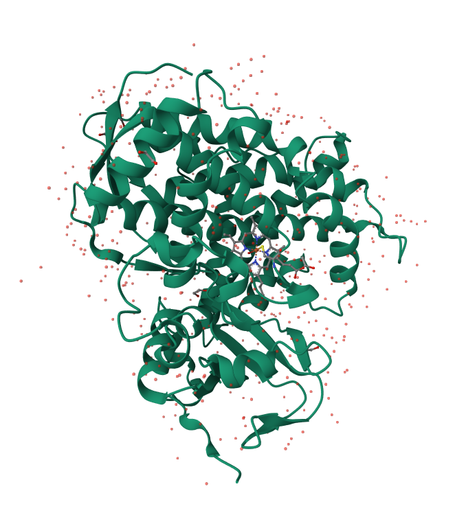

## Anàlisi de l'estructura secundària i supersecundària amb ChimeraX

Per fer l'estudi estructural s'ha utilitzat el programa ChimeraX ja que permet visualtizar i analitzar les diferents estructures i les seves interaccions.

### Estructures secundàries i interaccions estabilitzadores

#### - Fulles Beta (color groc):

Formades per 850 àtoms, 848 bonds, 102 residus repartits en 2 models i 365 pseudobonds.

Aquestes fulles es disposen en forma de làmines amb principalment ponts d'hidrogen entre cadenes polipeptídiques, especialment de manera antiparal·lela.

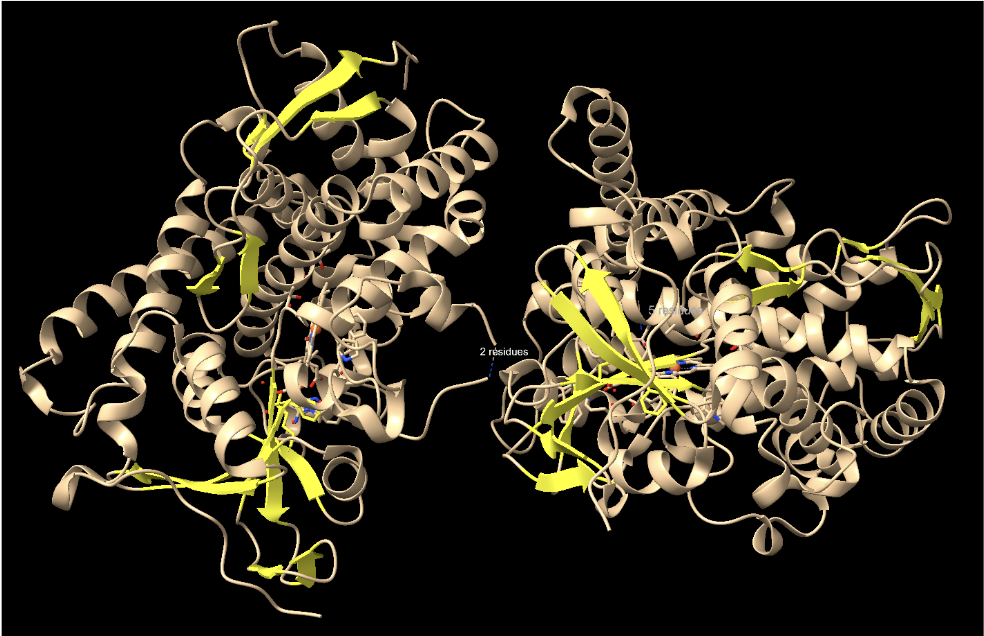


#### - Hèlix alfa (color blau):

Les hèlix alfa constitueixen la major part de la proteïna. S'han identificat 4512 àtoms, 4566 bonds, 571 residus i 3100 pseudobonds.

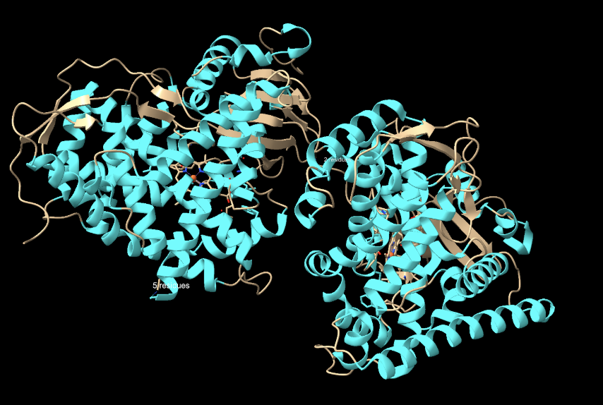


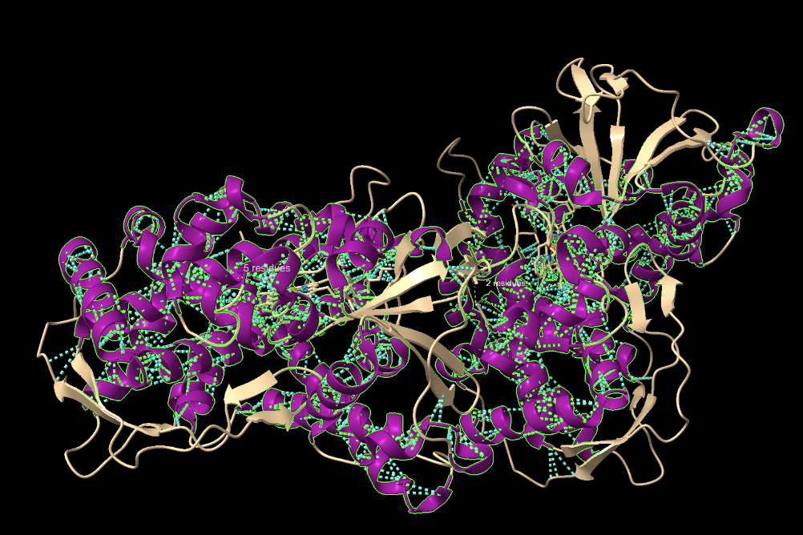


#### - Coils (color vermell):

Els llaços o coils presenten 1790 àtoms, 1790 bonds, 233 residus i 1 pseudobond.

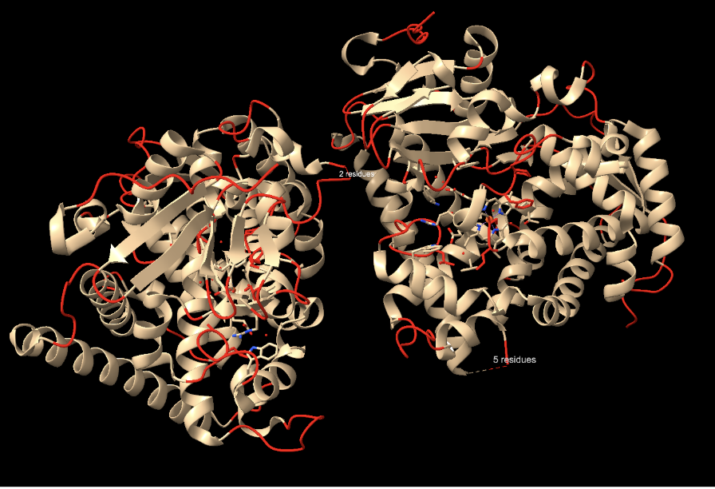


A diferència de les hèlix i les fulles beta, els coils no tenen una estructura definida, però són els principals llocs d'interacció amb altres estructures. En aquest cas identifiquem **2206** ponts d'hidrogen entre coils.

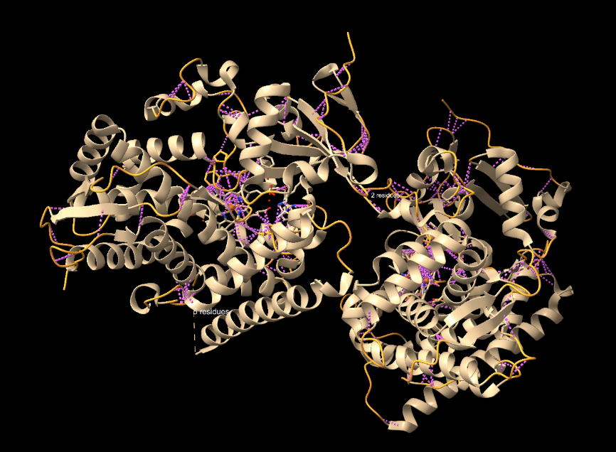


#### Interaccions estabilitzadores

##### - Ponts d'hidrogen:

Podem visualitzar 1913 ponts d'hidrogens representats amb el color blau (cian)

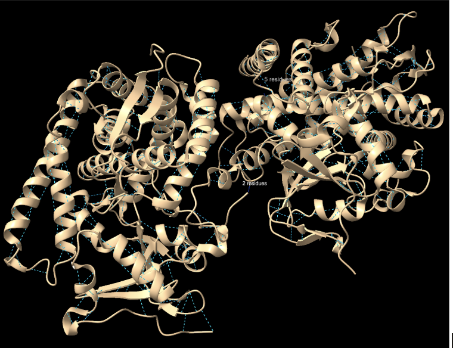


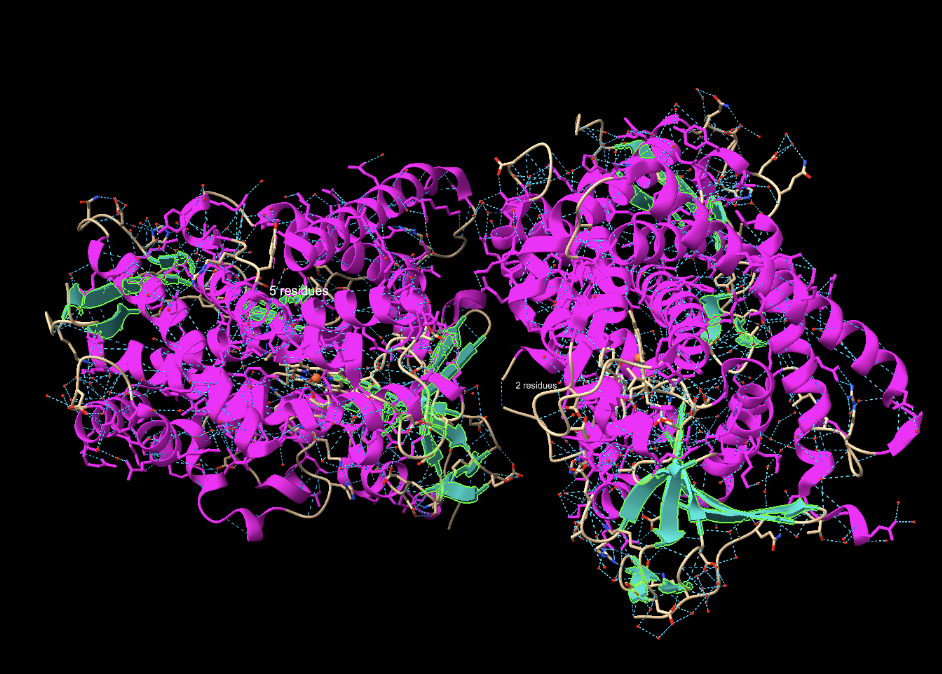

##### - Van der Waals:

Hi han representats 7162 interaccions Van der Waals, que son interaccions febles, de color verd

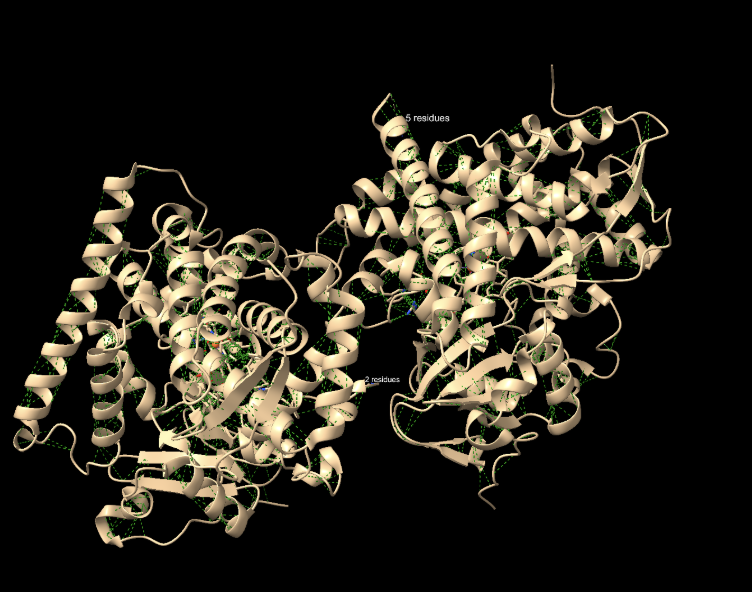

### Estructures supersecundàries

Son estructures que apareixen quan hi ha una agrupació o es formen motius en les estructures secundàries.

#### - Beta-meander:

Podem observar 4 tires consecutives beta antiparal·leles unides per loops

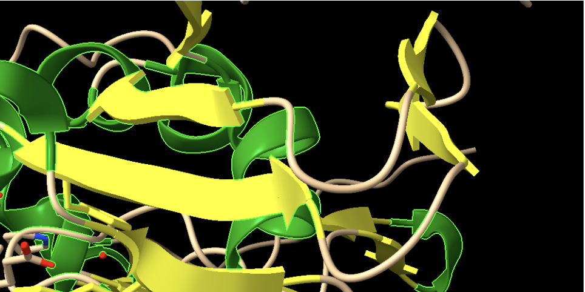


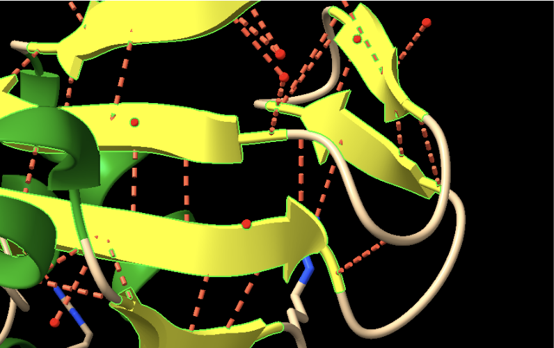


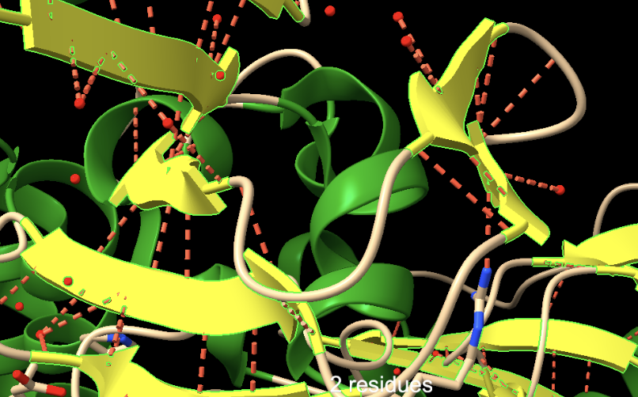


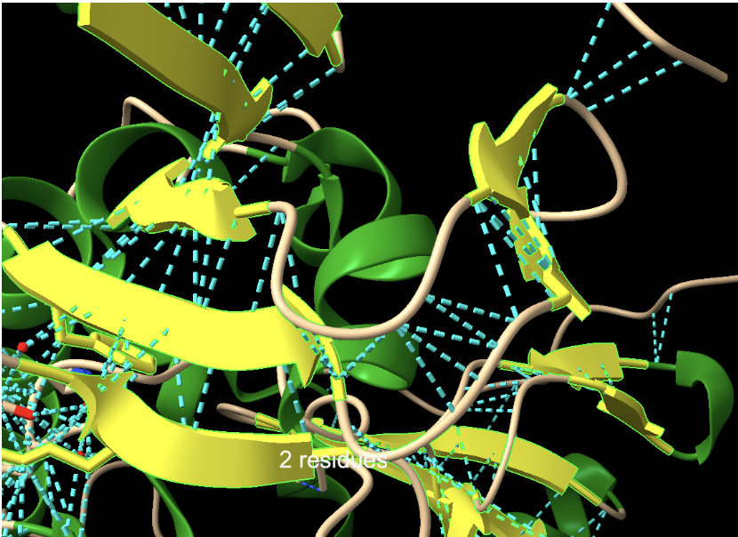

2n exemple del beta meander: 


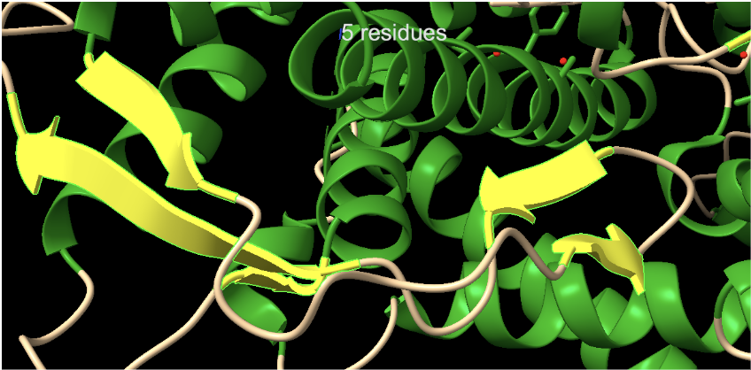
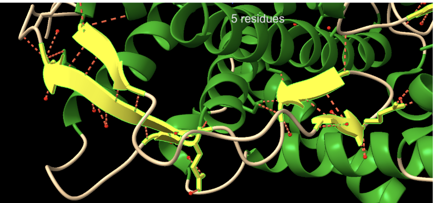


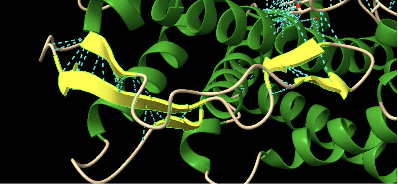


##### - Beta-hairpins:

Aquesta estructura és una β - hairpin, ja que es poden veure clarament 2 fulles β antiparaleles unides per un loop

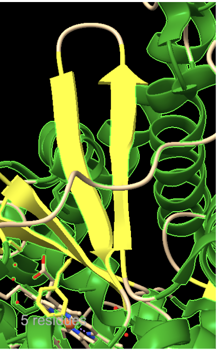

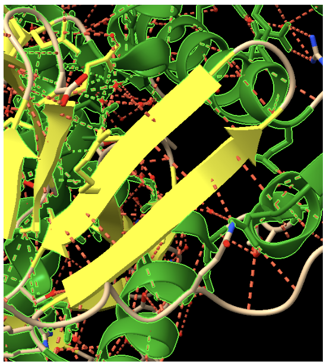
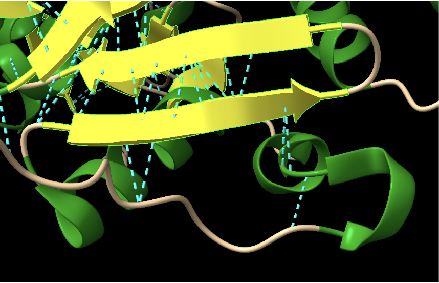

### Estructura terciària

L’estructura terciària de la proteïna correspon al plegament característic dels citocroms P450, amb un clar predomini d’hèlixs alfa que s’organitzen en una arquitectura compacta al voltant del centre actiu. Aquest tipus de plegament permet la formació d’una cavitat hidrofòbica interna adequada per a la unió i correcta orientació d’àcids grassos de cadena llarga respecte al grup hemo, fet essencial per a la seva funció catalítica.
Segons la base de dades CATH, el domini del citocrom P450 del CYP102A1 es classifica dins de la classe de proteïnes principalment alfa, amb una arquitectura helicoidal i una topologia pròpia de la família estructural dels citocroms P450, reflectint l’elevat grau de conservació estructural d’aquesta superfamília. D’acord amb la classificació d’ECOD, aquest domini s’engloba dins del grup P450-like, que inclou monooxigenases dependents de citocrom P450 amb un origen evolutiu comú. De manera coherent amb aquestes classificacions, segons SCOPe el domini del citocrom P450 també s’assigna a la classe de proteïnes principalment alfa, confirmant el plegament conservat característic d’aquesta família.
Pel que fa a l’estructura quaternària, el CYP102A1 és una proteïna monomèrica. Tot i això, presenta una organització funcional singular, ja que integra en una sola cadena polipeptídica el domini citocrom P450 i el domini reductasa, fet que permet una transferència d’electrons intramolecular eficient durant el cicle catalític.


## Funció de la proteïna

### Centre actiu

El centre actiu de la proteïna està format pel grup hemo (Fe-protoporfirina IX) dins del domini citocrom P450 (N-terminal), on el ferro és coordinat pel residu conservat Cys400, essencial per a l’activitat catalítica. Un residu important inclou Thr268, implicat en la transferència de protons i l’activació de l’oxigen molecular. La unió i orientació del substrat està controlada per residus hidrofòbics com Phe87, Val78, Leu188 i Ala264, mentre que Arg47 i Tyr51 participen en el reconeixement del substrat.

L’estructura presenta un inhibidor, el N-(12-imidazolyl-dodecanoyl)-L-leucine, i també presenta substrat sent aquests àcids grassos de cadena llarga (C12-C16).

El substrat, constituït per àcids grassos de cadena llarga, interacciona amb el centre actiu principalment mitjançant interaccions hidrofòbiques i de van der Waals amb residus com Phe87, Val78, Leu188 i Ala264, que formen una cavitat apolar. El grup carboxilat del substrat estableix interaccions electrostàtiques amb Arg47 i pot formar ponts d’hidrogen amb Tyr51 o molècules d’aigua. Aquest conjunt d’interaccions permet estabilitzar i orientar el substrat correctament respecte al grup hemo per a la reacció catalítica.

L’inhibidor N-(12-imidazolyl-dodecanoyl)-L-leucine interacciona amb el centre actiu del CYP102A1 mitjançant diversos tipus d’interaccions. El grup imidazol estableix una coordinació directa amb el ferro del grup hemo (enllaç Fe–N), bloquejant l’activitat catalítica. La cadena hidrocarbonada forma interaccions hidrofòbiques i de van der Waals amb residus com Phe87, Val78, Leu188 i Ala264, ocupant la cavitat del substrat. A més, grups polars de l’inhibidor poden establir interaccions electrostàtiques amb Arg47 i ponts d’hidrogen amb Tyr51 o molècules d’aigua, contribuint a l’estabilització del complex.

### Funció i mecanisme de l'enzim

La proteïna CYP102A1 (P14779) és una monooxigenasa dependent de NADPH que catalitza la hidroxilació d’àcids grassos de cadena llarga. El mecanisme catalític segueix el cicle típic dels citocroms P450: el substrat s’uneix prop del grup hemo, el ferro rep electrons des de NADPH a través dels cofactors FAD i FMN, i es produeix la unió i activació de l’oxigen molecular. Això genera una espècie reactiva (Fe(IV)=O) capaç d’oxidar el substrat mitjançant la inserció d’un grup hidroxil. Finalment, s’allibera el producte hidroxilat i l’enzim retorna al seu estat inicial.

### Modificacions post-translacionals

En el cas del CYP102A1 (P14779), no es descriuen moltes modificacions post-translacionals específiques. No obstant això, en proteïnes de la família dels citocroms P450 s’han descrit modificacions com la fosforilació en residus Ser, Thr o Tyr, que poden regular l’activitat enzimàtica. També poden produir-se modificacions com l’acetilació en residus Lys o oxidacions en Cys i Met. A més, el residu Cys400 és essencial, ja que coordina el grup hemo, una modificació funcional imprescindible per a l’activitat catalítica de l’enzim.

### Relació seqüència-estructura-funció

L’estructura del CYP102A1 està estretament relacionada amb la seva funció. El centre actiu conté un grup hemo coordinat pel residu Cys400, essencial per a l’activitat oxidativa. La cavitat hidrofòbica formada per residus com Phe87, Val78 o Leu188 permet la unió i posicionament dels àcids grassos, mentre que residus polars com Arg47 i Tyr51 contribueixen a la seva orientació. A més, residus com Thr268 participen en el mecanisme catalític. La presència d’un domini reductasa amb cofactors FAD i FMN facilita la transferència d’electrons des de NADPH. Aquesta organització estructural fa que l’enzim sigui altament eficient en la hidroxilació de substrats lipídics.

La seqüència d’aminoàcids determina la disposició d’aquests residus en l’espai tridimensional, i per tant la funció de la proteïna. Mutacions en residus clau poden alterar significativament l’activitat. Per exemple, mutacions en Phe87 (com F87A o F87G) modifiquen la mida de la cavitat i l’accés del substrat al centre actiu, afectant la selectivitat i l’activitat enzimàtica. Altres mutacions en residus de la butxaca del substrat poden canviar la regioselectivitat de la reacció o permetre l’oxidació de nous substrats.


