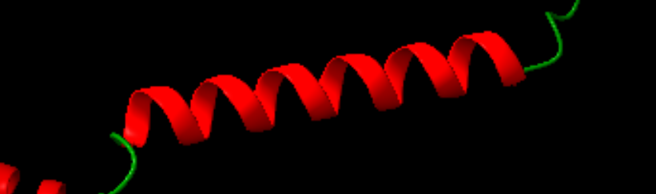
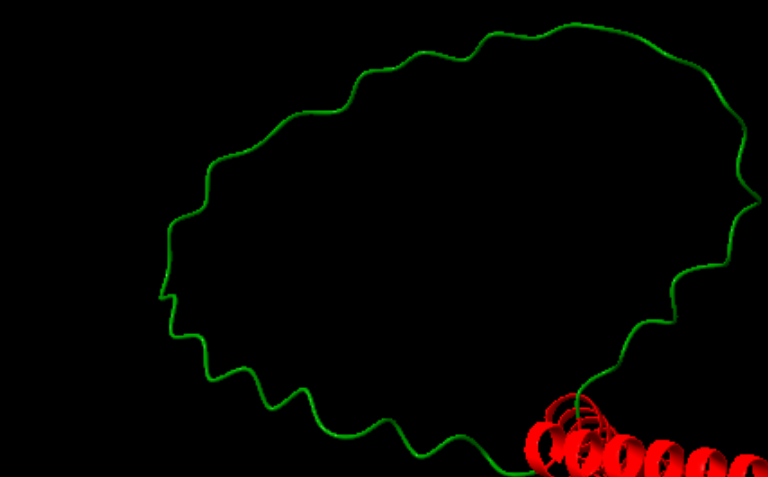
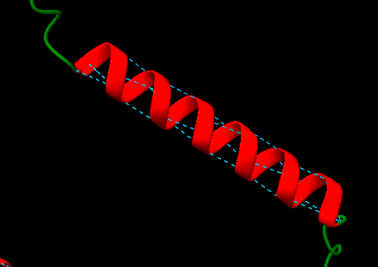
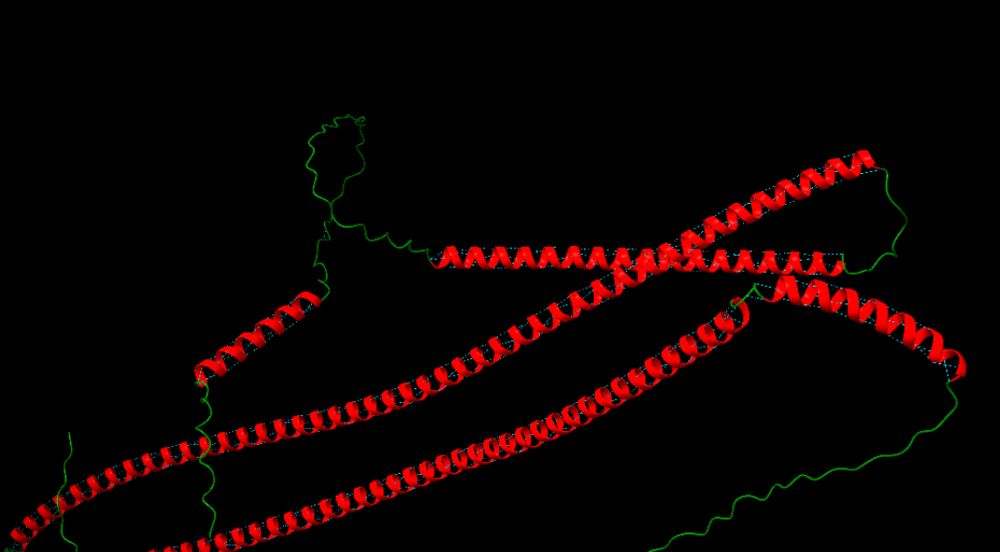
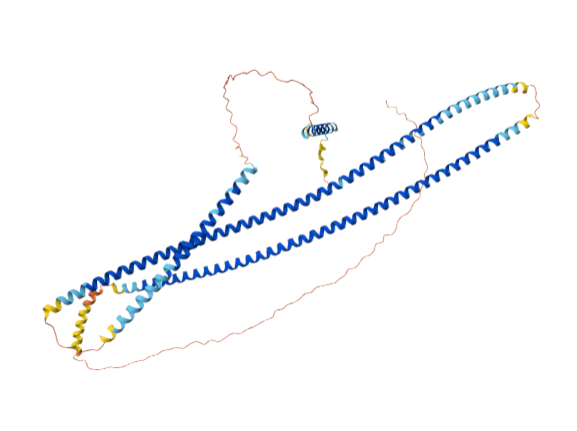
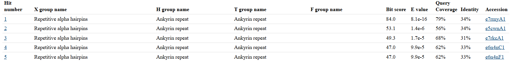
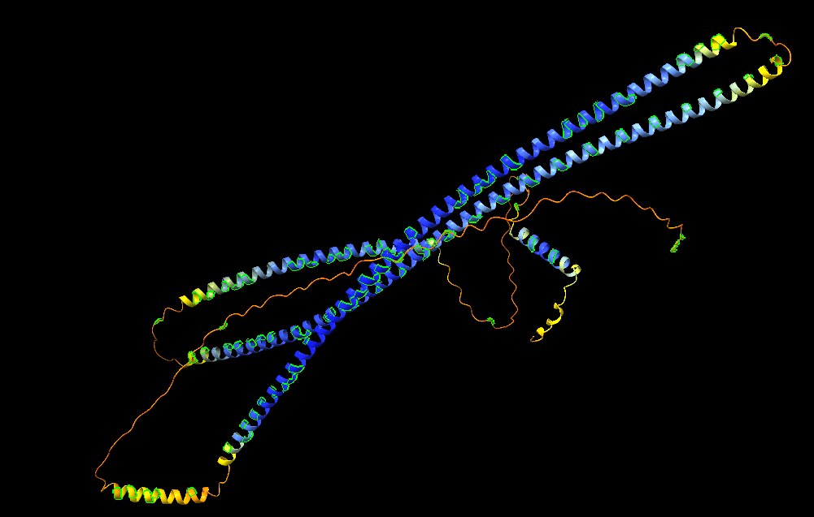
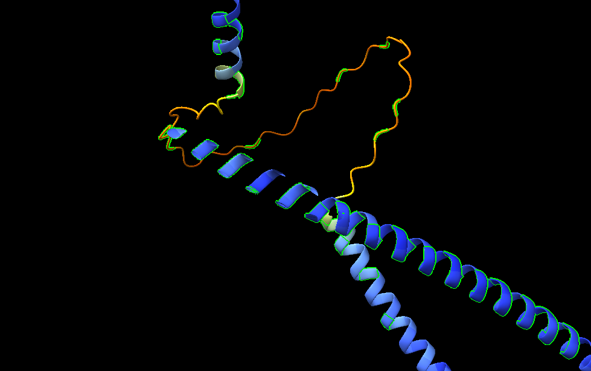

# **RELACIONS ESTRUCTURA-FUNCIÓ DE GOLGA6L4: Implicacions en l'arquitectura del complex de Golgi**

*Grup C: Carla Gómez, Irene Herrada, Abril Insa, Oriol Martí i Marina Valor*

## Índex

- [1. INFORMACIÓ SOBRE LA PROTEÏNA](#1informació-sobre-la-proteïna)
- [2. TREBALL AMB ChimeraX](#2treball-amb-chimerax)
  - [Tipus d'estructures secundàries detectades](#tipus-destructures-secundàries-detectades)
  - [Tipus d'estructures supersecundàries detectades](#tipus-destructures-supersecundàries-detectades)
  - [Estructura terciària](#estructura-terciària)
- [3. FUNCIÓ DE LA PROTEÏNA](#3-funció-de-la-proteïna)
  - [Absència de centre actiu i anàlisi estructural de GOLGA6L4](#absència-de-centre-actiu-i-anàlisi-estructural-de-golga6l4)
    - [Centre actiu i residus rellevants](#centre-actiu-i-residus-rellevants)
    - [Substrats i inhibidors](#substrats-i-inhibidors)
    - [Interaccions estructurals observades](#interaccions-estructurals-observades)
    - [Informació general](#informació-general)
    - [Modificacions post-traduccionals](#modificacions-post-traduccionals)

**Seqüència donada:** SGSGSTEEEEALLRWFQTLLAKFDELVKQLGDPRLLEEARRLQERLEEAKKRGDKRTIKQLAALLQMFVLIAQIFQLVEELGDPKLLEQAKRLLERLKEAVERGDEETIKELLDLAHMTYLIAQIFQLVEQLGDPRLLELAKELLKRLKEAQERGDRRTIERLLRLVQMTYLIAQIFQLVRQLGDPRLLETAKTLLTLLKLAFEEGDELLIKSLLTLVAETYRQAAAEQ

## **1.INFORMACIÓ SOBRE LA PROTEÏNA**

**Nom de la proteïna:** Golgin subfamily A member 6-like protein 4

**Nom del gen:** GOLGA6L4

**Codi UniProt:** A6NEF3

La funció de la proteïna codificada pel gen GOLGA6L4 no ha estat caracteritzada experimentalment. A la base de dades UniProt no es descriu una funció específica, i les anotacions disponibles provenen de models computacionals (PAN-GO), basats en homologia amb altres proteïnes.
No obstant això, GOLGA6L4 pertany a la família de les golgines, proteïnes associades a l’aparell de Golgi. Per analogia amb altres membres d’aquesta família, és probable que estigui implicada en el manteniment de l’estructura de l’aparell de Golgi i en processos de trànsit vesicular intracel·lular. No es tracta d’un enzim, per tant no presenta classificació EC ni activitat catalítica.

## **2.TREBALL AMB ChimeraX**

#### **Tipus d'estructures secundàries detectades**
- **Hèlix alpha (α)**

**Figura 1.** Hèlix alpha de la proteïna, mostrada en vermell amb una disposició helicoïdal

- **Loops**

**Figura 2.** Vista del loop estructural de la proteïna, una regió desordenada que actua com a connector entre elements d’estructura secundària i que no presenta patrons regulars d’enllaços d’hidrogen

- **Ponts d'hidrogen**

**Figura 3.** Representació dels ponts d’hidrogen que estabilitzen la conformació local, indicats mitjançant línies discontínues

#### **Tipus d'estructures supersecundàries detectades**

**Figura 4.** En l’anàlisi de l’estructura de la proteïna s’identifica la presència d’un motiu supersecundari predominant de tipus coiled-coil, format per diverses hèlixs alfa llargues disposades de manera paral·lela i lleugerament enrotllades entre si. Aquest tipus d’organització és característic de proteïnes riques en hèlixs alfa i amb funcions estructurals o d’interacció.

#### **Estructura terciària**

**Figura 5.** Estructura 3D de la proteïna

L’estructura terciària de la proteïna GOLGA6L4, obtinguda mitjançant AlphaFold, mostra un plegament allargat i predominantment α-helical, propi de proteïnes estructurals no globulars. Aquesta conformació es basa en la presència de múltiples hèlixs α que s’organitzen en estructures repetitives.

**Figura 6.** Resultats ECOD

L’anàlisi amb ECOD mostra un total de 53 resultats amb característiques estructurals molt similars, principalment classificats dins de dominis de tipus ankyrin repeat. La repetició d’aquests resultats indica una alta consistència en la classificació estructural, suggerint que la proteïna presenta un plegament basat en motius repetitius d’alpha hairpins (hèlix α–gir–hèlix α).

Tot i que la identitat de seqüència és moderada (~30–35%), els valors baixos d’E-value confirmen que la similitud estructural és significativa. En conjunt, aquests resultats reforcen que la proteïna presenta una arquitectura α-helical repetitiva, típica de proteïnes implicades en interaccions proteïna-proteïna.

No hi ha evidència experimental d’estructura quaternària; tanmateix, podria formar oligòmers per interaccions coiled-coil, com altres golgines.

## **3. FUNCIÓ DE LA PROTEÏNA**
### Absència de centre actiu i anàlisi estructural de GOLGA6L4
#### **Centre actiu i residus rellevants**
- La proteïna GOLGA6L4 **no presenta centre actiu definit**
- No es tracta d'un enzim, sinó una proteïna **estructural associada a l'aparell de Golgi**
- Com que a UniProt no hi cap anotació de llocs actius ni residus catalítics considerem que no hi ha **residus catalítics descrits** i no participa en **reacccions enzimàtiques**

#### **Substrats i inhibidors**
L’estructura analitzada correspon a un model predictiu d’AlphaFold, que representa la proteïna en estat aïllat, sense presència de substrats ni inhibidors.

#### **Interaccions estructurals observades**
Tot i no tenir funció catalítica, la proteïna presenta interaccions internes importants:
- **Ponts d'hidrogen** que estabilitzen les hèlix α i manté l'estructura secundària
- **Interaccions hidrofòbiques** entre residus com Leucina, Isoleucina i Valina 
- **Interaccions de van der Waals** entre cadenes properes
- **Interaccions electostàtiques** entre residus com Lisina i Glutamat que estabilitzen l'estructura tridimensional

**Figura 7.** Residus hidrofòbics (Val, Leu, Ile). Aquests residus es distribueixen principalment al llarg de les hèlix α, contribuint a l’estabilització dels motius coiled-coil mitjançant interaccions hidrofòbiques.

**Figura 8.** Residus amb càrrega positiva (Lys) i amb càrrega negativa (Glu). La seva proximitat suggereix possibles interaccions electrostàtiques que contribueixen a l’estabilització estructural i a la interacció amb altres proteïnes.

#### **Informació general**

L’anàlisi estructural mostra una proteïna predominantment formada per hèlix α llargues que s’organitzen en motius coiled-coil, una característica típica de les golgines. Aquest tipus d’estructura genera una conformació allargada que facilita les interaccions proteïna-proteïna i permet actuar com a element d’ancoratge dins l’aparell de Golgi.

Els principals elements estructurals implicats en la funció són:

- Hèlix α llargues que proporcionen estabilitat estructural
- Motius coiled-coil que afavoreixen la formació de complexes multiproteics
- Regions de llaç que aporten flexibilitat conformacional

Aquesta organització estructural és coherent amb el paper proposat de GOLGA6L4 en:

- Manteniment de l’arquitectura de l’aparell de Golgi
- Tethering o captura de vesícules
- Establiment d’interaccions dins del sistema endomembranós

#### **Modificacions post-translacionals**
No s’han descrit modificacions post-traduccionals específiques per a GOLGA6L4 a UniProt. Tanmateix, per analogia amb altres golgines, podria presentar fosforilació (Ser, Thr, Tyr), ubiquitinació i acetilació (Lys). Aquestes modificacions podrien regular la seva interacció amb altres proteïnes i la seva funció estructural al Golgi.

