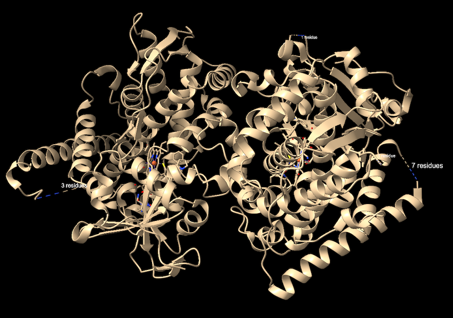
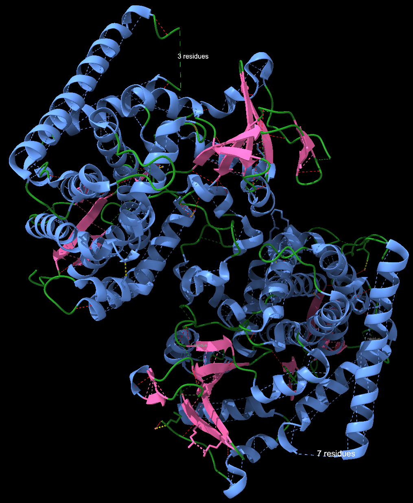
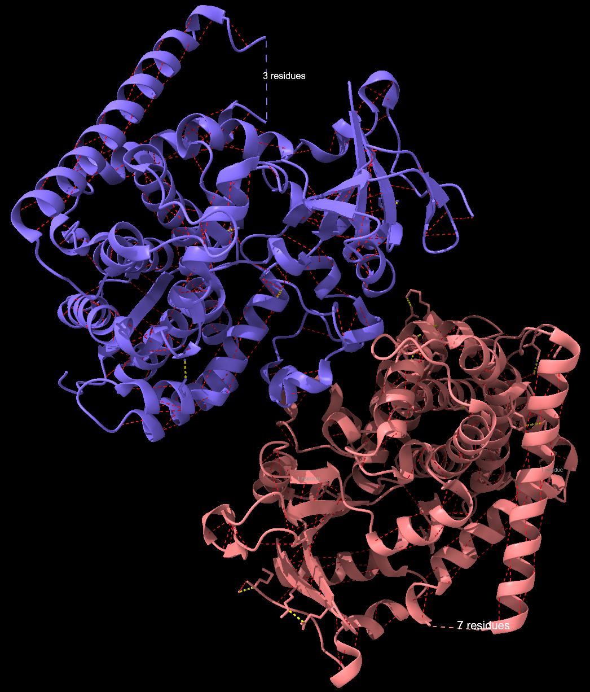
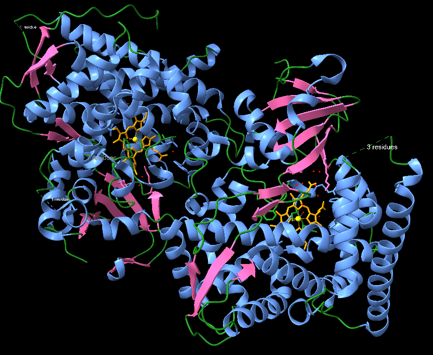
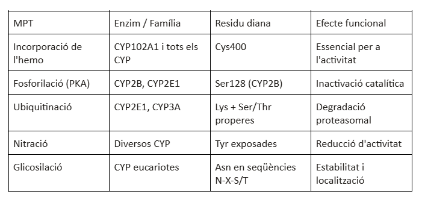

```{r setup, include=FALSE}
knitr::opts_chunk$set(echo = TRUE)

```
<style>
body {
  text-align: justify;
}
</style>

# Introducció

Els citocroms P450 són una superfamília d'enzims que contenen hemo b i funcionen com a monooxigenases. Es troben en organismes de tots els dominis de la vida i tenen com a funció catalitzar l'oxigenació —freqüentment hidroxilació— d'una àmplia varietat de molècules. Per fer-ho, utilitzen un intermediari transitori de ferro-oxo fèrric que facilita l'addició d'oxigen al substrat.

La proteïna estudiada en aquest treball és el **Citocrom P450 BM3** (CYP102A1), de l'organisme *Priestia megaterium*. Les seves dades d'identificació principals són les següents:

| Camp                 | Informació            |
|----------------------|-----------------------|
| **Nom**              | Citocrom P450 BM3     |
| **Organisme**        | *Priestia megaterium* |
| **Codi UniProt**     | P14779.2              |
| **Gen**              | *cyp102A1*            |
| **Classificació EC** | EC 1.14.14.1          |

La seqüència d'aminoàcids de la proteïna és la següent:

```         
MTIKEMPQPKTFGELKNLPLLNTDKPVQALMKIADELGEIFKFEAPGRVTRYISSQRLVK
EACDESRFDKNLSQARKFVRDFAGDGLATSWTHEKNWKKARNILLPRLSQQAMKGHAMMV
DIAVQLVQKWERLNSDEHIEVPEDMTRLTLDTIGLCGFNYRINSFYRDQPHPFITSMVRA
LDEVMNKLQRANPDDPAYDENKRQFQEDIKVMNDLVDKIIADRKASGEQSDDLLTHMLHG
KDPETGEPLDDENIRYQIITFLIAGHETTSGLLTFALYFLVKNPHVLQKAAEEAARVLVD
PVPSYKQVKQLKYVGMVLNEALRIWPTAPAFSLYAKEDTMLGGEYPLEKGDELMVLIPQL
HRDKTVWGDDVEEFRPERFENPSAIPQHAFKPFGNGQRACIGQQFALHEATLVLGMMLKH
FDFEDHTNYELDIEETLTLKPKGFVIKAKSKKIPLGGIPSPSTLEHHHHHH
```

# Estructura

## Protein Data Bank (PDB)

L'estructura tridimensional de la proteïna s'ha obtingut a partir del **Protein Data Bank (PDB)**, amb el codi d'accés **2IJ2**. Aquesta estructura ha estat seleccionada perquè presenta una de les resolucions més altes disponibles, ha estat determinada per difracció de raigs X (*X-ray diffraction*), té una identitat de seqüència propera al 100%, un E-value molt baix i la regió estructural cobreix gairebé la totalitat de la seqüència. A més, correspon al mateix organisme d'estudi.

## ChimeraX

### Estructura secundària

```{r figura1, echo=FALSE, fig.align='center', out.width='70%', fig.cap="**Figura 1.** Estructura tridimensional de la proteïna (PDB: 2IJ2) visualitzada amb ChimeraX en representació cartoon."}

```


L'estructura secundària de la proteïna es pot observar a la **Figura 2**, on es distingeixen clarament tres tipus d'elements:

-   **Hèlixs alfa** (blau): constitueixen la major part del plegament de la proteïna. Són estructures en forma d'espiral distribuïdes per tota la molècula i representen el domini predominant de la proteïna.

-   **Làmines beta** (rosa): presents en menor proporció. Estan formades per cadenes polipeptídiques esteses i poden adoptar orientació paral·lela o antiparal·lela.

-   **Llaços** (verd): connecten les hèlixs alfa amb les làmines beta. Són regions menys ordenades i més flexibles que permeten canvis de direcció i aporten dinàmica a la proteïna.

L'estabilitat d'aquestes estructures es manté gràcies als **ponts d'hidrogen** entre els grups del backbone peptídic, les **forces de Van der Waals** i les **interaccions hidrofòbiques** entre els aminoàcids apolars.

```{r figura2, echo=FALSE, fig.align='center', out.width='70%', fig.cap="**Figura 2.** Estructures secundàries de la proteïna visualitzades amb ChimeraX: hèlixs α (blau), làmines β (rosa), llaços (verd), ponts d'hidrogen (vermell) i interaccions de Van der Waals (groc)."}

```

### Estructura supersecundària

En l'estructura de la proteïna es poden observar motius d'estructura supersecundària, majoritàriament del tipus **alfa-alfa** —connectades pels llaços marcats en verd a la Figura 2—, que predominen degut a l'elevada proporció d'hèlixs alfa en la proteïna. De manera minoritària, també es poden identificar possibles combinacions del tipus **beta-alfa-beta**, tot i que les làmines beta són escasses.

Les interaccions presents en aquest tipus de superestructures inclouen:

-   **Ponts d'hidrogen** entre segments propers (representats en vermell a la Figura 2).
-   **Interaccions de Van der Waals** entre cadenes adjacents (representades en groc a la Figura 2).
-   **Interaccions hidrofòbiques** entre les cadenes laterals dels residus implicats.

### Estructura terciària

```{r figura3, echo=FALSE, fig.align='center', out.width='70%', fig.cap="**Figura 3.** Representació de la proteïna (PDB: 2IJ2) acolorida per cadena amb ChimeraX, mostrant les dues subunitats del dímer."}

```


Segons la classificació **CATH**, la proteïna presenta el codi **1.10.630.10**, pertanyent a la classe 1 (*mainly alpha*) i a la superfamília Cytochrome P450. Per tant, l'estructura terciària correspon a un plegament predominantment alfa-helicoidal.

Pel que fa a l'**estructura quaternària**, la proteïna es presenta com un **dímer**, amb dues cadenes polipeptídiques associades, tal com es pot observar a la Figura 3.

# Funció

### Centre actiu

**Residus rellevants del centre actiu**

El centre actiu del domini hemo es troba a la cavitat hidrofòbica situada sobre el grup hemo (HEM), que conté un àtom de ferro coordinat per una cisteïna axial conservada. Els residus més rellevants del centre actiu són els següents:

-   **Cys400**: residu més crític del centre actiu. Coordina directament l'àtom de ferro del grup hemo mitjançant el seu grup tiol, actuant com a lligand axial proximal. Els electrons provinents del domini FMN flueixen fins al ferro del hemo a través d'aquest residu (Munro et al., 2002).

-   **Thr268**: situat a l'hèlix I, ha estat implicat en múltiples funcions catalítiques: donació de protons, activació de l'oxigen molecular i reconeixement del substrat. La seva substitució per alanina o asparagina redueix dràsticament la capacitat de l'enzim de generar el complex d'alt spin i disminueix l'estabilitat de l'espècie oxi-ferrosa (Truan & Peterson, 1998; Butler et al., 2013).

-   **Phe393**: modula el potencial de reducció del hemo mitjançant interaccions directes amb Cys400. Mutacions en aquest residu alteren significativament la cinètica de transferència electrònica (Ost et al., 2001).

-   **Glu267 i Thr268**: formen part de la regió *kink* conservada de l'hèlix I i participen conjuntament en la xarxa de ponts d'hidrogen necessària per a l'activació de l'oxigen i l'estabilització d'intermediaris catalítics com l'espècie ferryl-oxo (Compost I) (Whitehouse et al., 2012).

-   **Phe87**: residu hidrofòbic que controla la selectivitat i especificitat de la reacció, limitant l'accés del substrat al ferro del hemo i condicionant la regiosselectivitat de la hidroxilació (Rea et al., 2012).

-   **Ser72, Val78, Ala82 i Leu188**: contribueixen a la conformació del centre actiu i al canal d'accés del substrat (Whitehouse et al., 2012).

```{r figura4, echo=FALSE, fig.align='center', out.width='70%', fig.cap="**Figura 4.** Representació de la proteïna (PDB: 2IJ2) amb ChimeraX, on els centres actius queden representats de color taronja i els dos àtoms de ferro presents en aquests de color groc."}

```

**Substrats i inhibidors**

Nombroses estructures cristal·logràfiques de P450 BM3 disponibles al PDB contenen substrats o inhibidors. Per exemple, l'estructura **1FAH** inclou àcid palmític com a substrat natural, mentre que d'altres inclouen inhibidors com l'**imidazol**, que coordina directament el ferro del hemo i impedeix la unió de l'oxigen (Munro et al., 2002).

**Interaccions entre residus del centre actiu i amb el substrat/inhibidor**

-   **Ponts d'hidrogen**: Thr268 estableix ponts d'hidrogen amb molècules d'aigua properes al ferro del hemo i amb l'espècie peròxid-ferro durant el cicle catalític. Ala264, també a l'hèlix I, contribueix a una xarxa de ponts d'hidrogen que desplaça el lligand aquós axial del ferro en unir-se el substrat.

-   **Interaccions de Van der Waals i hidrofòbiques**: Phe87, Val78, Ala82 i Leu188 formen una cavitat hidrofòbica que envolta la cua alifàtica del substrat (àcid gras). Aquestes interaccions posicionen el substrat de manera adequada per a la hidroxilació regiosselectiva en les posicions ω-1 a ω-3 (Rea et al., 2012; Whitehouse et al., 2012).

-   **Coordinació metàl·lica**: Cys400 coordina el ferro del hemo mitjançant un enllaç covalent de coordinació Fe–S. El substrat o inhibidor pot ocupar la posició axial distal del ferro, desplaçant la molècula d'aigua lligada, tal com s'ha observat cristal·logràficament amb DTT (Boerma et al., 2019).

-   **Interaccions electrostàtiques**: la cara proximal de l'hemo presenta càrregues positives que interaccionen amb els residus carregats negativament del domini FMN per facilitar la transferència electrònica entre dominis.

### Reacció

La funció principal de CYP102A1 és la **hidroxilació regio- i estereoselectiva d'àcids grassos de cadena llarga** (C12–C20), principalment en les posicions subtermininals ω-1, ω-2 i ω-3, consumint NADPH i O₂ molecular (Whitehouse et al., 2012).

CYP102A1 és un enzim **autosuficient**: el seu domini hemo catalític (BMP) i el domini reductasa diflavínic (BMR) estan fusionats en una sola cadena polipeptídica, la qual cosa li confereix una eficiència catalítica excepcional. La taxa de recanvi és superior a 3.000 min⁻¹, i s'ha reportat una taxa de 17.100 min⁻¹ per a l'oxidació de l'àcid araquidònic, la més alta coneguda entre tots els enzims P450.

La reacció global que catalitza és:

$$\text{R–H} + \text{NADPH} + \text{H}^+ + \text{O}_2 \rightarrow \text{R–OH} + \text{NADP}^+ + \text{H}_2\text{O}$$

on R–H és un àcid gras de cadena llarga i R–OH és el producte hidroxilat.

El **mecanisme catalític** comprèn els passos següents:

1.  **Unió del substrat**: l'àcid gras desplaça el lligand distal d'aigua del ferro fèrric (Fe³⁺), provocant un canvi d'espín de baix a alt que incrementa el potencial de reducció del ferro (Whitehouse et al., 2012).

2.  **Primera reducció (Fe³⁺ → Fe²⁺)**: el domini FMN del mateix polipèptid transfereix el primer electró al hemo, reduint el ferro a l'estat ferrós. La cadena de transferència és NADPH → FAD → FMN → Fe (Munro et al., 2002).

3.  **Unió de l'O₂**: el Fe²⁺ s'uneix al diòxigen formant el complex ferrosoxi [Fe²⁺–O₂], isoelectrònic amb l'estat fèrric-superoxo (Ortiz de Montellano, 2010).

4.  **Segona reducció**: un segon electró del FMN redueix el complex per generar l'anió peroxo-fèrric [Fe³⁺–O₂²⁻]. Aquest pas és habitualment el limitant de la velocitat del cicle catalític.

5.  **Primera protonació → Compost 0**: l'anió peroxo rep un protó sobre l'oxigen distal, generant el fèrric-hidroperoxo [Fe³⁺–OOH]. El residu Thr268 de l'hèlix I facilita la correcta entrega de protons en aquest pas (Truan & Peterson, 1998).

6.  **Segona protonació → Compost I**: una segona protonació sobre l'oxigen distal desencadena l'escissió heterolítica de l'enllaç O–O, alliberant H₂O i formant l'espècie ferryl-oxo altament reactiva, el **Compost I** [Fe⁴⁺=O]·⁺.

7.  **Abstracció d'H· i rebot d'oxigen**: el Compost I abstrau un àtom d'hidrogen del substrat, generant el Compost II [Fe⁴⁺–OH] i un radical orgànic, que es recombinen per donar el producte alcohol R–OH.

8.  **Alliberament del producte**: el producte hidroxilat s'allibera, l'H₂O torna a coordinar el ferro i l'enzim retorna a l'estat fèrric de repòs (Guengerich, 2018).

### Modificacions post-translacionals

CYP102A1 és un enzim bacterià de *Priestia megaterium*. Com a proteïna procariota soluble, no està sotmesa a la majoria de modificacions post-translacionals (MPT) pròpies dels citocroms P450 eucariotes, com ara la glicosilació o l'ancoratge a membranes del reticle endoplasmàtic. Aquesta és una diferència fonamental respecte als seus homòlegs eucariotes (Guengerich, 2001). No obstant això, existeixen modificacions funcionals rellevants que afecten CYP102A1 directament o bé proteïnes de la mateixa superfamília:

La **incorporació covalent del grup hemo** és la modificació més essencial per a l'activitat catalítica de qualsevol citocrom P450, inclòs CYP102A1. Aquesta incorporació es produeix a través de la coordinació del ferro amb la cisteïna axial **Cys400**, que constitueix el lligand tiolat conservat en tota la superfamília CYP. El motiu de seqüència conservat per a la unió del hemo és **FxxGxRxCxG**, on la cisteïna coordina el ferro i l'arginina estableix interaccions electrostàtiques fortes amb les cadenes laterals carregades negativament del hemo. Aquesta unió Fe–S és imprescindible per a la funció catalítica i la integritat estructural de la proteïna (Whitehouse et al., 2012).

La regulació de la disponibilitat de l'hemo pot ser considerada una forma de control postraduccional, ja que l'hemo juga un paper important en esdeveniments transcripcionals, traduccionals i postraduccionals de múltiples proteïnes, incloent els citocroms P450.

```{r taula1, echo=FALSE, fig.align='center', out.width='90%', fig.cap="**Taula 1.** Resum de les diferents modificacions post-traduccionals que pot patir l'enzim o altres enzims de famílies similars."}

```

### Relació seqüència-estructura-funció

L'estructura de CYP102A1 integra en un sol polipèptid el **domini hemo N-terminal (BMP)** i el **domini reductasa C-terminal (BMR)**, fusió que explica la seva excepcional eficiència catalítica (Whitehouse et al., 2012). Dins del domini hemo, els elements estructurals més rellevants per a la funció són:

-   **Hèlix I**: forma la paret del canal del substrat i conté residus essencials per a l'activació de l'oxigen.
-   **Hèlixs F i G amb el seu bucle**: actuen com a "tapa" del canal d'accés i experimenten el canvi conformacional obert/tancat en unir-se el substrat.
-   **Bucle de la cisteïna proximal**: conté Cys400, el lligand axial del ferro hèmic.

Els residus funcionalment més importants són:

-   **Cys400**: lligand tiolat axial del Fe, imprescindible per al cicle catalític.
-   **Thr268**: entrega de protons i estabilització del Compost I; la seva mutació redueix dràsticament l'activitat.
-   **Phe87**: controla la geometria d'accés del substrat i determina la regioselectivitat.
-   **Arg47/Tyr51**: al canal d'entrada, estableixen ponts d'hidrogen amb el carboxilat de l'àcid gras per posicionar el substrat (Whitehouse et al., 2012; Truan & Peterson, 1998).

### Variants

Les posicions amb major freqüència de substitució documentada es troben majoritàriament a les hèlixs B', F i I, e inclouen les posicions 87, 47, 78, 82, 188 i 267, entre d'altres. Les tres variants amb major impacte funcional documentat són:

-   **F87V**: la substitució de Phe87 per valina amplia la cavitat del centre actiu, permetent l'accés de fàrmacs i substrats no naturals de menor mida. Variants que combinen R47L, L86I, F87V i L188Q metabolitzen selectivament substrats de CYP1A2, com la fenacetina, fins als metabòlits humans acetaminofèn i resorufina.

-   **A82F**: ocupa un buit hidrofòbic adjacent al centre actiu. El mutant A82F presenta una afinitat pel substrat aproximadament **800 vegades superior** a la de l'enzim salvatge, amb una major conversió del ferro hèmic a l'estat d'alt spin i una eficiència catalítica similarment incrementada.

-   **Mutant M11** (R47L/F87V/L188Q/E267V/...): obtingut per evolució dirigida amb deu mutacions. Ha demostrat ser altament actiu i capaç de metabolitzar un conjunt divers de compostos farmacèutics, i ha servit com a plantilla per al disseny de nous variants biocatalítics. A nivell molecular, les mutacions augmenten col·lectivament la flexibilitat del domini lid, ampliant el canal d'accés a substrats no naturals (Boerma et al., 2019; Fansher et al., 2024).

# Referències

1.  Boerma, J. S., Vermeulen, N. P. E., & Commandeur, J. N. M. (2019). Structural analysis of cytochrome P450 BM3 mutant M11 in complex with dithiothreitol. *PLOS ONE*, *14*(5), e0217292. <https://doi.org/10.1371/journal.pone.0217292>

2.  Butler, C. F., Peet, C., Mason, A. E., Voice, M. W., Leys, D., & Munro, A. W. (2013). Key mutations alter the cytochrome P450 BM3 conformational landscape and remove inherent substrate bias. *Journal of Biological Chemistry*, *288*(35), 25387–25399. <https://doi.org/10.1074/jbc.M113.479717>

3.  CATH. (s.d.). CATH superfamily 1.10.630.10: Cytochrome P450. Recuperat el 23 de març de 2026, de CATH superfamily classification.

4.  Correia, M. A., Liao, M., & Kongmanas, K. (2011). Ubiquitin-dependent proteasomal degradation of human liver cytochrome P450 2E1: identification of sites targeted for phosphorylation and ubiquitination. *Journal of Biological Chemistry*, *286*(19), 16696–16710. <https://doi.org/10.1074/jbc.M110.176685>

5.  Correia, M. A., Sadeghi, S., & Mundo-Paredes, E. (2005). Cytochrome P450 ubiquitination: branding for the proteolytic slaughter? *Annual Review of Pharmacology and Toxicology*, *45*, 439–464. <https://doi.org/10.1146/annurev.pharmtox.45.120403.100040>

6.  Fansher, D. J., Besna, J. N., Fendri, A., & Pelletier, J. N. (2024). Choose your own adventure: a comprehensive database of reactions catalyzed by cytochrome P450 BM3 variants. *ACS Catalysis*, *14*(8), 5560–5592. <https://doi.org/10.1021/acscatal.4c00086>

7.  Girvan, H., Seward, H., Toogood, H., et al. (2006). Structural and spectroscopic characterization of P450 BM3 mutants with unprecedented P450 heme iron ligand sets. *Journal of Biological Chemistry*, *282*, 564–572.

8.  Guengerich, F. P. (2001). Common and uncommon cytochrome P450 reactions related to metabolism and chemical toxicity. *Chemical Research in Toxicology*, *14*(6), 611–650. <https://doi.org/10.1021/tx0002583>

9.  Guengerich, F. P. (2018). Mechanisms of cytochrome P450-catalyzed oxidations. *ACS Catalysis*, *8*(12), 10964–10976. <https://doi.org/10.1021/acscatal.8b03401>

10. Guengerich, F. P., Waterman, M. R., & Egli, M. (2016). Recent structural insights into cytochrome P450 function. *Trends in Pharmacological Sciences*, *37*(8), 625–640. <https://doi.org/10.1016/j.tips.2016.05.006>

11. Herráez, A. (s.d.). Estructura secundaria de las proteínas. Recuperat el 23 de març de 2026, de <https://biomodel.uah.es/model1j/prot/supersec/inicio.htm>

12. Koch, J. A., & Waxman, D. J. (1989). Posttranslational modification of hepatic cytochrome P450: phosphorylation of phenobarbital-inducible P450 forms PB-4 (IIB1) and PB-5 (IIB2) in isolated rat hepatocytes and in vivo. *Biochemistry*, *28*(8), 3145–3152. <https://doi.org/10.1021/bi00434a004>

13. Munro, A. W., Leys, D. G., McLean, K. J., Marshall, K. R., Ost, T. W. B., Daff, S., Miles, C. S., Chapman, S. K., Lysek, D. A., Moser, C. C., Page, C. C., & Dutton, P. L. (2002). P450 BM3: the very model of a modern flavocytochrome. *Trends in Biochemical Sciences*, *27*(5), 250–257. [https://doi.org/10.1016/S0968-0004(02)02086-8](https://doi.org/10.1016/S0968-0004(02)02086-8){.uri}

14. Oesch-Bartlomowicz, B., & Oesch, F. (2003). Phosphorylation of cytochromes P450: first discovery of a posttranslational modification of a drug-metabolizing enzyme. *Biochemical and Biophysical Research Communications*, *303*(2), 446–452. [https://doi.org/10.1016/S0006-291X(03)00357-5](https://doi.org/10.1016/S0006-291X(03)00357-5){.uri}

15. Ortiz de Montellano, P. R. (2010). Hydrocarbon hydroxylation by cytochrome P450 enzymes. *Chemical Reviews*, *110*(2), 932–948. <https://doi.org/10.1021/cr9002193>

16. Ost, T. W. B., Miles, C. S., Murdoch, J., Cheung, Y., Reid, G. A., Chapman, S. K., & Munro, A. W. (2001). Rational re-design of the substrate binding site of flavocytochrome P450 BM3. *FEBS Letters*, *486*(2), 173–177. [https://doi.org/10.1016/S0014-5793(00)02269-5](https://doi.org/10.1016/S0014-5793(00)02269-5){.uri}

17. Padayachee, T., Lamb, D. C., Nelson, D. R., & Syed, K. (2025). Structure-function analysis of the self-sufficient CYP102 family provides new insights into their biochemistry. *International Journal of Molecular Sciences*, *26*(5), 2161. <https://doi.org/10.3390/ijms26052161>

18. Rea, V., Kolkman, A. J., Vottero, E., Stronks, E. J., Ampt, K. A. M., Honing, M., Vermeulen, N. P. E., Wijmenga, S. S., & Commandeur, J. N. M. (2012). Active site substitution A82W improves the regioselectivity of steroid hydroxylation by cytochrome P450 BM3 mutants as rationalized by spin relaxation nuclear magnetic resonance studies. *Biochemistry*, *51*(3), 750–760. <https://doi.org/10.1021/bi201433v>

19. Szczesna-Skorupa, E., & Kemper, B. (2000). Regulation of cytochrome P450 by posttranslational modification. In *Cytochrome P450: Structure, Mechanism, and Biochemistry* (pp. 585–597). Springer. <https://doi.org/10.1007/978-3-642-77763-9_36>

20. Thistlethwaite, S., Jeffreys, L. N., Girvan, H. M., McLean, K. J., & Munro, A. W. (2021). A promiscuous bacterial P450: the unparalleled diversity of BM3 in pharmaceutical metabolism. *International Journal of Molecular Sciences*, *22*(21), 11380. <https://doi.org/10.3390/ijms222111380>

21. Truan, G., & Peterson, J. A. (1998). Thr268 in substrate binding and catalysis in P450BM-3. *Archives of Biochemistry and Biophysics*, *349*(1), 53–64. <https://doi.org/10.1006/abbi.1997.0400>

22. Whitehouse, C. J. C., Bell, S. G., & Wong, L. L. (2012). P450BM3 (CYP102A1): connecting the dots. *Chemical Society Reviews*, *41*(3), 1218–1260. <https://doi.org/10.1039/C1CS15192D>
