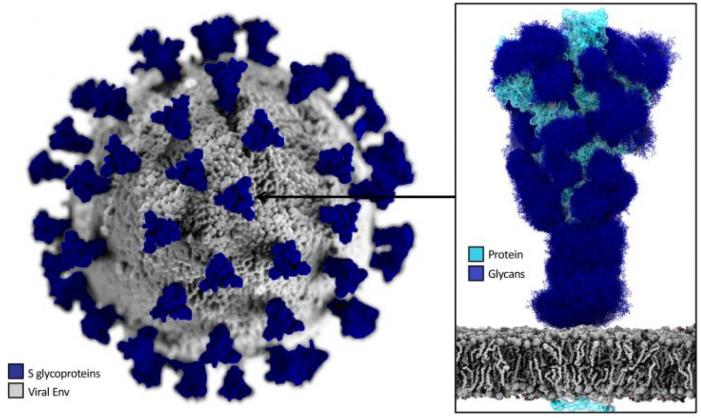

 <head>
    <meta charset="utf-8">
    <title>{{ page.title }}</title>

    <!-- Web component polyfill (only loads what it needs) -->

    <!-- Required to polyfill modern browsers as code is ES5 for IE... -->

<link rel="stylesheet" type="text/css" href="https://www.ebi.ac.uk/pdbe/pdb-component-library/css/pdbe-molstar-1.2.1.css">

  </head>

<h1> How a drug for COVID-19 is designed?</h1>

- [Understanding the mechanism of action of SARS-CoV-2](#understanding-the-mechanism-of-action-of-sars-cov-2)
  - [1. Virus-cell interactions](#1-virus-cell-interactions)
- [Variabilitat del genoma de SARS-CoV-2](#variabilitat-del-genoma-de-sars-cov-2)
- [Rational Drug Discovery](#rational-drug-discovery)
- [Complex 3CLpro-Nirmatelvir](#complex-3clpro-nirmatelvir)
- [Referències](#referències)

In this assignment we will briefly explore some key ideas in the desgin of a new drug. In particular, we will analyze the details of the way antivirals for SARS-CoV-2 can be designed-

Needed software and databases:

1. [OpenBabel](http://openbabel.org/wiki/Main_Page) to convert small molecules coordinates from one format to another
2. [Chimera](https://www.cgl.ucsf.edu/chimera/) to visualize proteins and their interactions.
3. [UNIPROT](https://www.uniprot.org/) to obtain information about a particular protein (sequence, structure, interactions...)

# Understanding the mechanism of action of SARS-CoV-2

The SARS-CoV-2 virus is the cause of the disease known as COVID19. The Spike protein is responsible for anchoring the virus to the cell surface. From here the fusion of the membranes occurs and the virus pours its RNA content into the cell. This RNA uses the cellular machinery to replicate the virus and to generate many more that can infect other cells. 

We will work with two different proteins of the virus:
* the spike protein, and
* the 3CLpro proteins

## 1. Virus-cell interactions

1. Identify the name of the cell surface protein that the SARS-CoV-2 Spike protein interacts with.
2. Look in the PDB for a structure of the complex between Spike protein and the above cell membrane protein.
3. Look in the PDB for a structure of the complex between Spike protein and antibodies

4. Analitza les estructures del PDB 7DF4 i 6WPT. Per a fer-ho, accedeix a "open/fetch by ID". Això abaixarà les dues proteïnes del PDB.
5. Anota els residus que estan a la regió d'interacció en el complexe Spike-ACE2 i els que estan a la regió entre SPIKE i l'anticós. Són les regions similars?

Alternativament, si Chimera no et funciona, pots observar aquestes proteïnes en els gràfics següents

# Variabilitat del genoma de SARS-CoV-2

1. Accedeix a la web [COVDB](https://covdb.stanford.edu/variants/omicron_ba_1_3/)
2. Observa la variabilitat de les diferents regions del genoma de SARS-CoV-2. És homogènia aquesta variabilitat? Perquè creus que no és així, en particular quan comparem què passa a SPIKE i a 3CLpro?

# Rational Drug Discovery

1. Accedeix a la web de [DRUGBANK](https://go.drugbank.com/)
2. Cerca l'estructura de Nirmatrelvir 
3. Baixa l'estructura en PDB de la molècula i visualitza-la a chimera. És correcta? Què li falta? 
4. Observa el fitxer que has baixat (pots usar wordpad). Veuràs que hi ha algun problema amb aquesta estructura i necessita que l'arreglem (manca d'hidrogens, estructura plana, etc). Obre [openbabel](http://openbabel.org/wiki/Main_Page) a l'ordinador i mira d'arreglar-la.
5. Torna a obrir la molècula a chimera i intenta identificar els diferents grups funcionals. Per on creus que interaccionarà amb la proteïna?

# Complex 3CLpro-Nirmatelvir

1. Accedeix al PDB i busca el complex de 3CLpro amb Nirmatelvir (PDB: 8DZ2)
2. Obre'l a Chimera i intenta identificar de quina manera interaccions. Pots identificar la histidina i la cisteïna del centre actiu de la proteïna?

<pdbe-molstar id="pdbeMolstarComponent" molecule-id="8dz2" hide-controls="false"></pdbe-molstar>

  

# Referències

1. Podeu trobar molta informació estructural i també enllaços a material didàctic interessant a la web del Protein Data Bank: [COVID-19/SARS-CoV-2 Resources](https://www.rcsb.org/news/feature/5e74d55d2d410731e9944f52).
2. (1) Greasley, S. E.; Noell, S.; Plotnikova, O.; Ferre, R.; Liu, W.; Bolanos, B.; Fennell, K.; Nicki, J.; Craig, T.; Zhu, Y.; Stewart, A. E.; Steppan, C. M. [Structural Basis for the in Vitro Efficacy of Nirmatrelvir against SARS-CoV-2 Variants](https://doi.org/10.1016/j.jbc.2022.101972). Journal of Biological Chemistry 2022, 298 (6), 101972.

&copy; [Jordi Villà Freixa](https://mon.uvic.cat/cbbl/members/) 2022