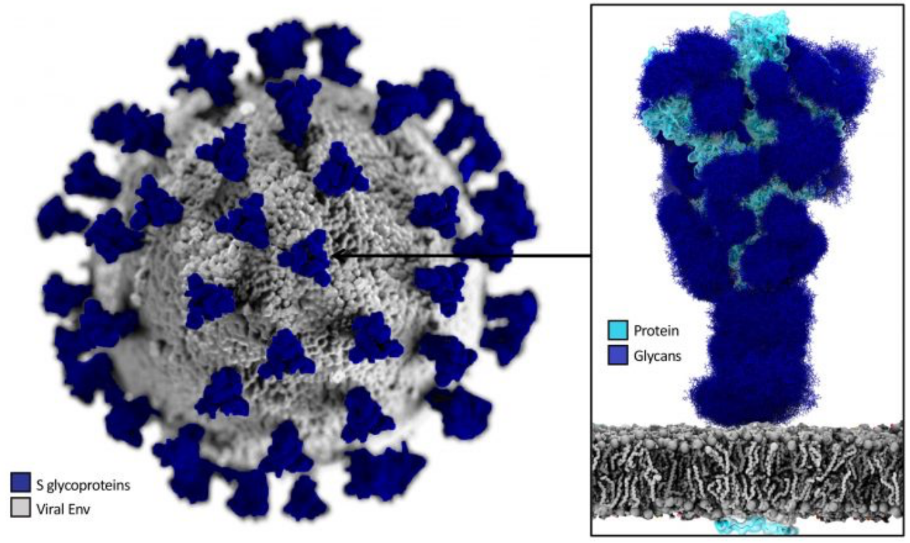
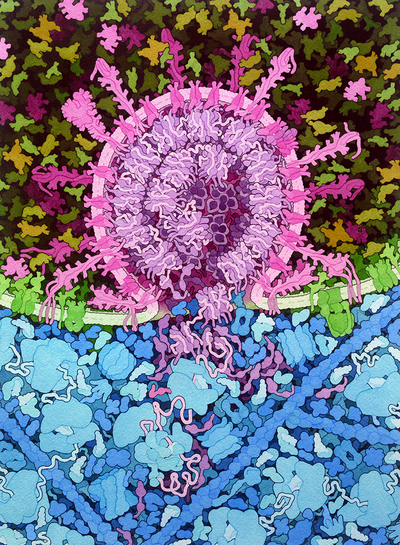
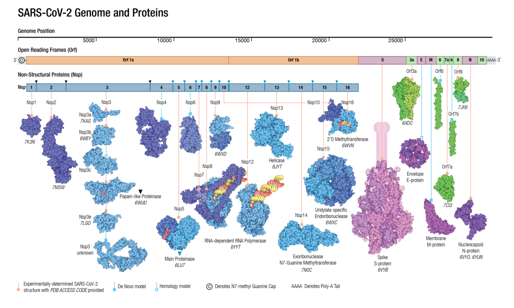

<h1> How a drug for COVID-19 is designed?</h1>

- [Introduction](#introduction)
- [Briefing on the mechanism of action of SARS-CoV-2](#briefing-on-the-mechanism-of-action-of-sars-cov-2)
- [Assignment questions](#assignment-questions)
  - [1) Virus-cell interactions](#1-virus-cell-interactions)
  - [2) Variability in the SARS-CoV-2 genome](#2-variability-in-the-sars-cov-2-genome)
  - [3) Rational Drug Discovery](#3-rational-drug-discovery)
    - [Ligand](#ligand)
    - [Complex](#complex)
- [References](#references)

# Introduction

In this assignment for the LVF601M course on Systems Biology at the University of Iceland, we will get some hints on the rational design of a new drug. In particular, we will visualize some simple details on the way an antiviral for SARS-CoV-2 can be designed.

Needed software and databases:

1. [OpenBabel](http://openbabel.org/wiki/Main_Page) to convert small molecules coordinates from one format to another
2. [Chimera](https://www.cgl.ucsf.edu/chimera/) to visualize proteins and their interactions.
3. [UNIPROT](https://www.uniprot.org/) to obtain information about a particular protein (sequence, structure, interactions...)

# Briefing on the mechanism of action of SARS-CoV-2

The SARS-CoV-2 virus is the cause of the disease known as COVID19. The Spike protein is responsible for anchoring the virus to the cell surface.

||
|:--:|
|Detail of the structure of the SARS-CoV-2, showing the Spike proteins in their glycosilated form|

 From here the fusion of the membranes occurs and the virus pours its RNA content into the cell. This RNA uses the cellular machinery to replicate the virus and to generate many more that can infect other cells. 

||
|:--:|
|[Credit: David S. Goodsell](https://pdb101.rcsb.org/sci-art/goodsell-gallery/sars-cov-2-fusion)|

||
|:--:|
|The proteome of SARS-CoV-2|

# Assignment questions

## 1) Virus-cell interactions

1. Get the human SARS-CoV-2 virus Spike protein Uniprot code.
2. Identify the name of the cell surface protein that the SARS-CoV-2 Spike protein interacts with.
3. Look in the PDB for a structure of the complex between Spike protein and the above cell membrane protein.
41. Look in the PDB for a structure of the complex between Spike protein and antibodies. What this structure tells you? 
2. Identify the residues that are in the interface regions, using the `select zone` tool in Chimera. Are they many? What do you think a good strategy for preventing SARS-CoV-2 to interact with the cell could be? Are the regions of interaction the same in the complexes you located in the above steps?

## 2) Variability in the SARS-CoV-2 genome

Go to the SARS-CoV-2 genome variation site at Stanford University: [COVDB](https://covdb.stanford.edu/variants/omicron_ba_1_3/). Look for the page devoted to the omicron variants:

6. Is the variability homogeneous? why do you think it is like this in terms of viral-host interaction evolution?
7. Check in particular the genomic region for 3CLpro. Can you give a measure of the percentage of variation of Spike and 3CLpro?

## 3) Rational Drug Discovery

### Ligand

8. Go to the [DRUGBANK](https://go.drugbank.com/) web site, and check for the Nirmatrelvir file. Download the structure in the PDB format and visualize it in Chimera. Paste it here Does it look right to you? What is missing?

||
|:--:|
|Some related molecules with antiviral properties, including Nirmatrelvir [(Greasley et al., 2022)](https://doi.org/10.1016/j.jbc.2022.101972)|

9.  Try fixing the structure using [openbabel](http://openbabel.org/wiki/Main_Page). Paste the new structure as seen in Chimera.
10. Can you identify the different functional groups. Discover the protein target of this molecule. Which of them is relevant for the interaction with the target? 

### Complex

11. Can you find a structure in the PDB that contains Nirmatrelivir with its target? 
2. The target is based on a conserved catalytic dyad, Can you recognize it using Chimera? 
3. Check the variability of the target and show in the structure where those variants at the level of aminoacids appear. Are they relevant for the function?
4. What is the mode of interaction between ligand and target? Can you elaborate on why would you consider it strong and specific? How can this be related to the activity of the protein?
5. Can you find information about the way Nirmatrelvir was designed? Innparticular, what are its precursors?

# References

* You can find interesting material on COVID19 structural biology at the web of the PDB: [COVID-19/SARS-CoV-2 Resources](https://www.rcsb.org/news/feature/5e74d55d2d410731e9944f52).
* Greasley, S. E.; Noell, S.; Plotnikova, O.; Ferre, R.; Liu, W.; Bolanos, B.; Fennell, K.; Nicki, J.; Craig, T.; Zhu, Y.; Stewart, A. E.; Steppan, C. M. [Structural Basis for the in Vitro Efficacy of Nirmatrelvir against SARS-CoV-2 Variants](https://doi.org/10.1016/j.jbc.2022.101972). Journal of Biological Chemistry 2022, 298 (6), 101972.

&copy; [Jordi Villà Freixa](https://mon.uvic.cat/cbbl/members/) 2023