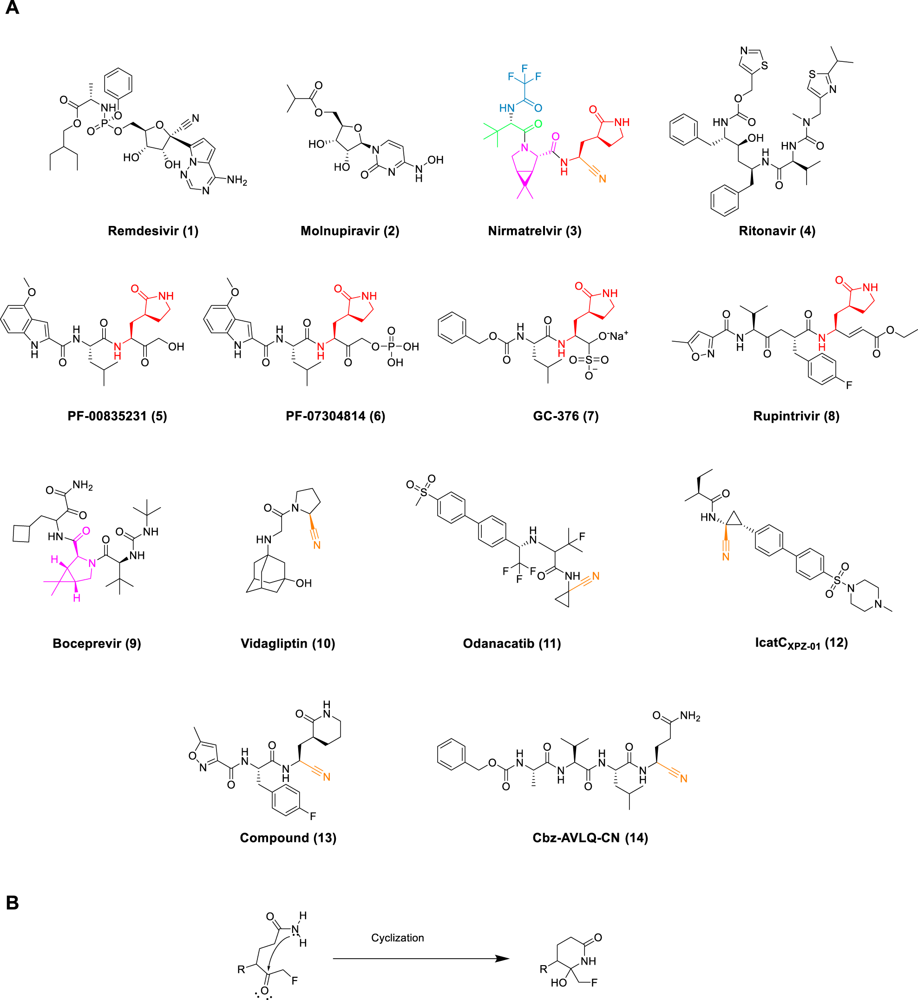

 <head>
    <meta charset="utf-8">
    <title>{{ page.title }}</title>

    <!-- Web component polyfill (only loads what it needs) -->

    <!-- Required to polyfill modern browsers as code is ES5 for IE... -->

<link rel="stylesheet" type="text/css" href="https://www.ebi.ac.uk/pdbe/pdb-component-library/css/pdbe-molstar-1.2.1.css">

  </head>

<h1> Com es dissenya un fàrmac per a la COVID-19?</h1>

- [Entenent el mecanisme d'acció del SARS-CoV-2](#entenent-el-mecanisme-dacció-del-sars-cov-2)
- [Estudiem les interaccions de la proteïna SPIKE](#estudiem-les-interaccions-de-la-proteïna-spike)
- [Variabilitat del genoma de SARS-CoV-2](#variabilitat-del-genoma-de-sars-cov-2)
- [Rational Drug Discovery](#rational-drug-discovery)
- [Complex 3CLpro-Nirmatelvir](#complex-3clpro-nirmatelvir)
- [Referències](#referències)

En aquest taller il·lustrarem els elements claus en la cerca d'un nou fàrmac. En concret, donarem una ullada, amb l'ajut de l'ordinador, del camí que han seguit els científics per trobar els primers medicaments antivirals per a la COVID-19. T'hi sumes?

Programari necessari:

1. [OpenBabel](http://openbabel.org/wiki/Main_Page) per poder convertir fitxers amb les coordenades Cartesianes de molècules d'un format a un altre
2. [Chimera](https://www.cgl.ucsf.edu/chimera/) per poder visualitzar les molècules en local. També hi ha eines online a moltes de les bases de dades de lligands i proteïnes.

# Entenent el mecanisme d'acció del SARS-CoV-2

El virus SARS-CoV-2 és el causant de la malaltia coneguda com COVID19. La proteïna Spike és l'encarregada d'ancorar el virus a la superfície cel·lular. A partir d'aquí es dóna la fusió de els membranes i el virus aboca el seu contingut de RNA dins la cèl·lula. Aquest RNA usa la maquinària cel·lular per replicar el virus i generar-ne molts més que puguin infectar altres cèl·lules. En aquest taller estduaiarem dos tipus d'estructures:

* l'estructura de l'spike protein i la seva interacció amb el receptor de membrana de la cèl·lula humana, ACE2. L'spike muta moltíssim, cosa que fa que, tot i ser un objectiu clar de les vacunes per la seva feina de "clau d'entrada" a la cèl·lula humana, les vacunes perden efectivitat a mesura que el virus evoluciona.
* l'estructura d'una proteïna clau per al funcionament del SARS-CoV-2: la proteasa principal. Aquesta proteïna és la diana terapèutica per excel·lència, per la seva baixa variabilitat genètica.

# Estudiem les interaccions de la proteïna SPIKE

1. obre chimera al teu ordinador
2. Analitza les estructures del PDB 7DF4 i 6WPT. Per a fer-ho, accedeix a "open/fetch by ID". Això abaixarà les dues proteïnes del PDB.
3. Anota els residus que estan a la regió d'interacció en el complexe Spike-ACE2 i els que estan a la regió entre SPIKE i l'anticós. Són les regions similars?

Alternativament, si Chimera no et funciona, pots observar aquestes proteïnes en els gràfics següents

# Variabilitat del genoma de SARS-CoV-2

1. Accedeix a la web [COVDB](https://covdb.stanford.edu/variants/omicron_ba_1_3/)
2. Observa la variabilitat de les diferents regions del genoma de SARS-CoV-2. És homogènia aquesta variabilitat? Perquè creus que no és així, en particular quan comparem què passa a SPIKE i a 3CLpro?

# Rational Drug Discovery

1. Accedeix a la web de [DRUGBANK](https://go.drugbank.com/)
2. Cerca l'estructura de Nirmatrelvir 
3. Baixa l'estructura en PDB de la molècula i visualitza-la a chimera. És correcta? Què li falta? 
4. Observa el fitxer que has baixat (pots usar wordpad). Veuràs que hi ha algun problema amb aquesta estructura i necessita que l'arreglem (manca d'hidrogens, estructura plana, etc). Obre [openbabel](http://openbabel.org/wiki/Main_Page) a l'ordinador i mira d'arreglar-la.
5. Torna a obrir la molècula a chimera i intenta identificar els diferents grups funcionals. Per on creus que interaccionarà amb la proteïna?

# Complex 3CLpro-Nirmatelvir

1. Accedeix al PDB i busca el complex de 3CLpro amb Nirmatelvir (PDB: 8DZ2)
2. Obre'l a Chimera i intenta identificar de quina manera interaccions. Pots identificar la histidina i la cisteïna del centre actiu de la proteïna?

<pdbe-molstar id="pdbeMolstarComponent" molecule-id="8dz2" hide-controls="false"></pdbe-molstar>

  

# Referències

1. Podeu trobar molta informació estructural i també enllaços a material didàctic interessant a la web del Protein Data Bank: [COVID-19/SARS-CoV-2 Resources](https://www.rcsb.org/news/feature/5e74d55d2d410731e9944f52).

&copy; [Jordi Villà Freixa](https://mon.uvic.cat/cbbl/members/) 2022