<head>
    <meta charset="utf-8">
    <title>{{ page.title }}</title>

    <!-- Web component polyfill (only loads what it needs) -->

    <!-- Required to polyfill modern browsers as code is ES5 for IE... -->

<link rel="stylesheet" type="text/css" href="https://www.ebi.ac.uk/pdbe/pdb-component-library/css/pdbe-molstar-1.2.1.css">

  </head>

<h1> How a drug for COVID-19 is designed?</h1>

- [Assignment anwers](#assignment-anwers)
  - [1) Virus-cell interactions](#1-virus-cell-interactions)
  - [2) Variability in the SARS-CoV-2 genome](#2-variability-in-the-sars-cov-2-genome)
  - [3) Rational Drug Discovery](#3-rational-drug-discovery)
    - [Ligand](#ligand)
    - [Complex](#complex)

# [Assignment](/LVF601M) anwers

## 1) Virus-cell interactions

**1.1) Get the human SARS-CoV-2 virus Spike protein Uniprot code.**

[P0DTC2](https://www.uniprot.org/uniprotkb/P0DTC2/entry)

**1.2) Identify the name of the cell surface protein that the SARS-CoV-2 Spike protein interacts with.**

In the section "interactions, we can see how most of the important ones (with more evidence from experiments, at least) refer to the Spike-ACE2 interaction.

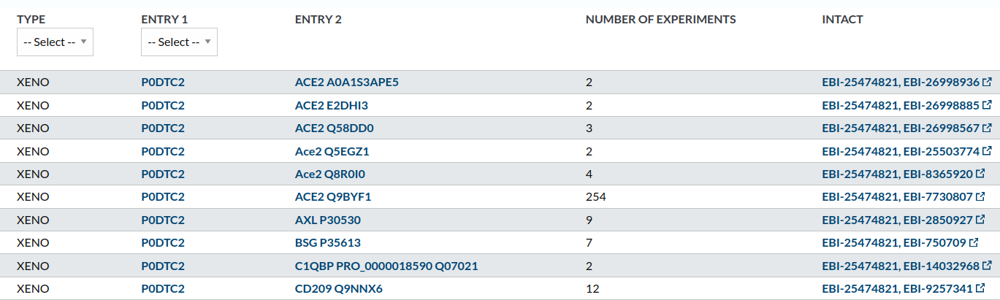

To deep into this, we can access the IntAct database through the [link in the right of the row]( https://www.ebi.ac.uk/intact/search?query=(id:EBI-25474821%20AND%20id:EBI-7730807)#interactor) with more experiments associated.

**1.3) Look in the PDB database for a structure of the complex between Spike protein and the above cell membrane protein. Add an image of the PDB obtained with Chimera.**

Again, many routes lead to the same place. For example, in the interactions section we have identified an interaction with 254 experiments (see image above). If we click in the link in the right of the row pointing to the `INTACT` database, we reach this page, where we can filtrate by `Interaction Method / x-ray diffraction`:

|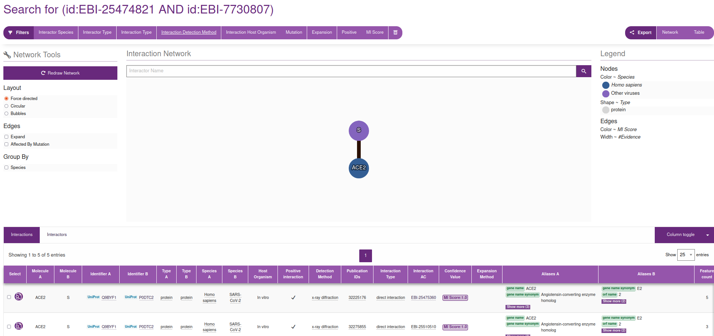|
|:--:|
|`INTACT` page for the interaction between Spkie and ACE2, filtered by X-ray diffraction|

If we then click on the `Interaction AC / EBI-25475360` which, at the time of writing this document, is the first document linked in the table (see figure), we reach this information, where, in the right hand side, points us to the PDB code [6M0J](https://www.rcsb.org/structure/6M0J).

|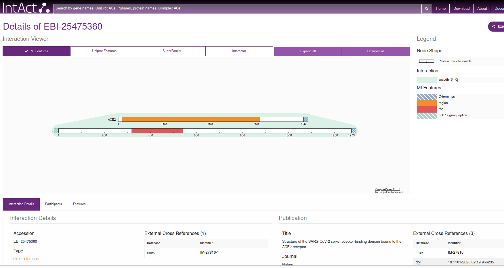|
|:--:|
|`EBI` page for the interaction between Spike and ACE2, filtered by X-ray diffraction|

<pdbe-molstar id="pdbeMolstarComponent" molecule-id="6m0j" hide-controls="false"></pdbe-molstar>

  

**1.4) Look in the PDB database for a structure of the complex between Spike protein and antibodies. Add an image of the PDB obtained with Chimera.**

We use here a simpler trick. Simply go to the web of the PDB database that we reached before and write `Spike antibody` in the search box. For example, we can check the PDB file [6XDG](https://www.rcsb.org/structure/6XDG), that contains the complex of SARS-CoV-2 receptor binding domain with the Fab fragments of two neutralizing antibodies. I show here the PDB file in an interactive way:

<pdbe-molstar id="pdbeMolstarComponent" molecule-id="6xdg" hide-controls="false"></pdbe-molstar>

  

In order to get it into Chimera, I open the program in the laptop and access the code through `File / fetch by ID`, inputting 6XDG in the corresponding box. 

|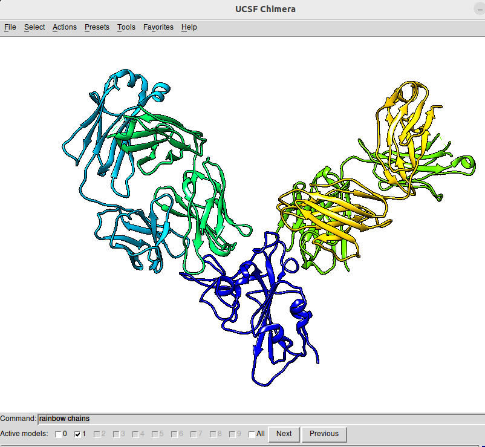|
|:--:|
|Chimera snapshot of the structure of [6XDG](https://www.rcsb.org/structure/6XDG). The figure has been obtained by, first selecting `Presets / Publication 1` and then activating `Favorites / Command Line` and typing the `rainbow chain` parameter in the command line box|

|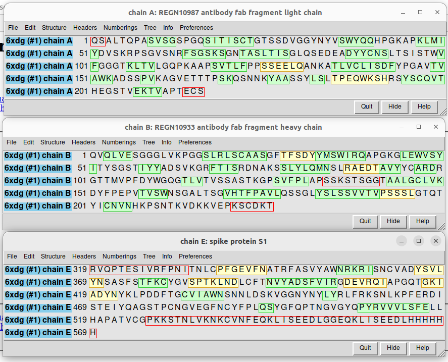|
|:--:|
|Sequences of the different chains in the [6XDG](https://www.rcsb.org/structure/6XDG) PDB code, corresponding to a fragment of the spike protein (chain E) and the light (chain  A and chain D -equal sequence, not shown) and heavy (chain B and chain C -equal sequence, not shown) chains of the REGN10933 neutralizing antibody.|

**1.5) Identify the residues that are in the interface regions, using the `select zone` tool in Chimera. Are they many? What do you think a good strategy for preventing SARS-CoV-2 to interact with the cell could be? Are the regions of interaction the same in the complexes you located in the above steps?**

For example, in the case of [6M0J](https://www.rcsb.org/structure/6M0J), we can first select a residue that is in the region by CONTRL+Left mouse button, and then find all the residues that are in that partiucular zone by `Select / zone` and follow the steps:

|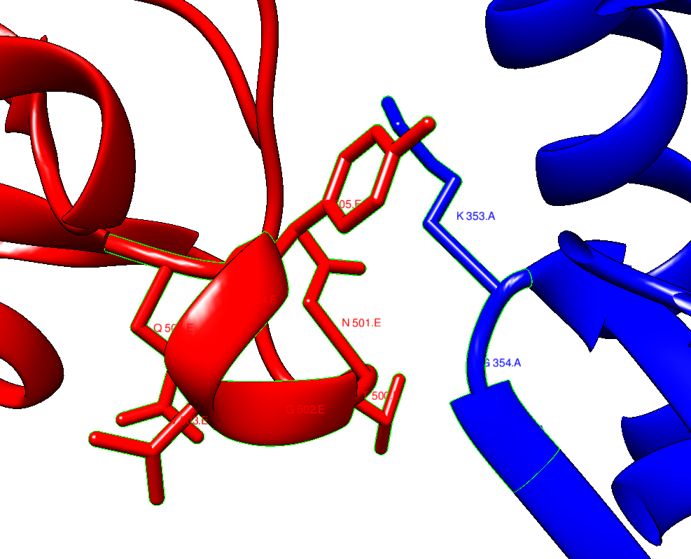|
|:--:|
|selected interaction region between ACE2 (blue) and Spike (orange).|

If you want to go further and explore the interface regions as a whole, you can use [ChimeraX](https://www.cgl.ucsf.edu/chimerax/), which I leave to you as an exercise. 

The answer to the question if the interface interactions aree the same is NO, in general. This implies that the antobodies are not targetting speciffically the same region in the spike protein as ACE2 does.

## 2) Variability in the SARS-CoV-2 genome

Go to the SARS-CoV-2 genome variation site at Stanford University: [COVDB](https://covdb.stanford.edu/variants/omicron_ba_1_3/). Look for the page devoted to the omicron variants:

**2.1) Is the variability homogeneous? why do you think it is like this in terms of viral-host interaction evolution?**

Taking for example the case of the [Omicron variant BA.1](https://covdb.stanford.edu/variants/omicron_ba_1_3/), we can see that the Spike protein presents astronger variation than the rest of the virus genom. In particular, much more that proteins that are responsible for the replication machinery.

|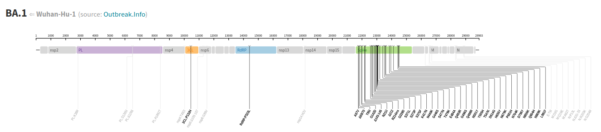|
|:--:|
|Detail on the variation of the SARS-CoV-2 genome, where we can see how the Spike protein (green region) presents a large variability as compared to other regions.|

The virus includes a recognition site (Spike) that can mutate easily because it is exposed and under strong selection pressure. Instead, other proteins in the genome are less prone to mutations, because they are pieces of the complex replication machinery, so they are less easy to be replaced or modified.

**2.2) Check in particular the genomic region for 3CLpro. Can you give a rough measure of the percentage of variation of Spike and 3CLpro?**

Folowing with the [Omicron variant BA.1](https://covdb.stanford.edu/variants/omicron_ba_1_3/) we can see that there a single aminoacid change among around 333 residues (approx 1000 base pairs, looking at the figure above). Instead, as a rough estimation, the Spike protein presents 34 in around 400 resudes (1273 base pairs) with respect to the Wuhan sequence. So the different in variability is huge among the two virus proteins.

## 3) Rational Drug Discovery

### Ligand

**3.1) Go to the [DRUGBANK](https://go.drugbank.com/) web site, and check for the Nirmatrelvir file. Download the structure in the PDB format and visualize it in Chimera. Paste it here Does it look right to you? What is missing?**

The molecule is shown flat in Chimera (see image below), which comes from the fact that the [PDB file in Drugbank](https://go.drugbank.com/structures/small_molecule_drugs/DB16691.pdb) is directly obtained from its SMILES code, without taking into accound the 3D structure. 3D structure is missing, as well as the hydrogen atoms in the moleculae.

**3.2)  Try fixing the structure using [openbabel](http://www.cheminfo.org/Chemistry/Cheminformatics/FormatConverter/index.html). Paste the new structure as seen in Chimera.**

Using OpenBabel, one can modify this by adding the correct 3D structure, including hydrogens.

We can fix this by going to any version of OpenBabel. For example, [its online implementation](http://www.cheminfo.org/Chemistry/Cheminformatics/FormatConverter/index.html).

|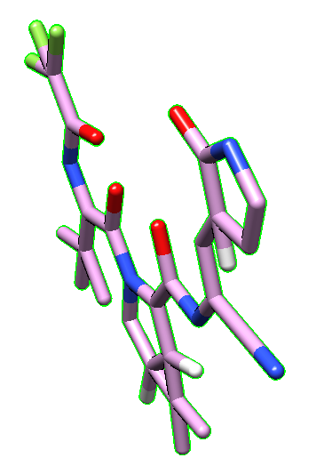|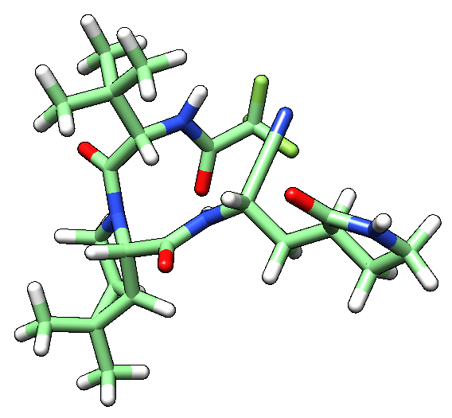|
|:--:|:--:|
|Nirmatrelvir PDB file obtained from Drugbank|Nirmatrelvir PDB after being fixed by OpenBabel|

|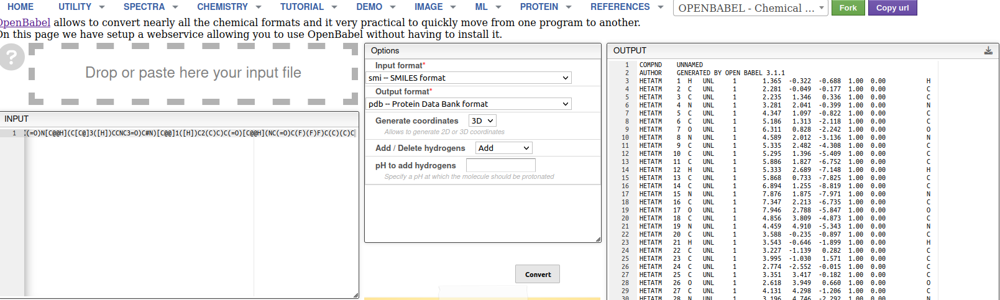|
|:--:|
|Detail on the use of OpenBabel to fix Nirmatrelvir structure. Left: we input the [SMILES](https://go.drugbank.com/structures/small_molecule_drugs/DB16691.smiles) of the molecule. Middle: setting up the parameters for the generation of the PDB format from SMILES. Right: final PDB file (right hand side of previous panel of images).|

**3.3)  Can you identify the different functional groups. Discover the protein target of this molecule. Which of them is relevant for the interaction with the target?**

Functional groups are man-assigned descriptors. Instead of moving into chemical description of the functional groups existing in the molecule, I have provided you a [simple script](https://github.com/CompBiochBiophLab/Tools/blob/master/chemoinformaticsTools/IdentifyFG.ipynb) to generate the different molecular fragments existing in the molecule, using RDKit, a very popular tool in chemoinformatics.

| molecular fragment | |
|:--:|:--:|
|Nirmatrelvir|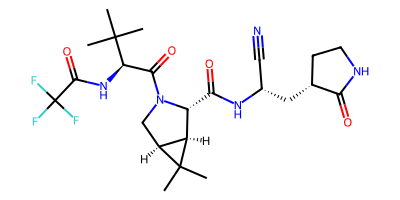  |
|CN(C)C(C)=O|NC.svg)   |
|CCC#N|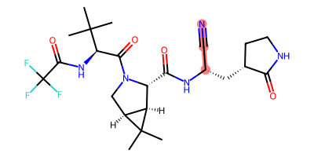|Nirmatrelvir|
|CF|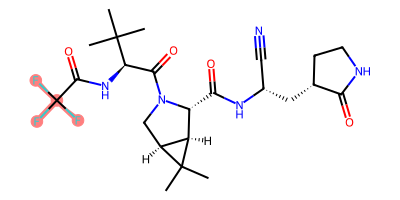|
|CN(C)C(C)=O|C(C)=O.svg)|
|CNC(C)=O|=O.svg)|

Following the info in the Drugbank page, we identify the mechanism of action of the molecule:

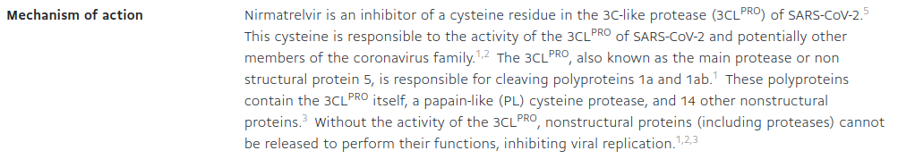

So, it is the catalytic Cysteine residue who interacts with Nirmatrelvir.

### Complex

**3.4) Can you find a structure in the PDB database that contains Nirmatrelivir with its target?**

With a simple search of Nirmatrelvir in the PDB site, we obtain up to 42 structures of the molecule bound to SARS-CoV-2 Mpro, the protease that Nirmatrelvir targets.

I take the first one, [PDB:7U29](https://www.rcsb.org/structure/7U29), a variant with the K90R mutation.

<pdbe-molstar id="pdbeMolstarComponent" molecule-id="6xdg" hide-controls="false"></pdbe-molstar>

  

**3.5) The target is based on a conserved catalytic dyad, Can you recognize it using Chimera?**

A search in google leads us to many articles describing the catalytic dyad in the protease. For example, for 6Y2E (see figure caption below):

|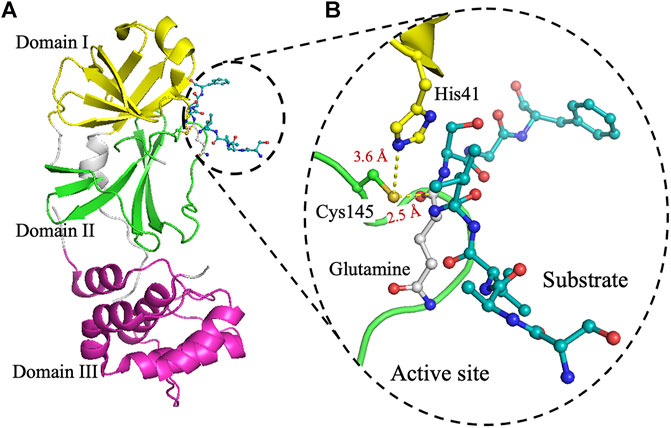|
|:--:|
|The crystal structure of 3CLpro. (A) Cartoon representation of 3CLpro of SARS-CoV-2 (PDB code 6Y2E) with domain I (residues 10–96) is shown in yellow, domain II (residues 102–180) in green, and domain III (residues 200–303) in pink. The peptide-substrate (blue) is shown in ball and stick representation, and it is located at the interface between domains I and II. (B) The active site of 3CLpro showing the peptide-substrate in blue and glutamine at P1-site is white. The catalytic residue Cys145, which is part of domain II, is 2.5 Å from the backbone carbonyl carbon of glutamine of the peptide-substrate. Residues of the catalytic dyad, His41 in domain I, is 3.6 Å from Cys145 in domain II. The figure was prepared using PyMol (Schrodinger LLC). (reproduced from Juliana C. Ferreira,Samar Fadl, Adrian J. Villanueva and Wael M. Rabeh [Front. Chem., Volume 9 - 2021 ]( https://doi.org/10.3389/fchem.2021.692168))|

and in our Chimera session for PDB:7U29, we can see it like

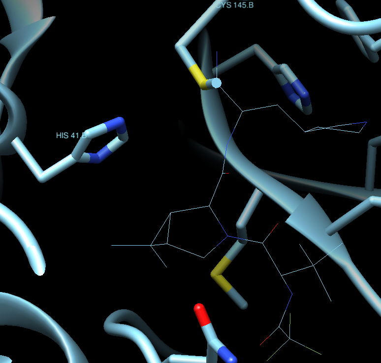

**3.6) Check the variability of the target and show in the structure where those variants at the level of aminoacids appear. Are they relevant for the function?**

Checking the info in the COVBD page as above, we see that for the Omicron BA.1, for example, the only mutation in the 3CL protease is P132H for Omicron and K90R for Beta variants. For other variants there are more variants like L205V (Zeta/P.2 variant), G15S (Lambda/C.37, C.1.2 and C.36.3 variants), V303I (B.1.1.523 variant) and T21I (for B.1.1.318 variant)
Taking as reference the same structure PDB:7U29, we see where those mutations are located in the following image taken from Chimera, where we have removed the visualization of the protein secondary structure to emphasize the position of the variants, along with the active site. As you can see, all variants are relativelky far from the binding site of the ligand and, thus, from the active site. They may produce more complex effects that are not seen from the still image shown here, but in principle it is reasonable to assume that the drug may be effective for most knopwn variants, if not all, based on this simple exploration.

|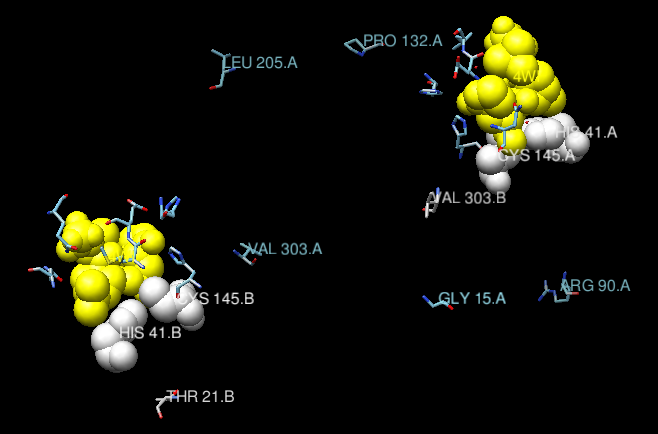|
|:--:|
|Position of the known variants in the main protease of SAARS-CoV-2, mapped on the structure PDB:7U29. Ribbons have been removed from the view, to emphasize the position of the mutations. In whit, the catalytic dyad. In yellow, the ligand (Nirmatrelvir). The two chains in the biological unit of the protein are shown.|

You have the session in Chimera [here](../files/3CLpro_variants.py), if you want to play with it.

**3.7) What is the mode of interaction between ligand and target? Can you elaborate on why would you consider it strong and specific? How can this be related to the activity of the protein?**

Taking again PDB:7U29 as our reference, and showing in sticks the structure of the ligand in Chimera (`Select / Residue / 4WI`) we get:

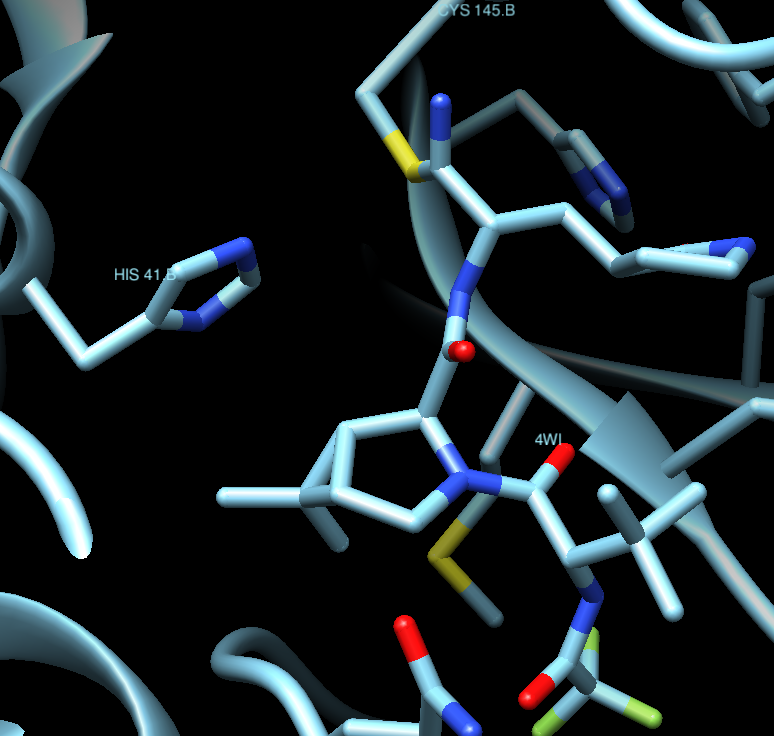

Where we can appreciate that the ligand is covalently bound to Cys145, which makes it more potent and irreversible. The ligand is, thus, a real obstacle for the protein to  properly function.

**3.8) Can you find information about the way Nirmatrelvir was designed? In particular, what are its precursors?**

Well, the discovery of PF-07321332 (Nirmatrelvir) is a very long and interesting story, and it is better [you explore it](https://cen.acs.org/pharmaceuticals/drug-discovery/How-Pfizer-scientists-transformed-an-old-drug-lead-into-a-COVID-19-antiviral/100/i3) by yourselves.

&copy; [Jordi Villà Freixa](https://mon.uvic.cat/cbbl/members/) 2023