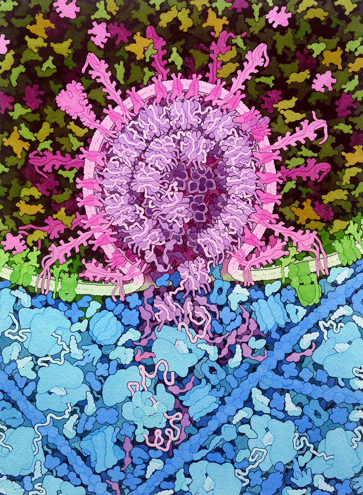
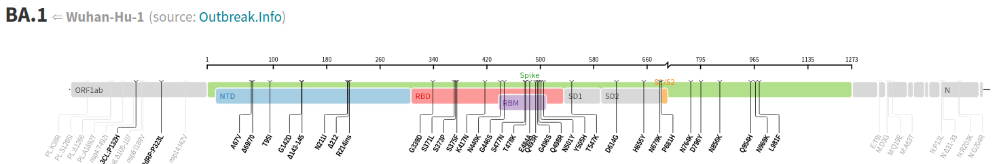
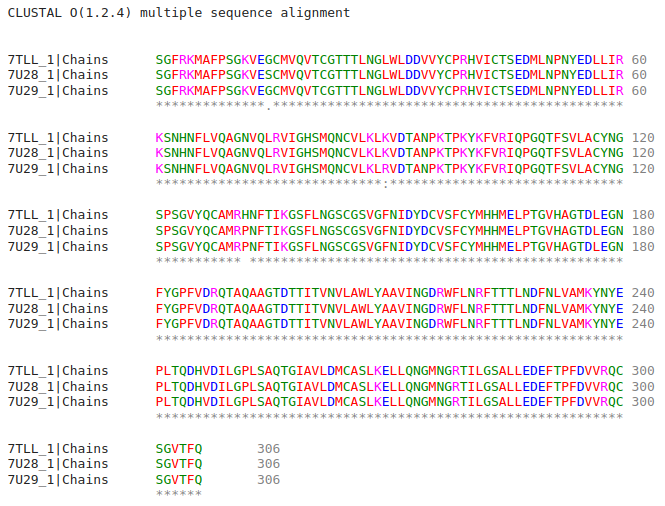

 <head>
    <meta charset="utf-8">
    <title>{{ page.title }}</title>

    <!-- Web component polyfill (only loads what it needs) -->

    <!-- Required to polyfill modern browsers as code is ES5 for IE... -->

<link rel="stylesheet" type="text/css" href="https://www.ebi.ac.uk/pdbe/pdb-component-library/css/pdbe-molstar-1.2.1.css">

  </head>

<h1>En cerca d'un antiviral per a la COVID19</h1>

Com s'ho fan els científics per trobar un antiviral per a un virus com el SARS-Cov-2? Com escullen la proteïna que els servirà de diana terapèutica? Com aprofiten el coneixement existent?

- [Com ataca el coronavirus?](#com-ataca-el-coronavirus)
- [Com muta el genoma del SARS-CoV-2](#com-muta-el-genoma-del-sars-cov-2)
- [Millor una proteïna menys variant per generar un antiviral: 3CLPro](#millor-una-proteïna-menys-variant-per-generar-un-antiviral-3clpro)
- [Ara et toca a tu!](#ara-et-toca-a-tu)

# Com ataca el coronavirus?

[Credit: David S. Goodsell](https://pdb101.rcsb.org/sci-art/goodsell-gallery/sars-cov-2-fusion)

<pdbe-molstar id="pdbeMolstarComponent" molecule-id="7df4" hide-controls="false"></pdbe-molstar>

Proteïna Spike interaccionant amb ACE2

   

<pdbe-molstar id="pdbeMolstarComponent" molecule-id="6wpt" hide-controls="false"></pdbe-molstar>

Proteïna Spike amb un anticós neutralitzant

   

# Com muta el genoma del SARS-CoV-2

[Alta variabilitat de la proteïna SPIKE](https://covdb.stanford.edu/variants/omicron_ba_1_3/)

# Millor una proteïna menys variant per generar un antiviral: 3CLPro

[Article](https://link-springer-com.biblioremot.uvic.cat/article/10.1007/s00044-022-02951-6)

<pdbe-molstar id="pdbeMolstarComponent" molecule-id="6yb7" hide-controls="false"></pdbe-molstar>

Proteasa principal del SARS-CoV-2 amb un inhibidor covalent.

   

# Ara et toca a tu!

Per seguir els diferents passos d'aquesta apassionant història t'hem preparat [un guió](https://jordivillafreixa.github.io/Proteines/GuioCOVID19/) on, pas a pas, podràs raonar com ho ha fet la comunitat científica per trobar una possible solució a la COVID-19. Encara queda molta més feina per fer. T'animes a seguir els passos d'aquests investigadors?

Sovint parlem de com d'important és invertir en recerca, tot i que de vegades els resultats no siguin immediatament aparents. Aquí us hem mostrat un exemple de com la recerca en genòmica, virologia, bioinformàtica, química mèdica, biologia molecular, descobriment de fàrmacs i modelatge molecular van de la mà quan cal trobar una resposta a un problema. L'acumulació de resultats i de coneixement al llarg de molts anys acaba essent determinant per trobar solucions ràpides a crisis sanitàries sobtades!

&copy; [Jordi Villà Freixa](https://mon.uvic.cat/cbbl/members/) 2022